# 一、Python语法的简要说明

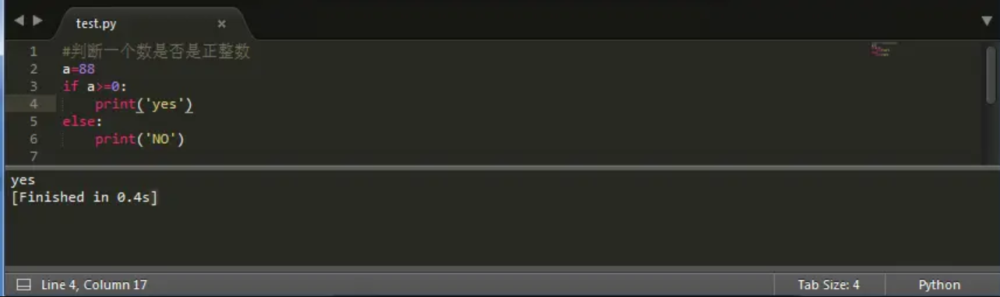

如上面的代码截图，以 # 开头的语句是注释，其他每一行都是一个语句，当语句以冒号 : 结尾时，缩进的语句视为代码块。

要注意的是 Python 程序是大小写敏感的，如果写错了大小写，程序会报错。

# 二、print()函数

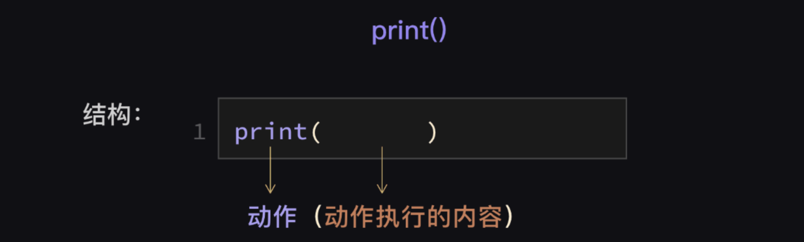

它的执行流程如下：

1. 向解释器发出指令，打印 'Hello Python'
2. 解析器把代码解释为计算器能读懂的机器语言
3. 计算机执行完后就打印结果

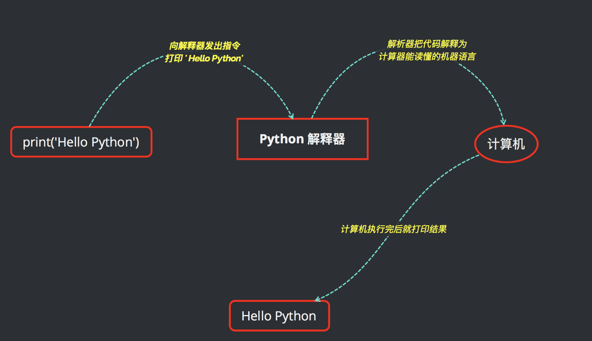

# 三、Python的基本数据类型

## 1、字符串

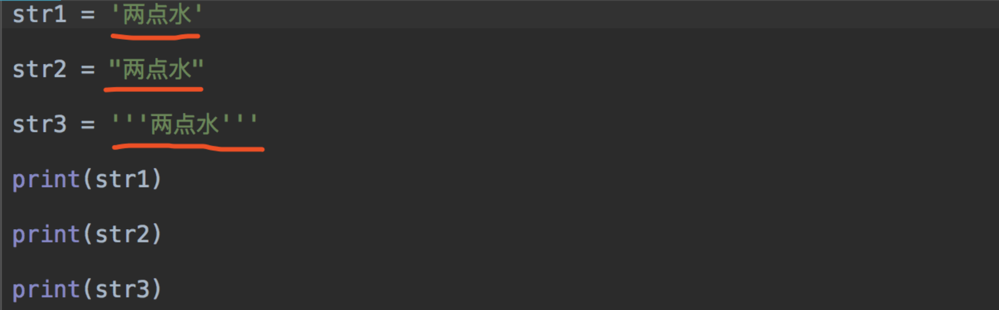

打印结果一样

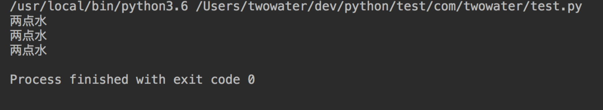

那如果我们的字符串不是 两点水，是 两'点'水 这样呢？

这样就直接报错了。

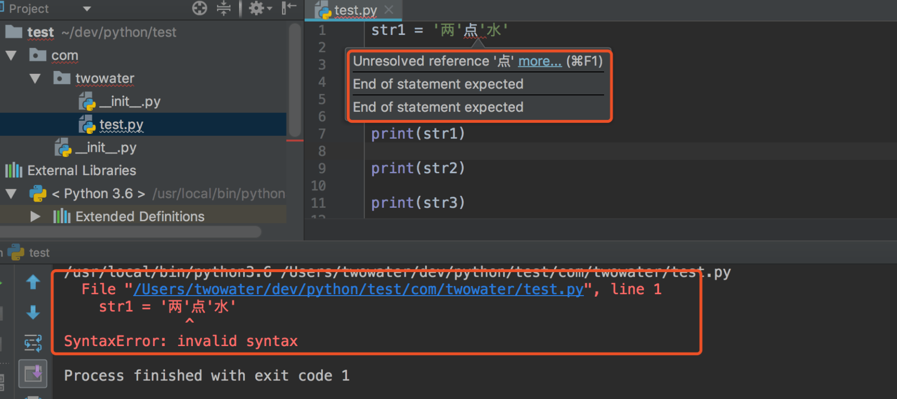

但是要注意，用单引号 ' ' 不行，用双引号 " " 是可以的。

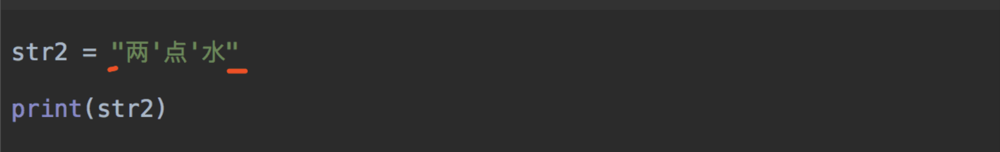

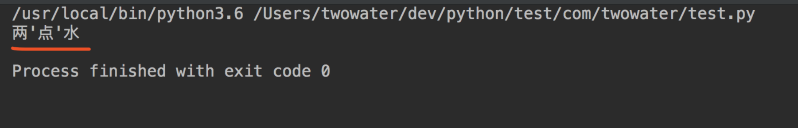

至于三引号，也是一样的，如果字符串内容里面含有双引号，也是会报同样的错误的。那么这时候你就可以用三引号了。

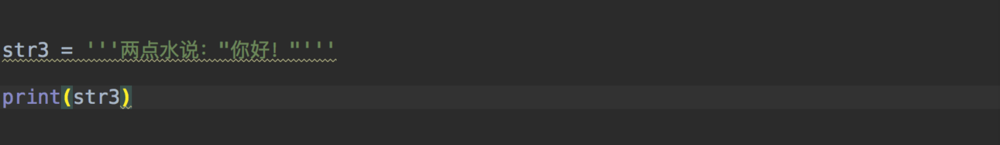

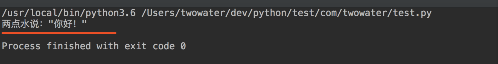

那么用单引号，双引号定义的字符串就不能表示这样的内容吗？

并不是的，你可以使用转义字符。

比如单引号，你可以使用 \' 来表示，双引号可以使用 \" 来表示。

注意，这里的是反斜杠 \, 不是斜杆 / 。

了解了之后，直接程序测试一下：

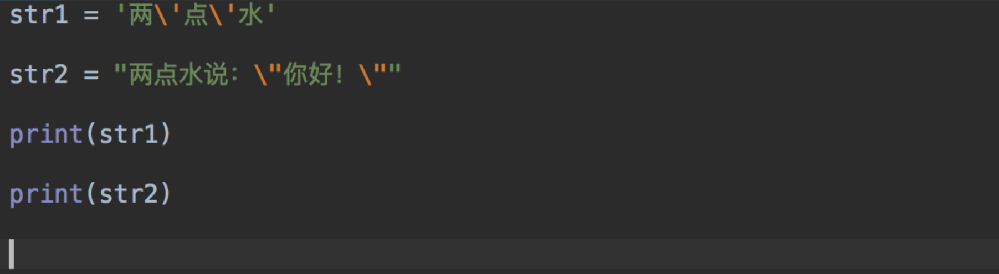

运行结果如下：

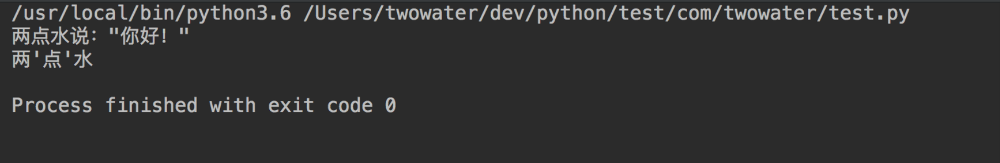

最后，也提一下， 三引号 ''' ''' 是直接可以分行的。

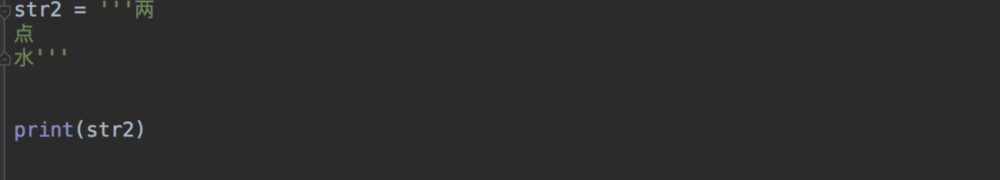

运行结果：

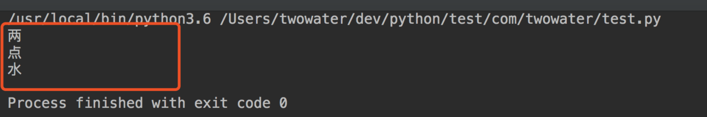

## 2、整数

整数英文为 integer 。代码中的整数跟我们平常认识的整数一样，包括正整数、负整数和零，是没有小数点的数字。

Python 可以处理任意大小的整数，例如：1，100，-8080，0，等等

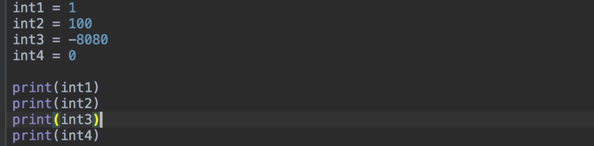

运行结果：

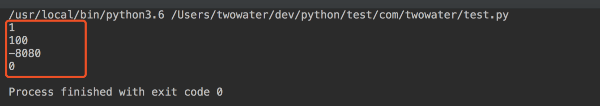

当然，要注意了，如果数字你用引号括起来了，那就属于字符串，而不属于整数。比如 '100' , 这 100 是字符串，不是整数。

在现实世界中，整数我们通常会做计算，因此代码世界也是一样，整数可以直接加减乘除。

比如：

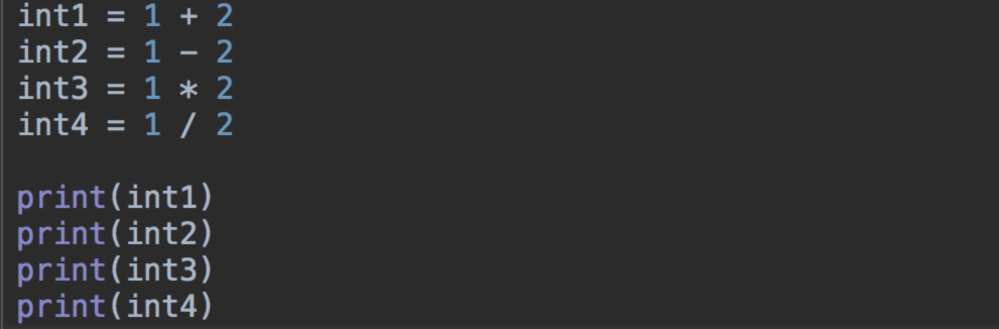

程序运行结果：

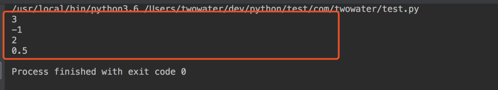

这里提示下大家，看看上面的例子，有没有发现什么？

看下 `int4` 打印出来的结果，是 `0.5` , 是一个小数。

而我们上面对整数的定义是什么？

是没有小数点的数字。

因此 `int4` 肯定不是整数。

这里我们可以使用 `type()` 函数来查看下类型。

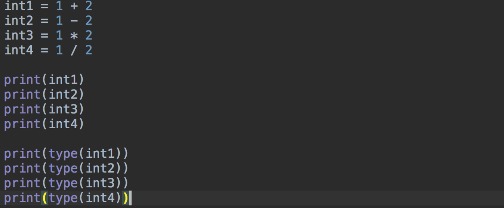

结果如下：

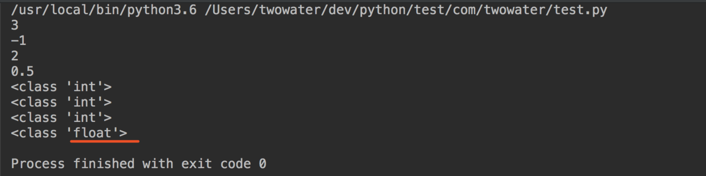

可以看到 `int4` 是 float 类型，而 `int1` ,`int2`,`int3` 都是 int 整数类型。

那么 float 是什么类型呢？

float 是浮点数类型，是我们下面会说到的。

在说浮点数之前，各位可以看下 Python 的算术运算符有哪些，有个印象。

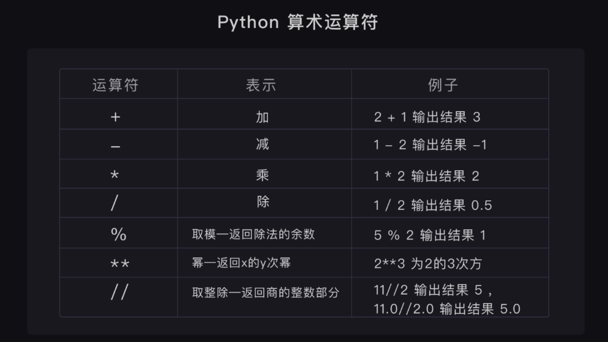

## 3、浮点数

浮点数的英文名是 float ，是指带小数的数字。

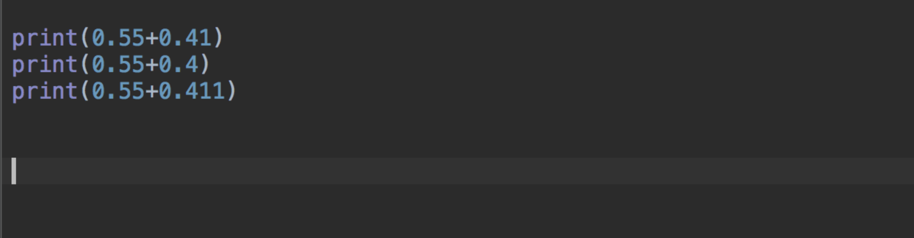

可是运算结果，对于初学者来说，可能会接受不了。

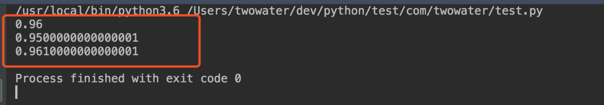

对于第一个还好，`0.55+0.41` 等于 0.96 ，运算结果完全一致。可是后面两个，你会发现怎么出现了那么多个零。

这是因为计算机对浮点数的表达本身是不精确的。保存在计算机中的是二进制数，二进制对有些数字不能准确表达，只能非常接近这个数。

所以我们在对浮点数做运算和比较大小的时候要小心。

## 4、布尔值

布尔值和布尔代数的表示完全一致，一个布尔值只有 `True` 、 `False `两种值，要么是 `True`，要么是 `False`，在 Python 中，可以直接用 True、False 表示布尔值（请注意大小写），也可以通过布尔运算计算出来。

布尔值可以用 `and`、`or` 和 `not` 运算。

`and` 运算是与运算，只有所有都为 True，and 运算结果才是 True。

`or` 运算是或运算，只要其中有一个为 True，or 运算结果就是 True。

`not` 运算是非运算，它是一个单目运算符，把 True 变成 False，False 变成 True。

## 5、空值

基本上每种编程语言都有自己的特殊值——空值，在 Python 中，用 None 来表示

# 四、字符串的编码问题

我们都知道计算机只能处理数字，如果要处理文本，就必须先把文本转换为数字才能处理。最早的计算机在设计时采用8个比特（bit）作为一个字节（byte），所以，一个字节能表示的最大的整数就是255（二进制11111111=十进制255），0 - 255被用来表示大小写英文字母、数字和一些符号，这个编码表被称为ASCII编码，比如大写字母 A 的编码是 65，小写字母 z 的编码是 122。

如果要表示中文，显然一个字节是不够的，至少需要两个字节，而且还不能和 ASCII 编码冲突，所以，中国制定了 GB2312 编码，用来把中文编进去。

类似的，日文和韩文等其他语言也有这个问题。为了统一所有文字的编码，Unicode 应运而生。Unicode 把所有语言都统一到一套编码里，这样就不会再有乱码问题了。

Unicode 通常用两个字节表示一个字符，原有的英文编码从单字节变成双字节，只需要把高字节全部填为 0 就可以。

因为 Python 的诞生比 Unicode 标准发布的时间还要早，所以最早的Python 只支持 ASCII 编码，普通的字符串 'ABC' 在 Python 内部都是 ASCII 编码的。

不过由于 Python 源代码也是一个文本文件，所以，当你的源代码中包含中文的时候，在保存源代码时，就需要务必指定保存为 UTF-8 编码。当Python 解释器读取源代码时，为了让它按 UTF-8 编码读取，我们通常在文件开头写上这两行：

```python
#!/usr/bin/env python3
# -*- coding: utf-8 -*-
```

第一行注释是为了告诉 Linux/OS X 系统，这是一个 Python 可执行程序，Windows 系统会忽略这个注释；

第二行注释是为了告诉 Python 解释器，按照 UTF-8 编码读取源代码，否则，你在源代码中写的中文输出可能会有乱码。

申明了 UTF-8 编码并不意味着你的 .py 文件就是 UTF-8 编码的，必须并且要确保文本编辑器正在使用 UTF-8 without BOM 编码

# 五、基本数据类型转换

Python 中基本数据类型转换的方法有下面几个。

| 方法                   | 说明                                                  |
| ---------------------- | ----------------------------------------------------- |
| int(x [,base ])        | 将x转换为一个整数                                     |
| float(x )              | 将x转换到一个浮点数                                   |
| complex(real [,imag ]) | 创建一个复数                                          |
| str(x )                | 将对象 x 转换为字符串                                 |
| repr(x )               | 将对象 x 转换为表达式字符串                           |
| eval(str )             | 用来计算在字符串中的有效 Python 表达式,并返回一个对象 |
| tuple(s )              | 将序列 s 转换为一个元组                               |
| list(s )               | 将序列 s 转换为一个列表                               |
| chr(x )                | 将一个整数转换为一个字符                              |
| unichr(x )             | 将一个整数转换为 Unicode 字符                         |
| ord(x )                | 将一个字符转换为它的整数值                            |
| hex(x )                | 将一个整数转换为一个十六进制字符串                    |
| oct(x )                | 将一个整数转换为一个八进制字符串                      |

这里我们可以尝试一下这些函数方法。

比如 `int()` 函数，将符合规则的字符串类型转化为整数 。

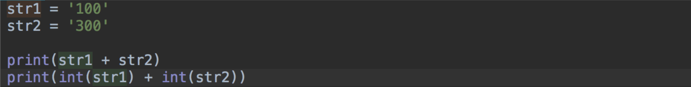

输出结果：

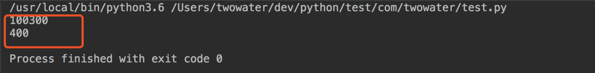

注意这里是符合规则的字符串类型，如果是文字形式等字符串是不可以被 `int()` 函数强制转换的。

还有小数形式的字符串也是不能用 `int()` 函数转换的。

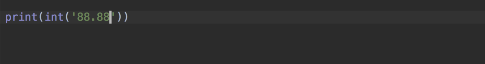

这样转换会报错。

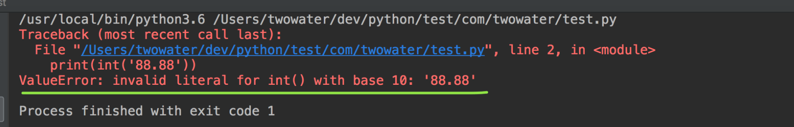

但这并不是意味着浮点数不能转化为整数，而是小数形式的字符串不能强转为字符串。

浮点数还是可以通过 `int()` 函数转换的。

比如：

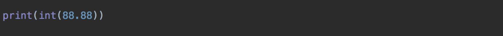

输出结果：

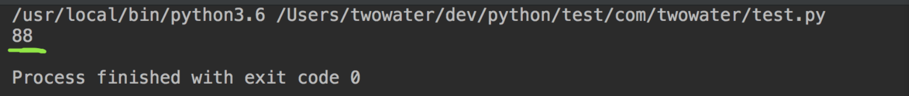

但是你会发现，结果是 88 ，后面小数点的 0.88 被去掉了。

这是因为 `int()` 函数是将数据转为整数。如果是浮点数转为整数，那么 `int()` 函数就会做取整处理，只取整数部分。所以输出的结果为 88 。

其余的方法就不一一列举了，只要多用，多试，这些方法都会慢慢熟悉的。还有如果是初学者，完全可以每个方法都玩一下，写一下，随便写，然后运行看结果，反正你的电脑又不会因为这样而玩坏的。

# 六、Python中的变量

## 1、变量的创建和赋值

在 Python 程序中，变量是用一个变量名表示，可以是任意数据类型，变量名必须是大小写英文、数字和下划线（_）的组合，且不能用数字开头，比如：

```python
a=88
```

这里的 `a` 就是一个变量，代表一个整数，注意一点是 Python 是不用声明数据类型的。在 Python 中 `=` 是赋值语句，跟其他的编程语言也是一样的，因为 Python 定义变量时不需要声明数据类型，因此可以把任意的数据类型赋值给变量，且同一个变量可以反复赋值，而且可以是不同的数据类型。

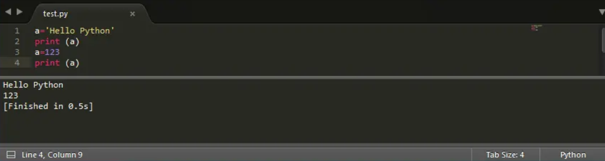

这种变量本身类型不固定的语言称之为动态语言，与之对应的是静态语言。静态语言在定义变量时必须指定变量类型，如果赋值的时候类型不匹配，就会报错。例如 Java 是静态语言。

## 2、变量的指向问题

我们来看下这段代码，发现最后打印出来的变量 b 是 `Hello Python` 。

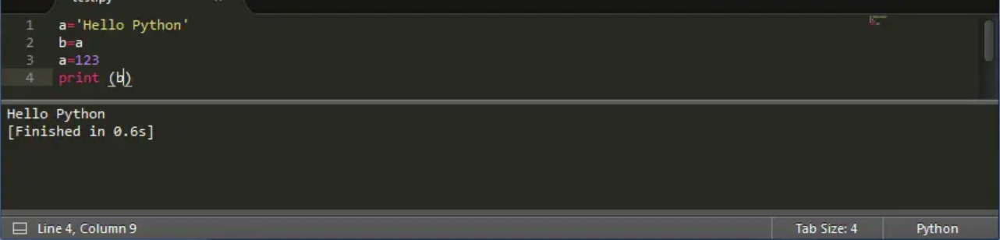

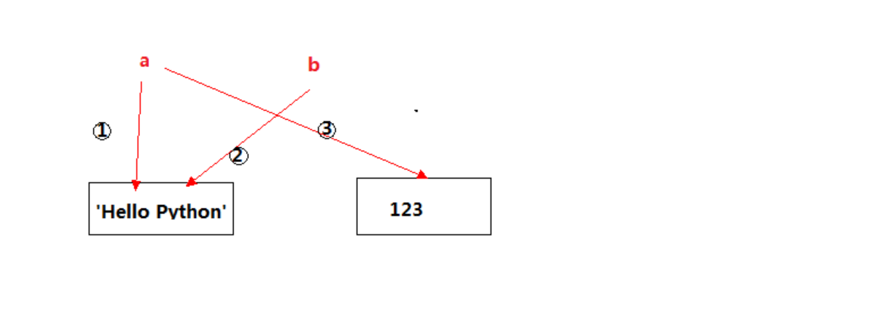

## 3、多个变量的赋值

Python 允许同时为多个变量赋值。例如：

```python
a = b = c = 1
```

以上实例，创建一个整型对象，值为 1，三个变量被分配到相同的内存空间上。

当然也可以为多个对象指定多个变量。例如：

```python
a, b, c = 1, 2, "liangdianshui"
```

以上实例，两个整型对象 1 和 2 的分配给变量 a 和 b，字符串对象 "liangdianshui" 分配给变量 c。