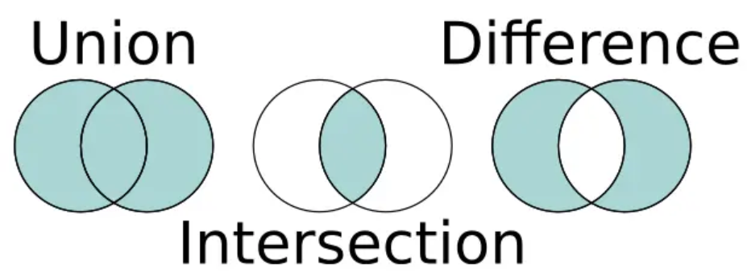

# 一、字典(Dictionary)

## 1、什么是 dict（字典）

上一章节，我们学习了列表（List） 和 元组（tuple） 来表示有序集合。

而我们在讲列表（list）的时候，我们用了列表（list） 来存储用户的姓名。

```python
name = ['一点水', '两点水', '三点水', '四点水', '五点水']
```

那么如果我们为了方便联系这些童鞋，要把电话号码也添加进去，该怎么做呢？

用 list 可以这样子解决：

```python
name = [['一点水', '131456780001'], ['两点水', '131456780002'], ['三点水', '131456780003'], ['四点水', '131456780004'], ['五点水', '131456780005']]
```

但是这样很不方便，我们把电话号码记录下来，就是为了有什么事能及时联系上这些童鞋。

如果用列表来存储这些，列表越长，我们查找起来耗时就越长。

这时候就可以用 dict （字典）来表示了，Python 内置了 字典（dict），dict 全称 dictionary，如果学过 Java ，字典就相当于 JAVA 中的 map，使用键-值（key-value）存储，具有极快的查找速度

```python
name = {'一点水': '131456780001', '两点水': '131456780002', '三点水': '131456780003', '四点水': '131456780004', '五点水': '131456780005'}
```

## 2、dict （字典）的创建

字典是另一种可变容器模型，且可存储任意类型对象。

字典的每个键值(key=>value)对用冒号(:)分割，每个对之间用逗号(,)分割，整个字典包括在花括号({})中 ,格式如下所示：

```python
dict = {key1 : value1, key2 : value2 }
```

注意：键必须是唯一的，但值则不必。值可以取任何数据类型，但键必须是不可变的。

创建 dict（字典）实例：

```python
dict1={'liangdianshui':'111111' ,'twowater':'222222' ,'两点水':'333333'}
dict2={'abc':1234,1234:'abc'}
```

## 3、访问 dict （字典）

我们知道了怎么创建列表了，回归到一开始提出到的问题，为什么使用字典能让我们很快的找出某个童鞋的电话呢？

```python
name = {'一点水': '131456780001', '两点水': '131456780002', '三点水': '131456780003', '四点水': '131456780004', '五点水': '131456780005'}

print(name['两点水'])
```

输出的结果：

```python
131456780002
```

可以看到，如果你知道某个人的名字，也就是 key 值， 就能很快的查找到他对应的电话号码，也就是 Value 。

这里需要注意的一点是：如果字典中没有这个键，是会报错的。

## 4、修改 dict （字典）

向字典添加新内容的方法是增加新的键/值对，修改或删除已有键/值对

```python
#-*-coding:utf-8-*-
dict1={'liangdianshui':'111111' ,'twowater':'222222' ,'两点水':'333333'}
print(dict1)
# 新增一个键值对
dict1['jack']='444444'
print(dict1)
# 修改键值对
dict1['liangdianshui']='555555'
print(dict1)
```

输出的结果：

```python
{'liangdianshui': '111111', 'twowater': '222222', '两点水': '333333'}
{'liangdianshui': '111111', 'twowater': '222222', '两点水': '333333', 'jack': '444444'}
{'liangdianshui': '555555', 'twowater': '222222', '两点水': '333333', 'jack': '444444'}
```

## 5、删除 dict （字典）

通过 `del` 可以删除 dict （字典）中的某个元素，也能删除 dict （字典）

通过调用 `clear()` 方法可以清除字典中的所有元素

```python
#-*-coding:utf-8-*-
dict1={'liangdianshui':'111111' ,'twowater':'222222' ,'两点水':'333333'}
print(dict1)
# 通过 key 值，删除对应的元素
del dict1['twowater']
print(dict1)
# 删除字典中的所有元素
dict1.clear()
print(dict1)
# 删除字典
del dict1
```

输出的结果：

```python
{'liangdianshui': '111111', 'twowater': '222222', '两点水': '333333'}
{'liangdianshui': '111111', '两点水': '333333'}
{}
```

## 6、 dict （字典）使用时注意的事项

(1) dict （字典）是不允许一个键创建两次的，但是在创建 dict （字典）的时候如果出现了一个键值赋予了两次，会以`最后一次赋予的值`为准

例如：

```python
#-*-coding:utf-8-*-
dict1={'liangdianshui':'111111' ,'twowater':'222222' ,'两点水':'333333','twowater':'444444'}
print(dict1)
print(dict1['twowater'])
```

输出结果：

```python
{'liangdianshui': '111111', 'twowater': '444444', '两点水': '333333'}
444444
```

(2) dict （字典）键必须不可变，可是键可以用数字，字符串或元组充当，但是就是不能使用列表

例如：

```python
#-*-coding:utf-8-*-
dict1={'liangdianshui':'111111' ,123:'222222' ,(123,'tom'):'333333','twowater':'444444'}
print(dict1)
```

输出结果：

```python
{'liangdianshui': '111111', 123: '222222', (123, 'tom'): '333333', 'twowater': '444444'}
```

(3) dict 内部存放的顺序和 key 放入的顺序是没有任何关系

和 list 比较，dict 有以下几个特点：

- 查找和插入的速度极快，不会随着key的增加而变慢
- 需要占用大量的内存，内存浪费多

而list相反：

- 查找和插入的时间随着元素的增加而增加
- 占用空间小，浪费内存很少

## 7、dict （字典） 的函数和方法

| 方法和函数     | 描述                                             |
| -------------- | ------------------------------------------------ |
| len(dict)      | 计算字典元素个数                                 |
| str(dict)      | 输出字典可打印的字符串表示                       |
| type(variable) | 返回输入的变量类型，如果变量是字典就返回字典类型 |
| dict.clear()   | 删除字典内所有元素                               |
| dict.copy()    | 返回一个字典的浅复制                             |
| dict.values()  | 以列表返回字典中的所有值                         |
| popitem()      | 随机返回并删除字典中的一对键和值                 |
| dict.items()   | 以列表返回可遍历的(键, 值) 元组数组              |

# 二、set

python 的 set 和其他语言类似, 是一个`无序不重复`元素集, 基本功能包括`关系测试`和`消除重复元素`。

set 和 dict 类似，但是 set `不存储 value 值`的。

## 1、set 的创建

创建一个 set，需要提供一个 list 作为输入集合

```python
set1=set([123,456,789])
print(set1)
```

输出结果：

```python
{456, 123, 789}
```

传入的参数 `[123,456,789]` 是一个 list，而显示的 `{456, 123, 789}` 只是告诉你这个 set 内部有 456, 123, 789 这 3 个元素，显示的顺序跟你参数中的 list 里的元素的顺序是不一致的，这也说明了 set 是无序的。

还有一点，我们观察到输出的结果是在大括号中的，经过之前的学习，可以知道，tuple (元组) 使用`小括号`，list (列表) 使用`方括号`, dict (字典) 使用的是`大括号`，dict 也是无序的，只不过 dict 保存的是 key-value 键值对值，而 set 可以理解为`只保存 key 值`。

回忆一下，在 dict （字典） 中创建时，有重复的 key ，会被后面的 key-value 值覆盖的，而 重复元素在 set 中自动被过滤的。

```python
set1=set([123,456,789,123,123])
print(set1)
```

输出的结果：

```python
{456, 123, 789}
```

## 2、set 添加元素

通过 add(key) 方法可以添加元素到 set 中，可以重复添加，但不会有效果

```python
set1=set([123,456,789])
print(set1)
set1.add(100)
print(set1)
set1.add(100)
print(set1)
```

输出结果：

```python
{456, 123, 789}
{456, 123, 100, 789}
{456, 123, 100, 789}
```

## 3、set 删除元素

通过 remove(key) 方法可以删除 set 中的元素

```python
set1=set([123,456,789])
print(set1)
set1.remove(456)
print(set1)
```

输出的结果：

```python
{456, 123, 789}
{123, 789}
```

## 4、set 的运用

因为 set 是一个`无序不重复`元素集，因此，两个 set 可以做数学意义上的 union(并集), intersection(交集), difference(差集) 等操作。



例子：

```python
set1=set('hello')
set2=set(['p','y','y','h','o','n'])
print(set1)
print(set2)

# 交集 (求两个 set 集合中相同的元素)
set3=set1 & set2
print('\n交集 set3:')
print(set3)
# 并集 （合并两个 set 集合的元素并去除重复的值）
set4=set1 | set2
print('\n并集 set4:')
print(set4)
# 差集
set5=set1 - set2
set6=set2 - set1
print('\n差集 set5:')
print(set5)
print('\n差集 set6:')
print( set6)


# 去除海量列表里重复元素，用 hash 来解决也行，只不过感觉在性能上不是很高，用 set 解决还是很不错的
list1 = [111,222,333,444,111,222,333,444,555,666]  
set7=set(list1)
print('\n去除列表里重复元素 set7:')
print(set7)
```

运行的结果：

```python
{'h', 'l', 'e', 'o'}
{'h', 'n', 'o', 'y', 'p'}

交集 set3:
{'h', 'o'}

并集 set4:
{'h', 'p', 'n', 'e', 'o', 'y', 'l'}

差集 set5:
{'l', 'e'}

差集 set6:
{'p', 'y', 'n'}

去除列表里重复元素 set7:
{555, 333, 111, 666, 444, 222}
```

