# 一、基本数据类型和变量

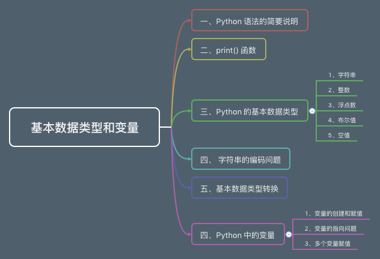

## python语法的简要说明

每种语言都有自己的语法，不管是自然语言（英语，中文）还是计算机编程语言。

Python 也不例外，它也有自己的语法规则，然后编辑器或者解析器根据符合语法的程序代码转换成 CPU 能够执行的机器码，然后执行。

Python 的语法比较简单，采用缩进方式。

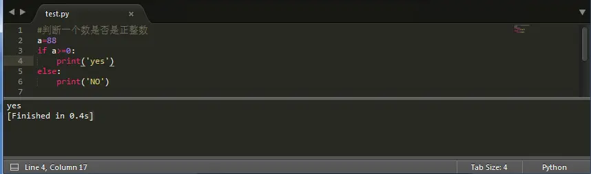

如上面的代码截图，以 # 开头的语句是注释，其他每一行都是一个语句，当语句以冒号 : 结尾时，缩进的语句视为代码块。

要注意的是 Python 程序是大小写敏感的，如果写错了大小写，程序会报错。

## print()函数

这里先说一下 `print()` 函数，如果你是新手，可能对函数不太了解，没关系，在这里你只要了解它的组成部分和作用就可以了，后面函数这一块会详细说明的。

`print()` 函数由两部分构成 ：

1.  指令：print
2.  指令的执行对象，在 print 后面的括号里的内容

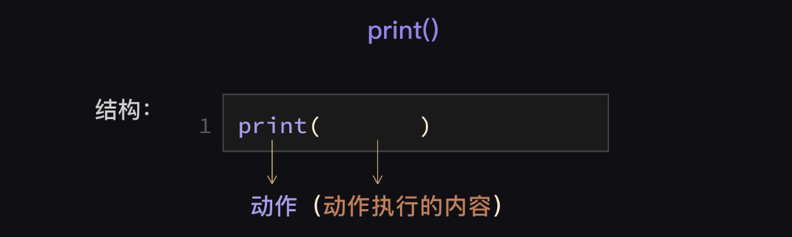

而 `print()` 函数的作用是让计算机把你给它的指令结果，显示在屏幕的终端上。这里的指令就是你在 `print()` 函数里的内容。

比如在上一章节中，我们的第一个 Python 程序，打印 `print('Hello Python')`

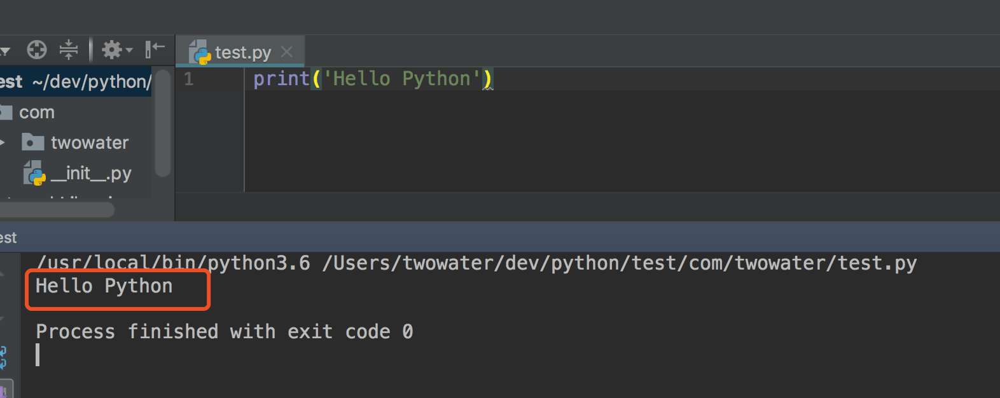

它的执行流程如下：

1. 向解释器发出指令，打印 'Hello Python' 
2. 解析器把代码解释为计算器能读懂的机器语言
3. 计算机执行完后就打印结果

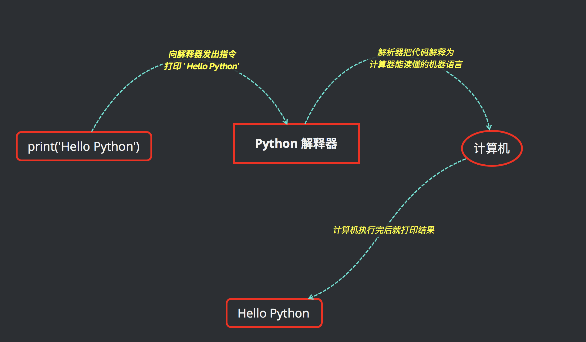

可能这里有人会问，为什么要加单引号，直接  `print(Hello Python)` 不行吗？

如果你写代码过程中，有这样的疑问，直接写一下代码，自己验证一下是最好的。

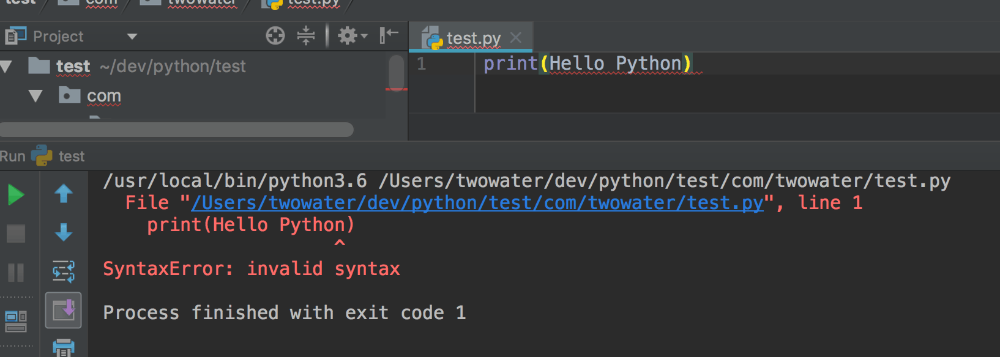

显然，去掉单引号后，运行结果标红了（报错），证明这是不可以的。

主要是因为这不符合 Python 的语法规则，去掉单引号后， Python 解释器根本没法看懂你写的是什么。

所以就报 ` SyntaxError: invalid syntax` 的错误，意思是：语法错误。说明你的语句不合规则。

## python的基本数据类型

### 1、字符串 ###

字符串英文 string ，是 python 中随处可见的数据类型，字符串的识别也非常的简单，就是用「引号」括起来的。

引号包括单引号 `' '` ，双引号 `" "` 和 三引号 `''' '''` ，比如 `'abc'` ，`"123"` 等等。

这里请注意，单引号 `''`  或双引号 `""`  本身只是一种表示方式，不是字符串的一部分，因此，字符串 `'abc'` 只有 a，b，c 这 3 个字符。

如果善于思考的你，一定会问？

为什么要有单引号 `' '` ，双引号 `" "` 和 三引号 `''' '''` 啊，直接定死一个不就好了，搞那么麻烦，那么多规则表达同一个东西干嘛？

对，一般来说一种语法只用一个规则来表示是最好的，竟然现在字符串有三种不同的表示，证明是有原因的。

那么我们先来看下这三种方式，来定义同样内容的字符串，再把它打印出来，看看是怎样的。

```python
str1 = '两点水'
str2 = "两点水"
str3 = '''两点水'''

print(str1)
print(str2)
print(str3)
```


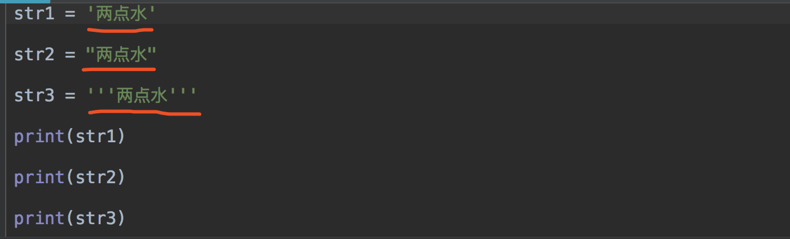

打印出来的结果是一样的。

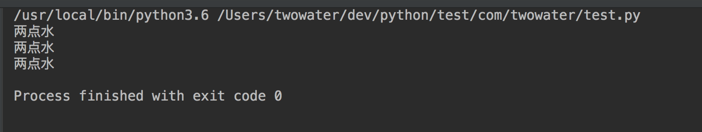

那如果我们的字符串不是 `两点水`，是 `两'点'水` 这样呢？

这样就直接报错了。

```python
str1 = '两'点'水'
print(str1)
```


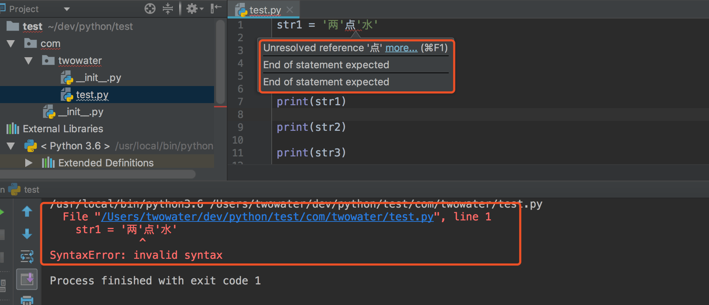

但是要注意，用单引号 `' '` 不行，用双引号 `" "` 是可以的。

```python
str2 = "两'点'水"
print(str2)
```


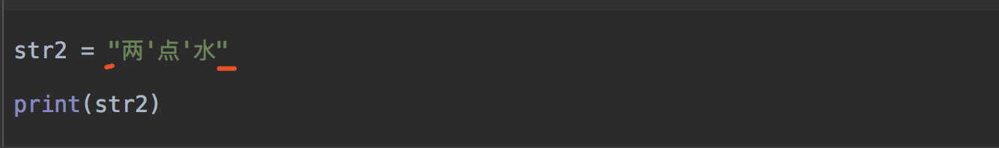

打印的结果也跟预想的一样：

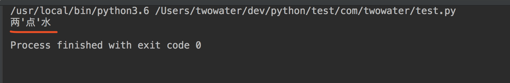

至于三引号，也是一样的，如果字符串内容里面含有双引号，也是会报同样的错误的。那么这时候你就可以用三引号了。

```python
str3 = '''两点水说："你好!"'''
print(str3)
```


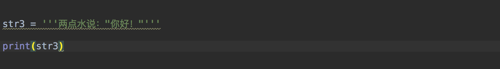

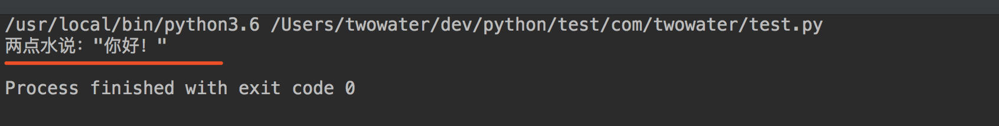

那么用单引号，双引号定义的字符串就不能表示这样的内容吗？

并不是的，你可以使用转义字符。

比如单引号，你可以使用 `\'` 来表示，双引号可以使用 `\"`  来表示。

注意，这里的是反斜杠 `\`, 不是斜杆 `/` 。

了解了之后，直接程序测试一下：

```python
str1 = '两\'点\'水'

str2 = "两点水说：\"你好！\""

print(str1)
print(str2)
```


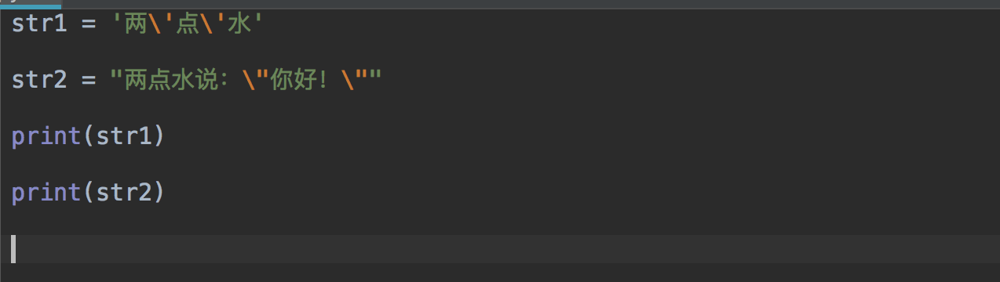

运行结果如下：

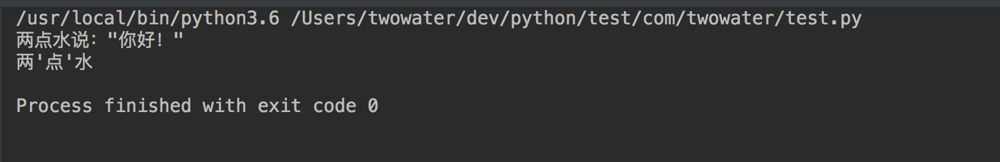

最后，也提一下， 三引号 `''' '''` 是直接可以分行的。

```python
str2 = '''两
点
水'''

print(str2)
```


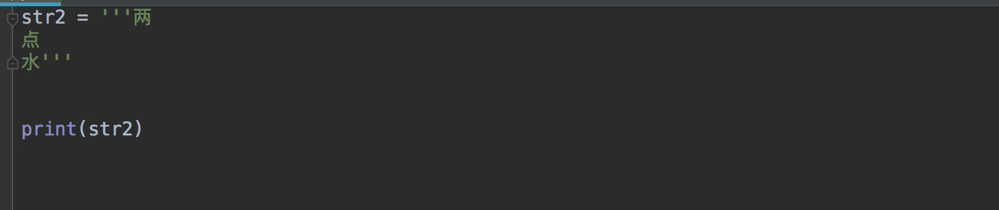

运行结果：

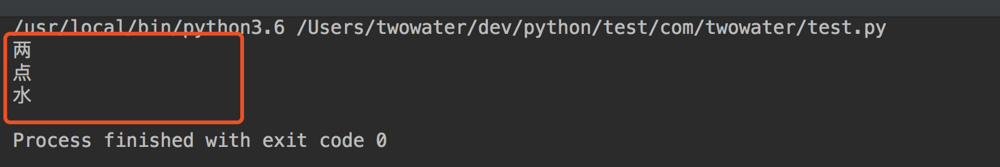


### 2、整数 ###

整数英文为 integer 。代码中的整数跟我们平常认识的整数一样，包括正整数、负整数和零，是没有小数点的数字。

Python 可以处理任意大小的整数，例如：`1`，`100`，`-8080`，`0`，等等。

```python
int1 = 1
int2 = 100
int3 = -8080
int4 = 0

print(int1)
print(int2)
print(int3)
print(int4)
```


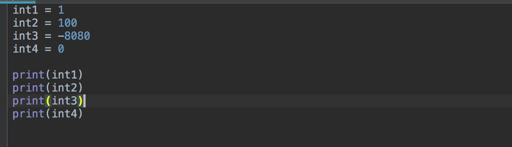

运行结果：

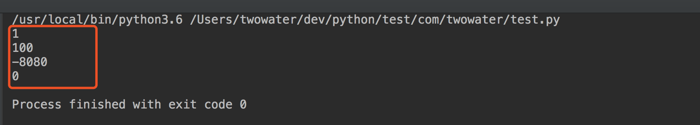

当然，要注意了，如果数字你用引号括起来了，那就属于字符串，而不属于整数。比如 `'100'` , 这 100 是字符串，不是整数。

在现实世界中，整数我们通常会做计算，因此代码世界也是一样，整数可以直接加减乘除。

比如：

```python
int1 = 1 + 2
int2 = 1 - 2
int3 = 1 * 2
int4 = 1 / 2
print(int1)
print(int2)
print(int3)
print(int4)
```


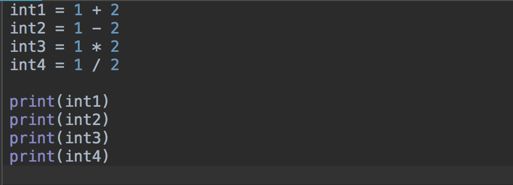

程序运行结果：

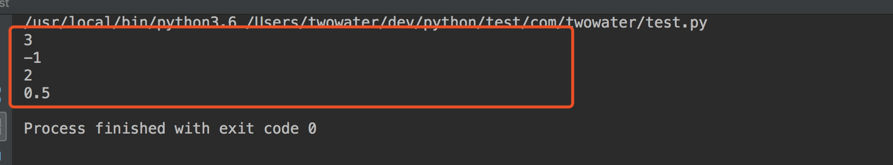

这里提示下大家，看看上面的例子，有没有发现什么？

看下 `int4` 打印出来的结果，是 `0.5` , 是一个小数。

而我们上面对整数的定义是什么？

是没有小数点的数字。

因此 `int4` 肯定不是整数。

这里我们可以使用 `type()` 函数来查看下类型。

```python
int1 = 1 + 2
int2 = 1 - 2
int3 = 1 * 2
int4 = 1 / 2
print(int1)
print(int2)
print(int3)
print(int4)

print(type(int1))
print(type(int2))
print(type(int3))
print(type(int4))
```


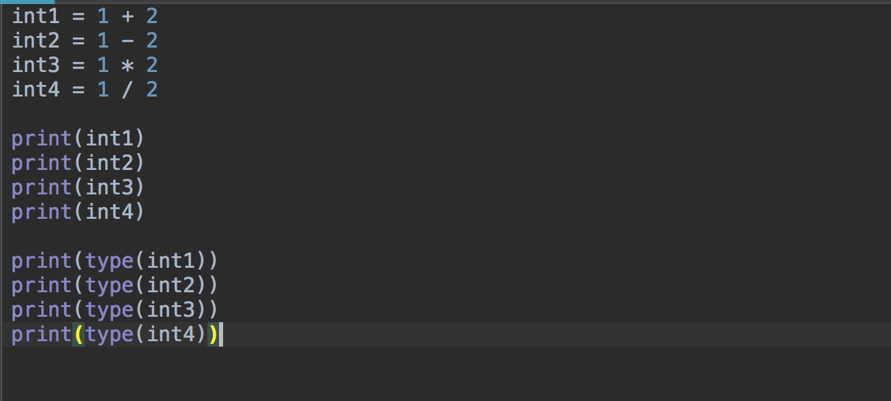

结果如下：

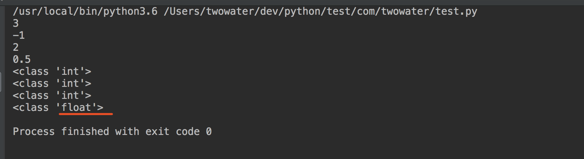

可以看到 `int4` 是 float 类型，而 `int1` ,`int2`,`int3` 都是 int 整数类型。

那么 float  是什么类型呢？

float 是浮点数类型，是我们下面会说到的。

在说浮点数之前，各位可以看下 Python 的算术运算符有哪些，有个印象。


```http
5月6日
```


### 3、浮点数 ###

浮点数的英文名是 float ，是指带小数的数字。

浮点数跟整数有很多类似的地方，但是浮点数是最折磨人的，也是最难让人捉摸透的。

就好比世界级的大佬 Herb Sutter 说的：「世上的人可以分为3类：一种是知道自己不懂浮点运算的；一种是以为自己懂浮点运算的；最后一种是极少的专家级人物，他们想知道自己是否有可能，最终完全理解浮点运算。」

为什么这么说呢？

看下面的例子 ，像整数一样，只是基本的浮点数加法运算。

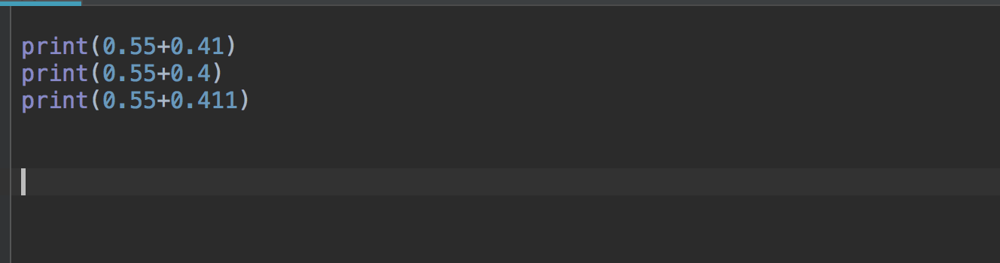

可是运算结果，对于初学者来说，可能会接受不了。

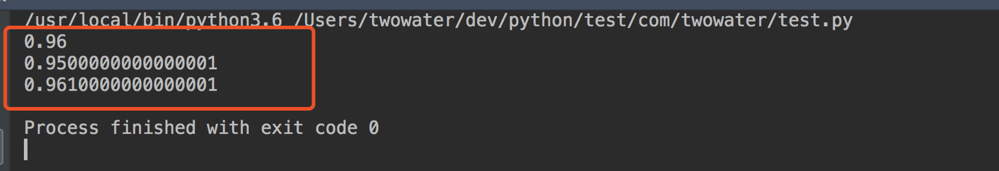

对于第一个还好，`0.55+0.41` 等于 0.96 ，运算结果完全一致。可是后面两个，你会发现怎么出现了那么多个零。

这是因为计算机对浮点数的表达本身是不精确的。保存在计算机中的是二进制数，二进制对有些数字不能准确表达，只能非常接近这个数。

所以我们在对浮点数做运算和比较大小的时候要小心。


### 4、布尔值 ###

布尔值和布尔代数的表示完全一致，一个布尔值只有 `True` 、 `False `两种值，要么是 `True`，要么是 `False`，在 Python 中，可以直接用 True、False 表示布尔值（请注意大小写），也可以通过布尔运算计算出来。

布尔值可以用 `and`、`or` 和 `not` 运算。

`and` 运算是与运算，只有所有都为 True，and 运算结果才是 True。

`or` 运算是或运算，只要其中有一个为 True，or 运算结果就是 True。

`not` 运算是非运算，它是一个单目运算符，把 True 变成 False，False 变成 True。


### 5、空值 ###

基本上每种编程语言都有自己的特殊值——空值，在 Python 中，用 None 来表示

## 字符串的编码问题

我们都知道计算机只能处理数字，如果要处理文本，就必须先把文本转换为数字才能处理。最早的计算机在设计时采用8个比特（bit）作为一个字节（byte），所以，一个字节能表示的最大的整数就是255（二进制11111111=十进制255），0 - 255被用来表示大小写英文字母、数字和一些符号，这个编码表被称为ASCII编码，比如大写字母 A 的编码是 65，小写字母 z 的编码是 122。

如果要表示中文，显然一个字节是不够的，至少需要两个字节，而且还不能和 ASCII 编码冲突，所以，中国制定了 GB2312 编码，用来把中文编进去。

类似的，日文和韩文等其他语言也有这个问题。为了统一所有文字的编码，Unicode 应运而生。Unicode 把所有语言都统一到一套编码里，这样就不会再有乱码问题了。

Unicode 通常用两个字节表示一个字符，原有的英文编码从单字节变成双字节，只需要把高字节全部填为 0 就可以。

因为 Python 的诞生比 Unicode 标准发布的时间还要早，所以最早的Python 只支持 ASCII 编码，普通的字符串 'ABC' 在 Python 内部都是 ASCII 编码的。

Python 在后来添加了对 Unicode 的支持，以 Unicode 表示的字符串用`u'...'`表示。

不过在最新的 Python 3 版本中，字符串是以 Unicode 编码的，也就是说，Python 的字符串支持多语言。就像上面的例子一样，我的代码中没有加`u'...'`，也能正常显示。

不过由于 Python 源代码也是一个文本文件，所以，当你的源代码中包含中文的时候，在保存源代码时，就需要务必指定保存为 UTF-8 编码。当Python 解释器读取源代码时，为了让它按 UTF-8 编码读取，我们通常在文件开头写上这两行：

```python
#!/usr/bin/env python3
# -*- coding: utf-8 -*-
```

第一行注释是为了告诉 Linux/OS X 系统，这是一个 Python 可执行程序，Windows 系统会忽略这个注释；

第二行注释是为了告诉 Python 解释器，按照 UTF-8 编码读取源代码，否则，你在源代码中写的中文输出可能会有乱码。

申明了 UTF-8 编码并不意味着你的 .py 文件就是 UTF-8 编码的，必须并且要确保文本编辑器正在使用 UTF-8 without BOM 编码


## 基本数据类型转换

Python 中基本数据类型转换的方法有下面几个。

| 方法                   | 说明                                                  |
| ---------------------- | ----------------------------------------------------- |
| int(x [,base ])        | 将x转换为一个整数                                     |
| float(x )              | 将x转换到一个浮点数                                   |
| complex(real [,imag ]) | 创建一个复数                                          |
| str(x )                | 将对象 x 转换为字符串                                 |
| repr(x )               | 将对象 x 转换为表达式字符串                           |
| eval(str )             | 用来计算在字符串中的有效 Python 表达式,并返回一个对象 |
| tuple(s )              | 将序列 s 转换为一个元组                               |
| list(s )               | 将序列 s 转换为一个列表                               |
| chr(x )                | 将一个整数转换为一个字符                              |
| unichr(x )             | 将一个整数转换为 Unicode 字符                         |
| ord(x )                | 将一个字符转换为它的整数值                            |
| hex(x )                | 将一个整数转换为一个十六进制字符串                    |
| oct(x )                | 将一个整数转换为一个八进制字符串                      |

注：在 Python 3 里，只有一种整数类型 int，表示为长整型，没有 python2 中的 Long。

这里我们可以尝试一下这些函数方法。

比如 `int()` 函数，将符合规则的字符串类型转化为整数 。

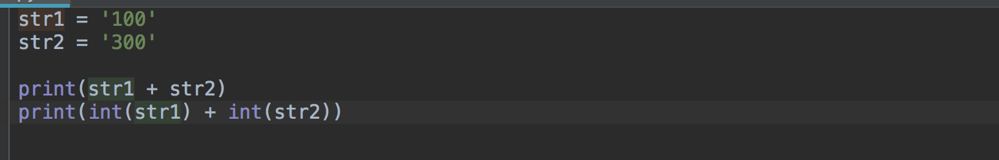

输出结果：

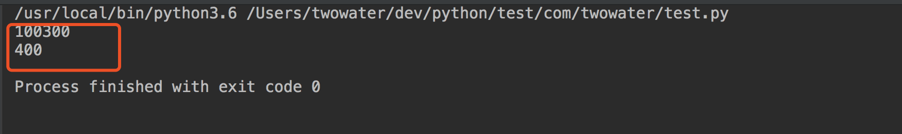

注意这里是符合规则的字符串类型，如果是文字形式等字符串是不可以被 `int()` 函数强制转换的。

还有小数形式的字符串也是不能用  `int()`  函数转换的。

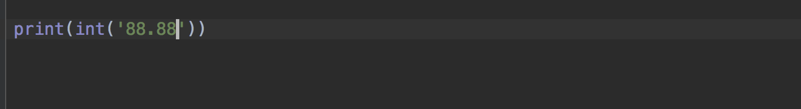

这样转换会报错。

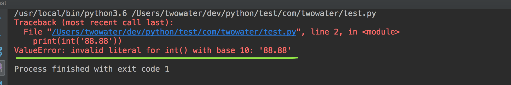

但这并不是意味着浮点数不能转化为整数，而是小数形式的字符串不能强转为字符串。

浮点数还是可以通过 `int()`  函数转换的。

比如：

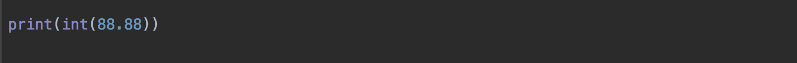

输出结果：

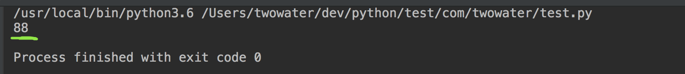

但是你会发现，结果是 88 ，后面小数点的 0.88 被去掉了。

这是因为  `int()`  函数是将数据转为整数。如果是浮点数转为整数，那么  `int()`  函数就会做取整处理，只取整数部分。所以输出的结果为 88 。

其余的方法就不一一列举了，只要多用，多试，这些方法都会慢慢熟悉的。还有如果是初学者，完全可以每个方法都玩一下，写一下，随便写，然后运行看结果，反正你的电脑又不会因为这样而玩坏的。

## python中的变量

### 1、变量的创建和赋值 ###

在 Python 程序中，变量是用一个变量名表示，可以是任意数据类型，变量名必须是大小写英文、数字和下划线（_）的组合，且不能用数字开头，比如：

```python
a=88
```

这里的 `a` 就是一个变量，代表一个整数，注意一点是 Python 是不用声明数据类型的。在 Python 中 `=` 是赋值语句，跟其他的编程语言也是一样的，因为 Python 定义变量时不需要声明数据类型，因此可以把任意的数据类型赋值给变量，且同一个变量可以反复赋值，而且可以是不同的数据类型。

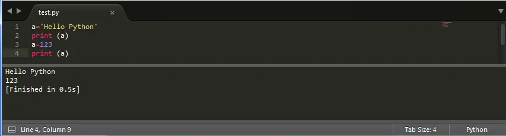

这种变量本身类型不固定的语言称之为动态语言，与之对应的是静态语言。静态语言在定义变量时必须指定变量类型，如果赋值的时候类型不匹配，就会报错。例如 Java 是静态语言。


### 2、变量的指向问题 ###

我们来看下这段代码，发现最后打印出来的变量 b 是 `Hello Python` 。

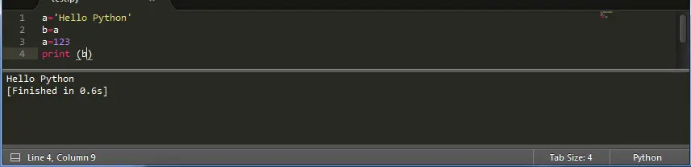

这主要是变量 a 一开始是指向了字符串 `Hello Python` ，`b=a` 创建了变量 b ,变量 b 也指向了a 指向的字符串 `Hello Python`，最后 `a=123`，把 变量 a 重新指向了 `123`，所以最后输出变量 b 是 `Hello Python`


 

### 3、多个变量赋值 ###

Python 允许同时为多个变量赋值。例如：

```python
a = b = c = 1
```

以上实例，创建一个整型对象，值为 1，三个变量被分配到相同的内存空间上。

当然也可以为多个对象指定多个变量。例如：

```python
a, b, c = 1, 2, "liangdianshui"
```

以上实例，两个整型对象 1 和 2 的分配给变量 a 和 b，字符串对象 "liangdianshui" 分配给变量 c。

# 二、List 和 Tuple

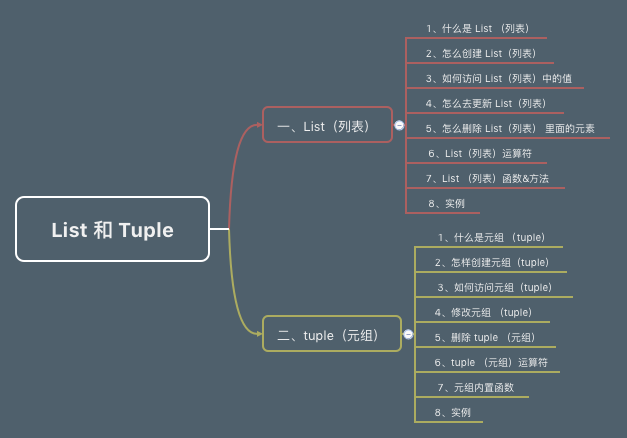

## List（列表）

### 1、什么是 List （列表）

List （列表）是 Python 内置的一种数据类型。 它是一种有序的集合，可以随时添加和删除其中的元素。

那为什么要有 List （列表）呢？

我们用一个例子来说明。

现在有一个团队要出去玩，要先报名。如果用我们之前学过的知识，那么就是用一个字符串变量把他们都记录起来。

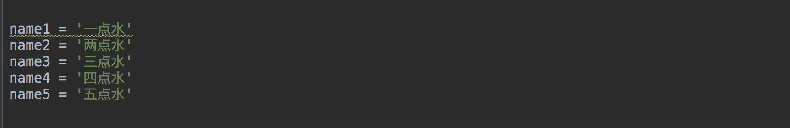

但是这样太麻烦了，而且也不美观。

在编程中，一定要学会偷懒，避免「重复性工作」。如果有一百个成员，那么你及时是复制粘贴，也会把你写烦。

这时候就可以使用列表了。

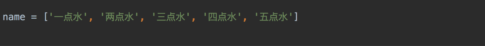

就这样，一行代码就可以存放 N 多个名字了。


### 2、怎么创建 List（列表） ###

从上面的例子可以分析出，列表的格式是这样的。

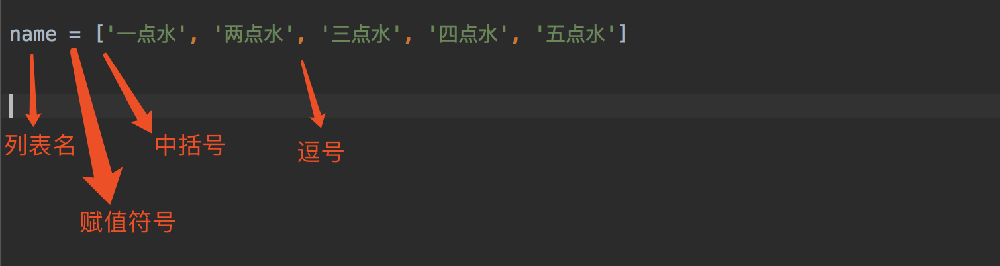

其实列表就是用中括号 `[]` 括起来的数据，里面的每一个数据就叫做元素。每个元素之间使用逗号分隔。

而且列表的数据元素不一定是相同的数据类型。

比如：

```python
list1=['两点水','twowter','liangdianshui',123]
```

这里有字符串类型，还有整数类型。

我们尝试把他打印出来，看看打印的结果是怎样的。

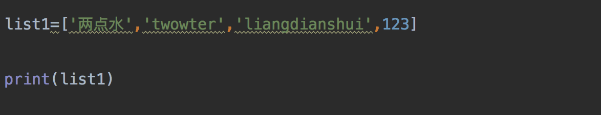

结果如下：

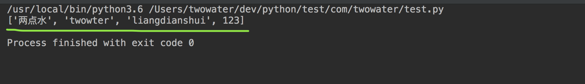


### 3、如何访问 List（列表）中的值 ###

就像一开始的例子，我们有时候不需要把全部人员的姓名都打印出来，有时候我们需要知道第 3 个报名的人是谁？前两名报名的是谁？

那么怎么从列表中取出来呢？

换种问法就是，怎么去访问列表中的值？

这时候我们可以通过列表的下标索引来访问列表中的值，同样你也可以使用方括号的形式截取字符。

例如：

```python
name = ['一点水', '两点水', '三点水', '四点水', '五点水']

# 通过索引来访问列表
print(name[2])
# 通过方括号的形式来截取列表中的数据
print(name[0:2])
```

输出的结果：

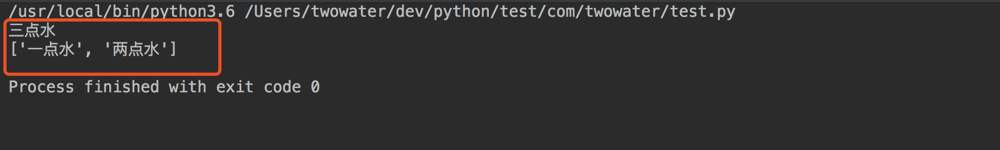

可见，我们需要知道知道 `name` 这个列表中第三个报名的是谁？只需要用 `name[2]`  就可以了。

这里你会问，为什么是 2 ，不是 3 呢？

这是因为在编程世界中，都是从 0 开始的，而不是我们生活习惯中从 1 开始。

所以需要知道第三个是谁？

那就是  `name[2]`  就可以了。

从例子来看，我们还把 `name[0:2]` 的结果打印出来了。

从打印结果来看，只打印了第一，第二个元素内容。

这里可能会有疑问？

为什么不是打印前三个啊，不是说 2 就是第 3 个吗？

那是因为这是**左闭右开**区间的。

所以 `name[0:2]` 的意思就是从第 0 个开始取，取到第 2 个，但是不包含第 2 个。

还是那句话，为了更好的理解，可以多去尝试，多去玩编程。

所以你可以尝试下下面的各种方式：

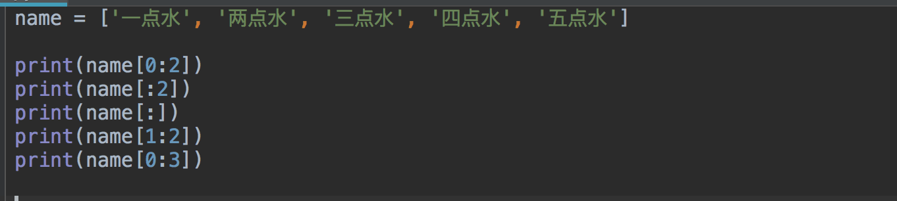

看看输出的结果：

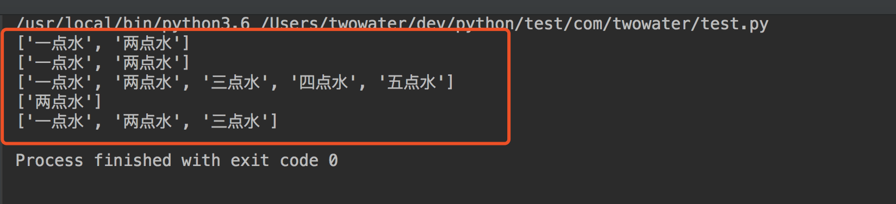

根据输出的结果和上面讲到的知识，就很容易理解其中的一些用法了。

### 4、怎么去更新 List（列表） ###

还是一开始的例子，我们用代码记录了报名人的名字，那后面可能会有新人加入，也有可能会发现一开始写错名字了，想要修改。

这时候怎么办呢？

这时候可以通过索引对列表的数据项进行修改或更新，也可以使用 append() 方法来添加列表项。

```python
name = ['一点水', '两点水', '三点水', '四点水', '五点水']


# 通过索引对列表的数据项进行修改或更新
name[1]='2点水'
print(name)

# 使用 append() 方法来添加列表项
name.append('六点水')
print(name)
```

输出的结果：

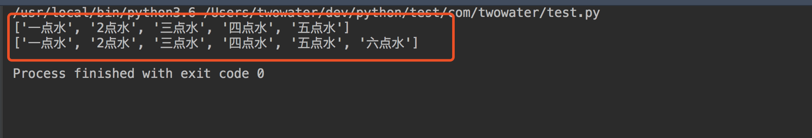


### 5、怎么删除 List（列表） 里面的元素 ###

那既然这样，肯定会有人中途退出的。

那么我们就需要在列表中，把他的名字去掉。

这时候使用 del 语句来删除列表的的元素

```python
name = ['一点水', '两点水', '三点水', '四点水', '五点水']

print(name)

# 使用 del 语句来删除列表的的元素
del name[3]
print(name)
```

输出的结果:

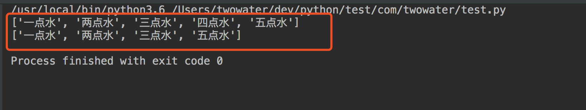

你看输出的结果，列表中已经没有了 `四点水` 这个数据了。证明已经删除成功了。


### 6、List（列表）运算符 ###

列表对 `+`  和 `*`  的操作符与字符串相似。`+` 号用于组合列表，`*`  号用于重复列表。

| Python 表达式                | 结果                         | 描述                 |
| ---------------------------- | ---------------------------- | -------------------- |
| len([1, 2, 3])               | 3                            | 计算元素个数         |
| [1, 2, 3] + [4, 5, 6]        | [1, 2, 3, 4, 5, 6]           | 组合                 |
| ['Hi!'] * 4                  | ['Hi!', 'Hi!', 'Hi!', 'Hi!'] | 复制                 |
| 3 in [1, 2, 3]               | True                         | 元素是否存在于列表中 |
| for x in [1, 2, 3]: print x, | 1 2 3                        | 迭代                 |


### 7、List （列表）函数&方法 ###

| 函数&方法               | 描述                                                         |
| ----------------------- | ------------------------------------------------------------ |
| len(list)               | 列表元素个数                                                 |
| max(list)               | 返回列表元素最大值                                           |
| min(list)               | 返回列表元素最小值                                           |
| list(seq)               | 将元组转换为列表                                             |
| list.append(obj)        | 在列表末尾添加新的对象                                       |
| list.count(obj)         | 统计某个元素在列表中出现的次数                               |
| list.extend(seq)        | 在列表末尾一次性追加另一个序列中的多个值（用新列表扩展原来的列表） |
| list.index(obj)         | 从列表中找出某个值第一个匹配项的索引位置                     |
| list.insert(index, obj) | 将对象插入列表                                               |
| list.pop(obj=list[-1])  | 移除列表中的一个元素（默认最后一个元素），并且返回该元素的值 |
| list.remove(obj)        | 移除列表中的一个元素（参数是列表中元素），并且不返回任何值   |
| list.reverse()          | 反向列表中元素                                               |
| list.sort([func])       | 对原列表进行排序                                             |


### 8、实例 ###


最后通过一个例子来熟悉了解 List 的操作

例子：

```python
#-*-coding:utf-8-*-
#-----------------------list的使用----------------------------------

# 1.一个产品，需要列出产品的用户，这时候就可以使用一个 list 来表示
user=['liangdianshui','twowater','两点水']
print('1.产品用户')
print(user)

# 2.如果需要统计有多少个用户，这时候 len() 函数可以获的 list 里元素的个数
len(user)
print('\n2.统计有多少个用户')
print(len(user))

# 3.此时，如果需要知道具体的用户呢？可以用过索引来访问 list 中每一个位置的元素，索引是0从开始的
print('\n3.查看具体的用户')
print(user[0]+','+user[1]+','+user[2])

# 4.突然来了一个新的用户，这时我们需要在原有的 list 末尾加一个用户
user.append('茵茵')
print('\n4.在末尾添加新用户')
print(user)

# 5.又新增了一个用户，可是这个用户是 VIP 级别的学生，需要放在第一位，可以通过 insert 方法插入到指定的位置
# 注意：插入数据的时候注意是否越界，索引不能超过 len(user)-1
user.insert(0,'VIP用户')
print('\n5.指定位置添加用户')
print(user)

# 6.突然发现之前弄错了，“茵茵”就是'VIP用户'，因此，需要删除“茵茵”；pop() 删除 list 末尾的元素
user.pop()
print('\n6.删除末尾用户')
print(user)

# 7.过了一段时间，用户“liangdianshui”不玩这个产品，删除了账号
# 因此需要要删除指定位置的元素，用pop(i)方法，其中i是索引位置
user.pop(1)
print('\n7.删除指定位置的list元素')
print(user)

# 8.用户“两点水”想修改自己的昵称了
user[2]='三点水'
print('\n8.把某个元素替换成别的元素')
print(user)

# 9.单单保存用户昵称好像不够好，最好把账号也放进去
# 这里账号是整数类型，跟昵称的字符串类型不同，不过 list 里面的元素的数据类型是可以不同的
# 而且 list 元素也可以是另一个 list
newUser=[['VIP用户',11111],['twowater',22222],['三点水',33333]]
print('\n9.不同元素类型的list数据')
print(newUser)

```

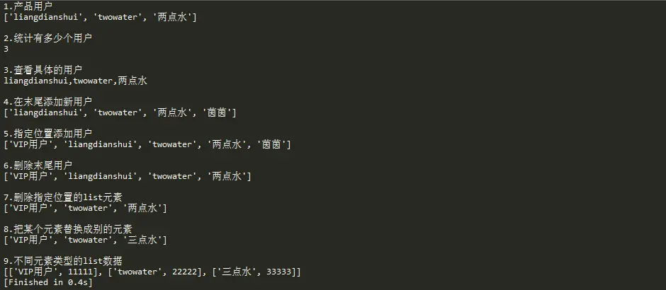


## tuple（元组）

### 1、什么是元组 （tuple） ###

上一节刚说了一个有序列表 List ，现在说另一种有序列表叫元组：tuple 。

tuple 和 List 非常类似，但是 tuple 一旦初始化就不能修改。
也就是说元组（tuple）是不可变的，那么不可变是指什么意思呢？

元组（tuple） 不可变是指当你创建了 tuple 时候，它就不能改变了，也就是说它也没有 append()，insert() 这样的方法，但它也有获取某个索引值的方法，但是不能赋值。

那么为什么要有 tuple 呢？

那是因为 tuple 是不可变的，所以代码更安全。

所以建议能用 tuple 代替 list 就尽量用 tuple 。


### 2、怎样创建元组（tuple） ###

元组创建很简单，只需要在括号中添加元素，并使用逗号隔开即可。

```python
tuple1=('两点水','twowter','liangdianshui',123,456)
tuple2='两点水','twowter','liangdianshui',123,456
```

创建空元组

```python
tuple3=()
```

元组中只包含一个元素时，需要在元素后面添加逗号

```python
tuple4=(123,)
```

如果不加逗号，创建出来的就不是 元组（tuple），而是指 ```123``` 这个数了。


这是因为括号 () 既可以表示元组（tuple），又可以表示数学公式中的小括号，这就产生了歧义。

所以如果只有一个元素时，你不加逗号，计算机就根本没法识别你是要进行整数或者小数运算还是表示元组。

因此，Python 规定，这种情况下，按小括号进行计算，计算结果自然是 ```123``` ，而如果你要表示元组的时候，就需要加个逗号。

具体看下图 tuple4 和 tuple5 的输出值

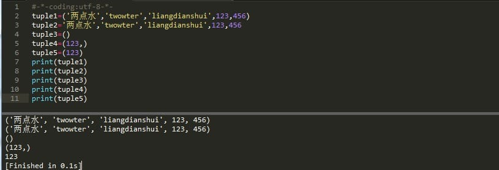


### 3、如何访问元组（tuple） ###

元组下标索引也是从 0 开始，元组（tuple）可以使用下标索引来访问元组中的值。

```python
#-*-coding:utf-8-*-

tuple1=('两点水','twowter','liangdianshui',123,456)
tuple2='两点水','twowter','liangdianshui',123,456

print(tuple1[1])
print(tuple2[0])
```

输出的结果：

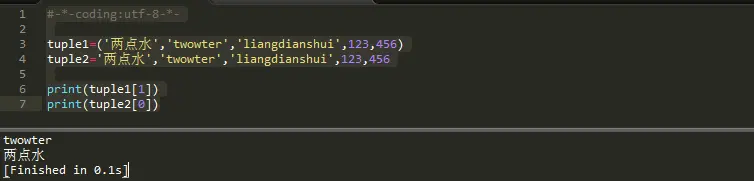


### 4、修改元组 （tuple） ###

可能看到这个小标题有人会疑问，上面不是花了一大段来说 tuple 是不可变的吗？

这里怎么又来修改 tuple （元组） 了。

那是因为元组中的元素值是不允许修改的，但我们可以对元组进行连接组合，还有通过修改其他列表的值从而影响 tuple 的值。

具体看下面的这个例子：

```python
#-*-coding:utf-8-*-
list1=[123,456]
tuple1=('两点水','twowater','liangdianshui',list1)
print(tuple1)
list1[0]=789
list1[1]=100
print(tuple1)
```

输出的结果：

```
('两点水', 'twowater', 'liangdianshui', [123, 456])
('两点水', 'twowater', 'liangdianshui', [789, 100])
```


可以看到，两次输出的 tuple 值是变了的。我们看看 tuple1 的存储是怎样的。


可以看到，tuple1 有四个元素，最后一个元素是一个 List ，List 列表里有两个元素。

当我们把 List 列表中的两个元素 `124` 和 `456` 修改为 `789` 和 `100` 的时候，从输出来的 tuple1 的值来看，好像确实是改变了。

但其实变的不是 tuple 的元素，而是 list 的元素。

tuple 一开始指向的 list 并没有改成别的 list，所以，tuple 所谓的“不变”是说，tuple 的每个元素，指向永远不变。注意是 tupe1 中的第四个元素还是指向原来的 list ，是没有变的，我们修改的只是列表 List 里面的元素。


### 5、删除 tuple （元组） ###

tuple 元组中的元素值是不允许删除的，但我们可以使用 del 语句来删除整个元组

```python
#-*-coding:utf-8-*-

tuple1=('两点水','twowter','liangdianshui',[123,456])
print(tuple1)
del tuple1
```

### 6、tuple （元组）运算符 ###

与字符串一样，元组之间可以使用 `+` 号和 `*` 号进行运算。这就意味着他们可以组合和复制，运算后会生成一个新的元组。

| Python 表达式                 | 结果                         | 描述         |
| ----------------------------- | ---------------------------- | ------------ |
| len((1, 2, 3))                | 3                            | 计算元素个数 |
| (1, 2, 3) + (4, 5, 6)         | (1, 2, 3, 4, 5, 6)           | 连接         |
| ('Hi!',) * 4                  | ('Hi!', 'Hi!', 'Hi!', 'Hi!') | 复制         |
| 3 in (1, 2, 3)                | True                         | 元素是否存在 |
| for x in (1, 2, 3):  print(x) | 1 2 3                        | 迭代         |

### 7、元组内置函数 ###

| 方法       | 描述                 |
| ---------- | -------------------- |
| len(tuple) | 计算元组元素个数     |
| max(tuple) | 返回元组中元素最大值 |
| min(tuple) | 返回元组中元素最小值 |
| tuple(seq) | 将列表转换为元组     |


### 8、实例 ###

最后跟列表一样，来一个实例，大家也可以多尝试，去把元组的各种玩法玩一遍。

```python
name1 = ('一点水', '两点水', '三点水', '四点水', '五点水')

name2 = ('1点水', '2点水', '3点水', '4点水', '5点水')

list1 = [1, 2, 3, 4, 5]

# 计算元素个数
print(len(name1))
# 连接,两个元组相加
print(name1 + name2)
# 复制元组
print(name1 * 2)
# 元素是否存在 (name1 这个元组中是否含有一点水这个元素)
print('一点水' in name1)
# 元素的最大值
print(max(name2))
# 元素的最小值
print(min(name2))
# 将列表转换为元组
print(tuple(list1))
```

输出的结果如下：

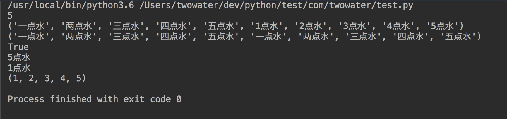

# 三、Dict 和 Set

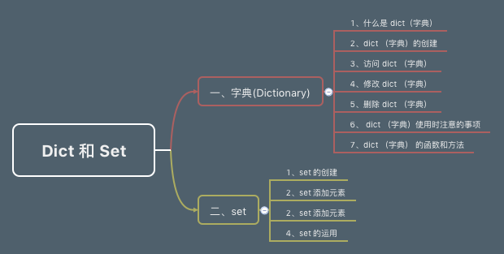

## 字典(Dictionary)

### 1、什么是 dict（字典） ###

上一章节，我们学习了列表（List） 和 元组（tuple） 来表示有序集合。

而我们在讲列表（list）的时候，我们用了列表（list） 来存储用户的姓名。

```python
name = ['一点水', '两点水', '三点水', '四点水', '五点水']
```

那么如果我们为了方便联系这些童鞋，要把电话号码也添加进去，该怎么做呢？

用 list 可以这样子解决：

```python
name = [['一点水', '131456780001'], ['两点水', '131456780002'], ['三点水', '131456780003'], ['四点水', '131456780004'], ['五点水', '131456780005']]
```

但是这样很不方便，我们把电话号码记录下来，就是为了有什么事能及时联系上这些童鞋。

如果用列表来存储这些，列表越长，我们查找起来耗时就越长。

这时候就可以用 dict （字典）来表示了，Python 内置了 字典（dict），dict 全称 dictionary，如果学过 Java ，字典就相当于 JAVA 中的 map，使用键-值（key-value）存储，具有极快的查找速度。

```python
name = {'一点水': '131456780001', '两点水': '131456780002', '三点水': '131456780003', '四点水': '131456780004', '五点水': '131456780005'}
```


### 2、dict （字典）的创建 ###

字典是另一种可变容器模型，且可存储任意类型对象。

字典的每个键值(key=>value)对用冒号(:)分割，每个对之间用逗号(,)分割，整个字典包括在花括号({})中 ,格式如下所示：

```python
dict = {key1 : value1, key2 : value2 }
```

注意：键必须是唯一的，但值则不必。值可以取任何数据类型，但键必须是不可变的。

创建 dict（字典）实例：

```python
dict1={'liangdianshui':'111111' ,'twowater':'222222' ,'两点水':'333333'}
dict2={'abc':1234,1234:'abc'}
```


### 3、访问 dict （字典） ###

我们知道了怎么创建列表了，回归到一开始提出到的问题，为什么使用字典能让我们很快的找出某个童鞋的电话呢？


```python
name = {'一点水': '131456780001', '两点水': '131456780002', '三点水': '131456780003', '四点水': '131456780004', '五点水': '131456780005'}

print(name['两点水'])
```


输出的结果：

```
131456780002
```

可以看到，如果你知道某个人的名字，也就是 key 值， 就能很快的查找到他对应的电话号码，也就是 Value 。

这里需要注意的一点是：如果字典中没有这个键，是会报错的。


### 4、修改 dict （字典） ###

向字典添加新内容的方法是增加新的键/值对，修改或删除已有键/值对

```python
#-*-coding:utf-8-*-
dict1={'liangdianshui':'111111' ,'twowater':'222222' ,'两点水':'333333'}
print(dict1)
# 新增一个键值对
dict1['jack']='444444'
print(dict1)
# 修改键值对
dict1['liangdianshui']='555555'
print(dict1)
```

输出的结果：

```
{'liangdianshui': '111111', 'twowater': '222222', '两点水': '333333'}
{'liangdianshui': '111111', 'twowater': '222222', '两点水': '333333', 'jack': '444444'}
{'liangdianshui': '555555', 'twowater': '222222', '两点水': '333333', 'jack': '444444'}
```

### 5、删除 dict （字典） ###

通过 `del` 可以删除 dict （字典）中的某个元素，也能删除 dict （字典）

通过调用 `clear()` 方法可以清除字典中的所有元素

```python
#-*-coding:utf-8-*-
dict1={'liangdianshui':'111111' ,'twowater':'222222' ,'两点水':'333333'}
print(dict1)
# 通过 key 值，删除对应的元素
del dict1['twowater']
print(dict1)
# 删除字典中的所有元素
dict1.clear()
print(dict1)
# 删除字典
del dict1
```

输出的结果：

```
{'liangdianshui': '111111', 'twowater': '222222', '两点水': '333333'}
{'liangdianshui': '111111', '两点水': '333333'}
{}
```

### 6、 dict （字典）使用时注意的事项 ###

(1) dict （字典）是不允许一个键创建两次的，但是在创建 dict （字典）的时候如果出现了一个键值赋予了两次，会以最后一次赋予的值为准

例如：

```python
#-*-coding:utf-8-*-
dict1={'liangdianshui':'111111' ,'twowater':'222222' ,'两点水':'333333','twowater':'444444'}
print(dict1)
print(dict1['twowater'])
```

输出的结果：

```
{'liangdianshui': '111111', 'twowater': '444444', '两点水': '333333'}
444444
```


(2) dict （字典）键必须不可变，可是键可以用数字，字符串或元组充当，但是就是不能使用列表

例如：

```python
#-*-coding:utf-8-*-
dict1={'liangdianshui':'111111' ,123:'222222' ,(123,'tom'):'333333','twowater':'444444'}
print(dict1)
```

输出结果：

```
{'liangdianshui': '111111', 123: '222222', (123, 'tom'): '333333', 'twowater': '444444'}
```

(3) dict 内部存放的顺序和 key 放入的顺序是没有任何关系

和 list 比较，dict 有以下几个特点：

* 查找和插入的速度极快，不会随着key的增加而变慢

* 需要占用大量的内存，内存浪费多

而list相反：

* 查找和插入的时间随着元素的增加而增加

* 占用空间小，浪费内存很少


### 7、dict （字典） 的函数和方法 ###

| 方法和函数     | 描述                                             |
| -------------- | ------------------------------------------------ |
| len(dict)      | 计算字典元素个数                                 |
| str(dict)      | 输出字典可打印的字符串表示                       |
| type(variable) | 返回输入的变量类型，如果变量是字典就返回字典类型 |
| dict.clear()   | 删除字典内所有元素                               |
| dict.copy()    | 返回一个字典的浅复制                             |
| dict.values()  | 以列表返回字典中的所有值                         |
| popitem()      | 随机返回并删除字典中的一对键和值                 |
| dict.items()   | 以列表返回可遍历的(键, 值) 元组数组              |

## set

python 的 set 和其他语言类似, 是一个无序不重复元素集, 基本功能包括关系测试和消除重复元素。

set 和 dict 类似，但是 set 不存储 value 值的。


### 1、set 的创建 ###

创建一个 set，需要提供一个 list 作为输入集合

```python
set1=set([123,456,789])
print(set1)
```

输出结果：

```
{456, 123, 789}
```

传入的参数 `[123,456,789]` 是一个 list，而显示的 `{456, 123, 789}` 只是告诉你这个 set 内部有 456, 123, 789 这 3 个元素，显示的顺序跟你参数中的 list 里的元素的顺序是不一致的，这也说明了 set 是无序的。

还有一点，我们观察到输出的结果是在大括号中的，经过之前的学习，可以知道，tuple (元组) 使用小括号，list (列表) 使用方括号, dict (字典) 使用的是大括号，dict 也是无序的，只不过 dict 保存的是 key-value 键值对值，而 set 可以理解为只保存 key 值。

回忆一下，在 dict （字典） 中创建时，有重复的 key ，会被后面的 key-value 值覆盖的，而 重复元素在 set 中自动被过滤的。


```python
set1=set([123,456,789,123,123])
print(set1)
```

输出的结果：

```
{456, 123, 789}
```

### 2、set 添加元素 ###

通过 add(key) 方法可以添加元素到 set 中，可以重复添加，但不会有效果

```python
set1=set([123,456,789])
print(set1)
set1.add(100)
print(set1)
set1.add(100)
print(set1)
```

输出结果：

```
{456, 123, 789}
{456, 123, 100, 789}
{456, 123, 100, 789}
```

### 3、set 删除元素 ###

通过 remove(key) 方法可以删除 set 中的元素

```python
set1=set([123,456,789])
print(set1)
set1.remove(456)
print(set1)
```

输出的结果：

```
{456, 123, 789}
{123, 789}
```


### 4、set 的运用 ###

因为 set 是一个无序不重复元素集，因此，两个 set 可以做数学意义上的 union(并集), intersection(交集), difference(差集) 等操作。

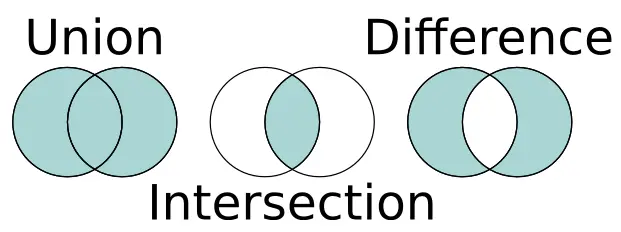

例子：

```python
set1=set('hello')
set2=set(['p','y','y','h','o','n'])
print(set1)
print(set2)

# 交集 (求两个 set 集合中相同的元素)
set3=set1 & set2
print('\n交集 set3:')
print(set3)
# 并集 （合并两个 set 集合的元素并去除重复的值）
set4=set1 | set2
print('\n并集 set4:')
print(set4)
# 差集
set5=set1 - set2
set6=set2 - set1
print('\n差集 set5:')
print(set5)
print('\n差集 set6:')
print( set6)


# 去除海量列表里重复元素，用 hash 来解决也行，只不过感觉在性能上不是很高，用 set 解决还是很不错的
list1 = [111,222,333,444,111,222,333,444,555,666]  
set7=set(list1)
print('\n去除列表里重复元素 set7:')
print(set7)

```

运行的结果：

```
{'h', 'l', 'e', 'o'}
{'h', 'n', 'o', 'y', 'p'}

交集 set3:
{'h', 'o'}

并集 set4:
{'h', 'p', 'n', 'e', 'o', 'y', 'l'}

差集 set5:
{'l', 'e'}

差集 set6:
{'p', 'y', 'n'}

去除列表里重复元素 set7:
{555, 333, 111, 666, 444, 222}
```


# 四、条件语句和循环语句

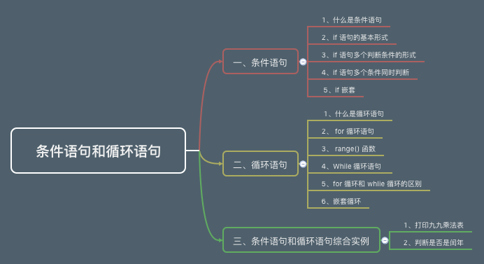

## 条件语句

### 1、什么是条件语句 ###


Python 条件语句跟其他语言基本一致的，都是通过一条或多条语句的执行结果（ True 或者 False ）来决定执行的代码块。

Python 程序语言指定任何非 0 和非空（null）值为 True，0 或者 null 为 False。

执行的流程图如下：

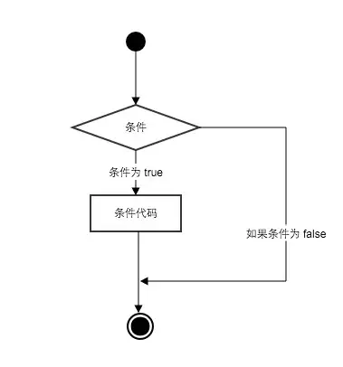


### 2、if 语句的基本形式 ###

Python 中，if 语句的基本形式如下：

```python
if 判断条件：
    执行语句……
else：
    执行语句……
```

之前的章节也提到过，Python 语言有着严格的缩进要求，因此这里也需要注意缩进，也不要少写了冒号 `:` 。

if 语句的判断条件可以用>（大于）、<(小于)、==（等于）、>=（大于等于）、<=（小于等于）来表示其关系。

例如：

```python
# -*-coding:utf-8-*-

results=59

if results>=60:
    print ('及格')
else :
    print ('不及格')

```

输出的结果为：

```txt
不及格
```

上面也说到，非零数值、非空字符串、非空 list 等，判断为 True，否则为 False。因此也可以这样写：

```python
num = 6
if num :
    print('Hello Python')
```

输出的结果如下：

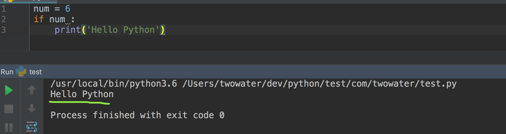

可见，把结果打印出来了。

那如果我们把 `num ` 改为空字符串呢？

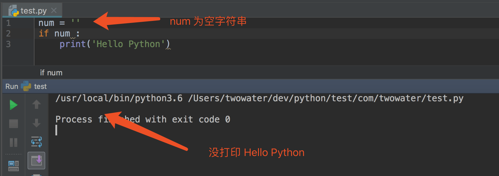

很明显，空字符串是为 False 的，不符合条件语句，因此不会执行到  `print('Hello Python')`  这段代码。

还有再啰嗦一点，提醒一下，在条件判断代码中的冒号 `:` 后、下一行内容是一定要缩进的。不缩进是会报错的。

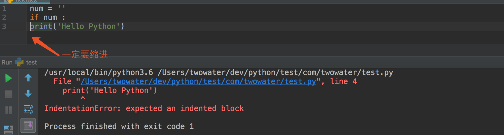

冒号和缩进是一种语法。它会帮助 Python 区分代码之间的层次，理解条件执行的逻辑及先后顺序。


### 3、if 语句多个判断条件的形式 ###

有些时候，我们的判断语句不可能只有两个，有些时候需要多个，比如上面的例子中大于 60 的为及格，那我们还要判断大于 90 的为优秀，在 80 到 90 之间的良好呢？

这时候需要用到 if 语句多个判断条件，

用伪代码来表示：

```python
if 判断条件1:
    执行语句1……
elif 判断条件2:
    执行语句2……
elif 判断条件3:
    执行语句3……
else:
    执行语句4……
```

实例：

```python
# -*-coding:utf-8-*-

results = 89

if results > 90:
    print('优秀')
elif results > 80:
    print('良好')
elif results > 60:
    print ('及格')
else :
    print ('不及格')

```

输出的结果：

```txt
良好
```


### 4、if 语句多个条件同时判断 ###

有时候我们会遇到多个条件的时候该怎么操作呢？

比如说要求 java 和 python 的考试成绩要大于 80 分的时候才算优秀，这时候该怎么做？

这时候我们可以结合 `or` 和  `and` 来使用。

or （或）表示两个条件有一个成立时判断条件成功

and （与）表示只有两个条件同时成立的情况下，判断条件才成功。

例如：

```python
# -*-coding:utf-8-*-

java = 86
python = 68

if java > 80 and  python > 80:
    print('优秀')
else :
    print('不优秀')

if ( java >= 80  and java < 90 )  or ( python >= 80 and python < 90):
    print('良好')

```

输出结果：

```txt
不优秀
良好
```

注意：if 有多个条件时可使用括号来区分判断的先后顺序，括号中的判断优先执行，此外 and 和 or 的优先级低于 >（大于）、<（小于）等判断符号，即大于和小于在没有括号的情况下会比与或要优先判断。

### 5、if 嵌套 ###

if 嵌套是指什么呢？

就跟字面意思差不多，指 if 语句中可以嵌套 if 语句。

比如上面说到的例子，也可以用 if 嵌套来写。

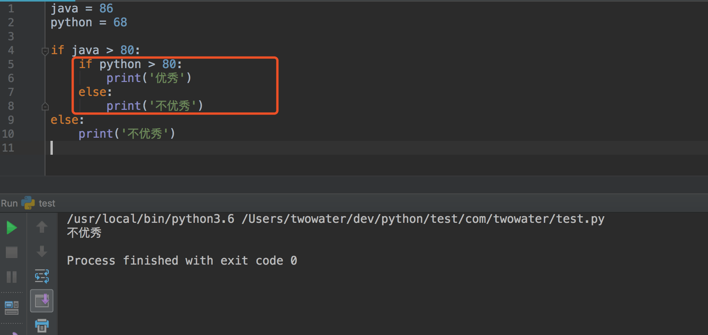

```python
# -*-coding:utf-8-*-


java = 50
python = 68

if java > 80:
    if python > 80:
        print('good')
    else:
        print('bad')
else:
    print('bad')
```

当然这只是为了说明 if 条件语句是可以嵌套的。如果是这个需求，我个人还是不太建议这样使用 if 嵌套的，因为这样代码量多了，而且嵌套太多，也不方便阅读代码。

## 循环语句

### 1、什么是循环语句 ###

一般编程语言都有循环语句，为什么呢？

那就问一下自己，我们弄程序是为了干什么？

那肯定是为了方便我们工作，优化我们的工作效率啊。

而计算机和人类不同，计算机不怕苦也不怕累，也不需要休息，可以一直做。

你要知道，计算机最擅长就是做重复的事情。

所以这时候需要用到循环语句，循环语句允许我们执行一个语句或语句组多次。

循环语句的一般形式如下：

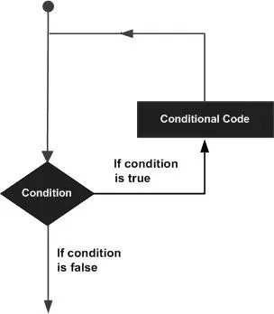


在 Python 提供了 for 循环和 while 循环。

这里又有一个问题了，如果我想让他运行了一百次之后停止，那该怎么做呢？

这时候需要用到一些控制循环的语句：

| 循环控制语句 | 描述                                                         |
| ------------ | ------------------------------------------------------------ |
| break        | 在语句块执行过程中终止循环，并且跳出整个循环                 |
| continue     | 在语句块执行过程中终止当前循环，跳出该次循环，执行下一次循环 |
| pass         | pass 是空语句，是为了保持程序结构的完整性                    |

这些控制语句是为了让我们告诉程序什么时候停止，什么时候不运行这次循环。


### 2、 for 循环语句 ###

我们先来看下 for 循环语句。

它的流程图基本如下：


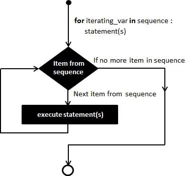


基本的语法格式：

```python
for iterating_var in sequence:
   statements(s)
```

那么我们根据他的基本语法格式，随便写个例子测试一下：


```python
for letter in 'Hello 两点水':
    print(letter)
```

输出的结果如下：

```txt
H
e
l
l
o

两
点
水
```

从打印结果来看，它就是把字符串 `Hello 两点水`  一个一个字符的打印出来。

那如果我们把字符串换为字典 dict 呢？

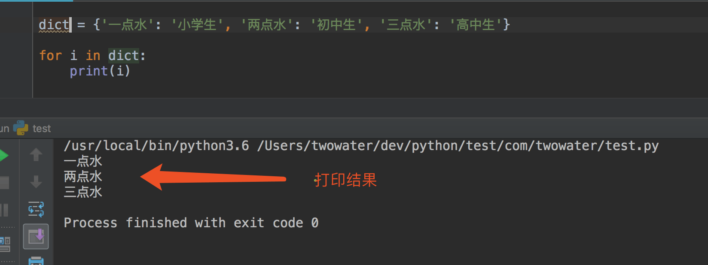

```python
# -*-coding:utf-8-*-


dict = {'一点水':'小学生','两点水':'初中生','三点水':'高中生'}

for i in dict:
    print(i)
```

你会发现只打印了字典 dict 中的每一个 key 值。

很多时候，我都是建议大家学到一个新的知识点，都多去尝试。

你尝试一遍，自己观察出来的结论，好过别人说十遍。

如果你不知道怎么去试？

可以根据我们的例子举一反三，比如上面的 for 循环，试了字符串，字典，那我们之前学的基本数据类型还有什么呢？

不记得可以再返回去看看，可以把所有的基本类型都拿去尝试一下。

比如，你试了之后，会发现整数和浮点数是不可以直接放在 for 循环里面的。

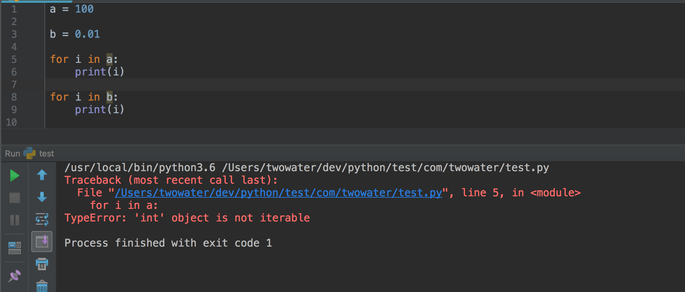


### 3、 range() 函数 ###

for 循环还常常和 range() 函数搭配使用的。

如果不知道 range() 函数 , 我们直接通过一段程序来理解。

```python
for i in range(3):
    print(i)
```

打印的结果为：

```
0
1
2
```

可见，打印了  0 到 3 。

使用 range(x) 函数，就可以生成一个从 0 到 x-1 的整数序列。

如果是 `range(a,b)`  函数，你可以生成了一个左闭右开的整数序列。

其实例子中的  `range(3)` 可以写成 `range(0,3)`, 结果是一样的。

其实使用 range() 函数，我们更多是为了把一段代码重复运行 n 次。

这里提个问题，你仔细观察 range()  函数，上面说到的不管是 1 个参数的，还是 2 个参数的都有什么共同的特点？

不知道你们有没有发现，他都是每次递增 1 的。

`range(3)` 就是 0 ，1，2  ，每次递增 1 。

`range(3,6)`  就是 3 ，4 ，5 ，也是每次递增 1 的。

那能不能每次不递增 1 呢？

比如我想递增 2 呢？

在程序的编写中，肯定会遇到这样的需求的。而 python 发展至今，range 函数肯定也会有这种功能。

所以 range 函数还有一个三个参数的。

比如  `range(0,10,2) ` , 它的意思是：从 0 数到 10（不取 10 ），每次间隔为 2 。

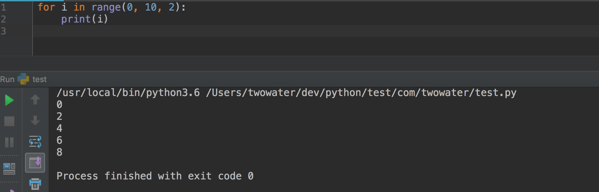


 


### 4、While 循环语句 ###

While 循环和 for 循环的作用是一样的。

我们先来看看 While 循环语句的样子。

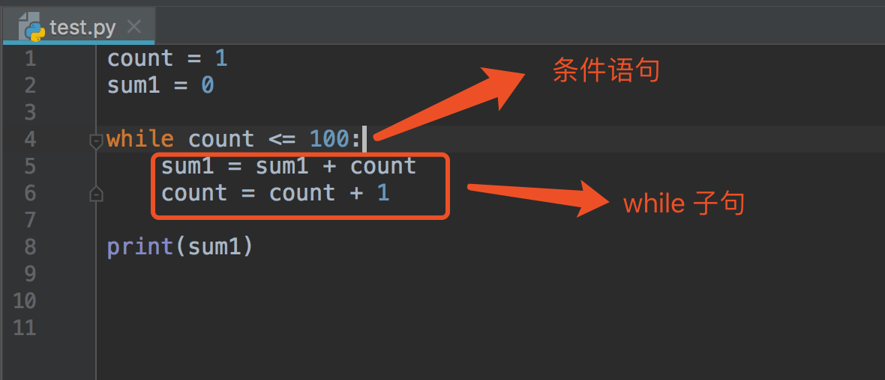

程序输出的结果是：

```txt
5050
```

这个例子是计算 1 到 100 所有整数的和。


### 5、for 循环和 whlie 循环的区别 ###

之前也提到过了，如果一种语法能表示一个功能，那没必要弄两种语法来表示。

竟然都是循环，for 循环和 while 循环肯定有他们的区别的。

那什么时候才使用 for 循环和 while 循环呢？

* for 循环主要用在迭代可迭代对象的情况。

* while 循环主要用在需要满足一定条件为真，反复执行的情况。
  （死循环+break 退出等情况。）

* 部分情况下，for 循环和 while 循环可以互换使用。

例如：

```python
for i in range(0, 10):
    print(i)


i = 0
while i < 10:
    print(i)
    i = i + 1
```

虽然打印的结果是一样的，但是细细品味你会发现，他们执行的顺序和知道的条件是不同的。


### 6、嵌套循环 ###

循环语句和条件语句一样，都是可以嵌套的。

具体的语法如下：

**for 循环嵌套语法**

```python
for iterating_var in sequence:
   for iterating_var in sequence:
      statements(s)
   statements(s)
```

**while 循环嵌套语法**

```python
while expression:
   while expression:
      statement(s)
   statement(s)
```

除此之外，你也可以在循环体内嵌入其他的循环体，如在 while 循环中可以嵌入 for 循环， 反之，你可以在 for 循环中嵌入 while 循环

比如：

当我们需要判断 sum 大于 1000 的时候，不在相加时，可以用到 break ，退出整个循环。

```python
count = 1
sum = 0
while (count <= 100):
    sum = sum + count
    if ( sum > 1000):  #当 sum 大于 1000 的时候退出循环
        break
    count = count + 1
print(sum)
```

输出的结果：

```txt
1035
```

有时候，我们只想统计 1 到 100 之间的奇数和，那么也就是说当 count 是偶数，也就是双数的时候，我们需要跳出当次的循环，不想加，这时候可以用到 break

```python
count = 1
sum = 0
while (count <= 100):
    if ( count % 2 == 0):  # 双数时跳过输出
        count = count + 1
        continue
    sum = sum + count
    count = count + 1
print(sum)
```

输出的语句：

```txt
2500
```

还有：

```python
for num in range(10,20):  # 迭代 10 到 20 之间的数字
   for i in range(2,num): # 根据因子迭代
      if num%i == 0:      # 确定第一个因子
         j=num/i          # 计算第二个因子
         print ('%d 是一个合数' % num)
         break            # 跳出当前循环
   else:                  # 循环的 else 部分
      print ('%d 是一个质数' % num)
```

输出的结果：

```txt
10 是一个合数
11 是一个质数
12 是一个合数
13 是一个质数
14 是一个合数
15 是一个合数
16 是一个合数
17 是一个质数
18 是一个合数
19 是一个质数
```


当然，这里还用到了  `for … else`  语句。

其实 for 循环中的语句和普通的没有区别，else 中的语句会在循环正常执行完（即 for 不是通过 break 跳出而中断的）的情况下执行。

当然有 `for … else`  ，也会有   `while … else` 。他们的意思都是一样的。

## 条件语句和循环语句综合实例

### 1、打印九九乘法表 ###

```python
# -*- coding: UTF-8 -*-

# 打印九九乘法表
for i in range(1, 10):
        for j in range(1, i+1):
            # 打印语句中，大括号及其里面的字符 (称作格式化字段) 将会被 .format() 中的参数替换,注意有个点的
            print('{}x{}={}\t'.format(i, j, i*j), end='')  
        print()
```

输出的结果:

```txt
1x1=1   
2x1=2   2x2=4   
3x1=3   3x2=6   3x3=9   
4x1=4   4x2=8   4x3=12  4x4=16  
5x1=5   5x2=10  5x3=15  5x4=20  5x5=25  
6x1=6   6x2=12  6x3=18  6x4=24  6x5=30  6x6=36  
7x1=7   7x2=14  7x3=21  7x4=28  7x5=35  7x6=42  7x7=49  
8x1=8   8x2=16  8x3=24  8x4=32  8x5=40  8x6=48  8x7=56  8x8=64  
9x1=9   9x2=18  9x3=27  9x4=36  9x5=45  9x6=54  9x7=63  9x8=72  9x9=81 
```


### 2、判断是否是闰年 ###

```python
# 判断是否是闰年

year = int(input("请输入一个年份: "))
if (year % 4) == 0 and (year % 100) != 0 or (year % 400) == 0:
    print('{0} 是闰年' .format(year))
else:
     print('{0} 不是闰年' .format(year))

```


# 五、函数

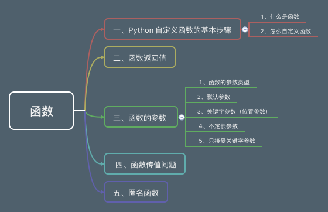

## Python 自定义函数的基本步骤

### 1、什么是函数 ###

函数，其实我们一开始学 Python 的时候就接触过。

不过我们使用的大多数都是 Python 的内置函数。

比如基本每个章节都会出现的 `print()`  函数。

而现在，我们主要学习的是自定义函数。

**各位有没有想过为什么需要函数呢？**

如果要想回答这个问题，我们需要先了解函数是什么？

函数就是组织好的，可重复使用的，用来实现单一，或相关联功能的代码段。

没错，函数其实就是把代码抽象出来的代码段。

那为什么要抽象出来呢？

**方便我们使用，方便我们重复使用。**

**函数的本质就是我们把一些数据喂给函数，让他内部消化，然后吐出你想要的东西，至于他怎么消化的，我们不需要知道，它内部解决。**

怎么理解这句话呢？

举个例子，好比每次用到的 print 函数，我们都知道这个函数的作用是可以把我们的数据输出到控制台，让我们看到。所以 `print('两点水')` , 我们想打印 `两点水` 出来，就把 `两点水` 这个数据喂给  `print` 函数，然后他就直接把结果打印到控制台上了。


### 2、怎么自定义函数 ###

怎么自定义函数？

要知道怎么定义函数，就要知道函数的组成部分是怎样的。

```python
def 函数名(参数1，参数2....参数n):
    函数体
    return 语句
```

这就是 Python 函数的组成部分。

所以自定义函数，基本有以下规则步骤：

* 函数代码块以 def 关键词开头，后接函数标识符名称和圆括号()
* 任何传入参数和自变量必须放在圆括号中间。圆括号之间可以用于定义参数
* 函数的第一行语句可以选择性地使用文档字符串（用于存放函数说明）
* 函数内容以冒号起始，并且缩进
* return [表达式] 结束函数，选择性地返回一个值给调用方。不带表达式的 return 相当于返回 None。

语法示例：

```python
def functionname( parameters ):
   "函数_文档字符串"
   function_suite
   return [expression]
```

实例：

1. def 定义一个函数，给定一个函数名 sum 
2. 声明两个参数 num1 和 num2
3. 函数的第一行语句进行函数说明：两数之和
4. 最终 return 语句结束函数，并返回两数之和

```python
def sum(num1,num2):
	"两数之和"
	return num1+num2

# 调用函数
print(sum(5,6))
```

输出结果：

```python
11
```


## 函数返回值

通过上面的学习，可以知道通过 return [表达式] 语句用于退出函数，选择性地向调用方返回一个表达式。

**不带参数值的 return 语句返回 None。**

具体示例：

```python
# -*- coding: UTF-8 -*-

def sum(num1,num2):
	# 两数之和
	if not (isinstance (num1,(int ,float)) and isinstance (num2,(int ,float))):
		raise TypeError('参数类型错误')
	return num1+num2

print(sum(1,2))
```

返回结果：

```txt
3
```

这个示例，还通过内置函数`isinstance()`进行数据类型检查，检查调用函数时参数是否是整形和浮点型。如果参数类型不对，会报错，提示 `参数类型错误`,如图：

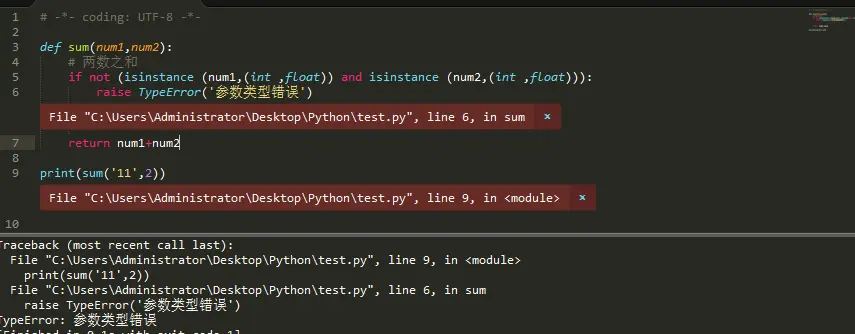

当然，函数也可以返回多个值，具体实例如下：

```python
# -*- coding: UTF-8 -*-

def  division ( num1, num2 ):
	# 求商与余数
         a = num1 % num2
         b = (num1-a) / num2
         return b , a

num1 , num2 = division(9,4)
tuple1 = division(9,4)

print (num1,num2)
print (tuple1)
```

输出的值：

```txt
2.0 1
(2.0, 1)
```

认真观察就可以发现，尽管从第一个输出值来看，返回了多个值，实际上是先创建了一个元组然后返回的。

回忆一下，元组是可以直接用逗号来创建的，观察例子中的 ruturn ，可以发现实际上我们使用的是逗号来生成一个元组。

Python 语言中的函数返回值可以是多个，而其他语言都不行，这是Python 相比其他语言的简便和灵活之处。

**Python 一次接受多个返回值的数据类型就是元组。**

不知道此刻你还记不记得元组的相关知识，如果不记得，建议现在立刻写几个例子回忆一下，比如如何获取元组的第一个元素出来。

## 函数的参数

### 1、函数的参数类型 ###

设置与传递参数是函数的重点，而 Python 的函数对参数的支持非常的灵活。

主要的参数类型有：默认参数、关键字参数（位置参数）、不定长参数。

下面我们将一一了解这几种参数。


### 2、默认参数 ###

有时候，我们自定义的函数中，如果调用的时候没有设置参数，需要给个默认值，这时候就需要用到默认值参数了。

默认参数，只要在构造函数参数的时候，给参数赋值就可以了

例如：


```python
# -*- coding: UTF-8 -*-

def print_user_info( name , age , sex = '男' ):
    # 打印用户信息
    print('昵称：{}'.format(name) , end = ' ')
    print('年龄：{}'.format(age) , end = ' ')
    print('性别：{}'.format(sex))
    return;

# 调用 print_user_info 函数

print_user_info( '两点水' , 18 , '女')
print_user_info( '三点水' , 25 )
```

输出结果：

```txt
昵称：两点水 年龄：18 性别：女
昵称：三点水 年龄：25 性别：男
```

从输出结果可以看到，当你设置了默认参数的时候，在调用函数的时候，不传该参数，就会使用默认值。

但是这里需要注意的一点是：**只有在形参表末尾的那些参数可以有默认参数值**，也就是说你不能在声明函数形参的时候，先声明有默认值的形参而后声明没有默认值的形参。

这是因为赋给形参的值是根据位置而赋值的。例如，def func(a, b=1) 是有效的，但是 def func(a=1, b) 是 无效 的。 

默认值参数就这样结束了吗？

还没有的，细想一下，如果参数中是一个可修改的容器比如一个 lsit （列表）或者 dict （字典），那么我们使用什么来作为默认值呢？

我们可以使用 None 作为默认值。就像下面这个例子一样：

```python
# 如果 b 是一个 list ，可以使用 None 作为默认值
def print_info( a , b = None ):
    if b is None :
        b=[]
    return;
```

认真看下例子，会不会有这样的疑问呢？在参数中我们直接 `b=[]` 不就行了吗？

也就是写成下面这个样子：

```python
def print_info( a , b = [] ):
    return;
```

对不对呢？

运行一下也没发现错误啊，可以这样写吗？

这里需要特别注意的一点：**默认参数的值是不可变的对象，比如None、True、False、数字或字符串**，如果你像上面的那样操作，当默认值在其他地方被修改后你将会遇到各种麻烦。

这些修改会影响到下次调用这个函数时的默认值。

示例如下：

```python
# -*- coding: UTF-8 -*-

def print_info( a , b = [] ):
    print(b)
    return b ;

result = print_info(1)

result.append('error')

print_info(2)
```

输出的结果：

```txt
[]
['error']
```

认真观察，你会发现第二次输出的值根本不是你想要的，因此切忌不能这样操作。


还有一点，有时候我就是不想要默认值啊，只是想单单判断默认参数有没有值传递进来，那该怎么办？

我们可以这样做：

```python
_no_value =object()

def print_info( a , b = _no_value ):
    if b is _no_value :
        print('b 没有赋值')
    return;
```

这里的 `object` 是 python 中所有类的基类。 你可以创建 `object` 类的实例，但是这些实例没什么实际用处，因为它并没有任何有用的方法， 也没有任何实例数据(因为它没有任何的实例字典，你甚至都不能设置任何属性值)。 你唯一能做的就是测试同一性。也正好利用这个特性，来判断是否有值输入。


### 3、关键字参数（位置参数） ###

一般情况下，我们需要给函数传参的时候，是要按顺序来的，如果不对应顺序，就会传错值。

不过在 Python 中，可以通过参数名来给函数传递参数，而不用关心参数列表定义时的顺序，这被称之为关键字参数。

使用关键参数有两个优势 ：

* 由于我们不必担心参数的顺序，使用函数变得更加简单了。

* 假设其他参数都有默认值，我们可以只给我们想要的那些参数赋值

具体看例子：

```python
# -*- coding: UTF-8 -*-

def print_user_info( name ,  age  , sex = '男' ):
    # 打印用户信息
    print('昵称：{}'.format(name) , end = ' ')
    print('年龄：{}'.format(age) , end = ' ')
    print('性别：{}'.format(sex))
    return;

# 调用 print_user_info 函数

print_user_info( name = '两点水' ,age = 18 , sex = '女')
print_user_info( name = '两点水' ,sex = '女', age = 18 )

```

输出的值：

```txt
昵称：两点水 年龄：18 性别：女
昵称：两点水 年龄：18 性别：女
```


### 4、不定长参数 ###

或许有些时候，我们在设计函数的时候，我们有时候无法确定传入的参数个数。

那么我们就可以使用不定长参数。

Python 提供了一种元组的方式来接受没有直接定义的参数。这种方式在参数前边加星号 `*` 。

如果在函数调用时没有指定参数，它就是一个空元组。我们也可以不向函数传递未命名的变量。

例如：

```python
# -*- coding: UTF-8 -*-

def print_user_info( name ,  age  , sex = '男' , * hobby):
    # 打印用户信息
    print('昵称：{}'.format(name) , end = ' ')
    print('年龄：{}'.format(age) , end = ' ')
    print('性别：{}'.format(sex) ,end = ' ' )
    print('爱好：{}'.format(hobby))
    return;

# 调用 print_user_info 函数
print_user_info( '两点水' ,18 , '女', '打篮球','打羽毛球','跑步')

```

输出的结果：

```python
昵称：两点水 年龄：18 性别：女 爱好：('打篮球', '打羽毛球', '跑步')
```

通过输出的结果可以知道，`*hobby`是可变参数，且 hobby 其实就是一个 tuple （元祖）


可变长参数也支持关键字参数（位置参数），没有被定义的关键参数会被放到一个字典里。

这种方式即是在参数前边加 `**`,更改上面的示例如下：


```python
# -*- coding: UTF-8 -*-

def print_user_info( name ,  age  , sex = '男' , ** hobby ):
    # 打印用户信息
    print('昵称：{}'.format(name) , end = ' ')
    print('年龄：{}'.format(age) , end = ' ')
    print('性别：{}'.format(sex) ,end = ' ' )
    print('爱好：{}'.format(hobby))
    return;

# 调用 print_user_info 函数
print_user_info( name = '两点水' , age = 18 , sex = '女', hobby = ('打篮球','打羽毛球','跑步'))

```

输出的结果：

```txt
昵称：两点水 年龄：18 性别：女 爱好：{'hobby': ('打篮球', '打羽毛球', '跑步')}	
```

通过对比上面的例子和这个例子，可以知道，`*hobby`是可变参数，且 hobby其实就是一个 tuple （元祖），`**hobby`是关键字参数，且 hobby 就是一个 dict （字典）


### 5、只接受关键字参数 ###

关键字参数使用起来简单，不容易参数出错，那么有些时候，我们定义的函数希望某些参数强制使用关键字参数传递，这时候该怎么办呢？

将强制关键字参数放到某个`*`参数或者单个`*`后面就能达到这种效果,比如：

```python
# -*- coding: UTF-8 -*-

def print_user_info( name , *, age  , sex = '男' ):
    # 打印用户信息
    print('昵称：{}'.format(name) , end = ' ')
    print('年龄：{}'.format(age) , end = ' ')
    print('性别：{}'.format(sex))
    return;

# 调用 print_user_info 函数
print_user_info( name = '两点水' ,age = 18 , sex = '女' )

# 这种写法会报错，因为 age ，sex 这两个参数强制使用关键字参数
#print_user_info( '两点水' , 18 , '女' )
print_user_info('两点水',age='22',sex='男')
```

通过例子可以看，如果 `age` , `sex` 不使用关键字参数是会报错的。

很多情况下，使用强制关键字参数会比使用位置参数表意更加清晰，程序也更加具有可读性。使用强制关键字参数也会比使用 `**kw` 参数更好且强制关键字参数在一些更高级场合同样也很有用。


## 函数传值问题

先看一个例子：

```python
# -*- coding: UTF-8 -*-
def chagne_number( b ):
    b = 1000

b = 1
chagne_number(b)
print( b )
```

最后输出的结果为：

```txt
1
```

先看看运行的结果？

想一下为什么打印的结果是 1 ，而不是 1000 ？

其实把问题归根结底就是，为什么通过函数 `chagne_number` 没有更改到 b 的值？

这个问题很多编程语言都会讲到，原理解释也是差不多的。

这里主要是函数参数的传递中，传递的是类型对象，之前也介绍了 Python 中基本的数据类型等。而这些类型对象可以分为可更改类型和不可更改的类型

**在 Python 中，字符串，整形，浮点型，tuple 是不可更改的对象，而 list ， dict 等是可以更改的对象。**

例如：

**不可更改的类型**：变量赋值 `a = 1`，其实就是生成一个整形对象 1 ，然后变量 a 指向 1，当 `a = 1000` 其实就是再生成一个整形对象 1000，然后改变 a 的指向，不再指向整形对象 1 ，而是指向 1000，最后 1 会被丢弃

**可更改的类型**：变量赋值 `a = [1,2,3,4,5,6]` ，就是生成一个对象 list ，list 里面有 6 个元素，而变量 a 指向 list ，`a[2] = 5`则是将 list a 的第三个元素值更改,这里跟上面是不同的，并不是将 a 重新指向，而是直接修改 list 中的元素值。

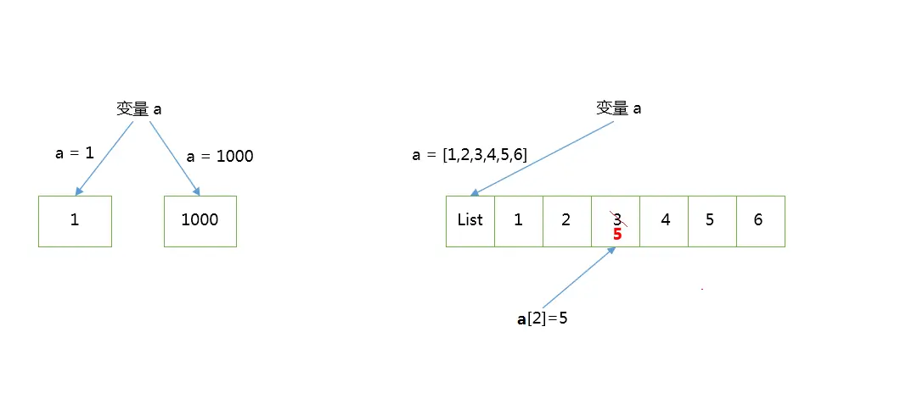

这也将影响到函数中参数的传递了：

**不可更改的类型**：类似 c++ 的值传递，如 整数、字符串、元组。如fun（a），传递的只是 a 的值，没有影响 a 对象本身。比如在 fun（a）内部修改 a 的值，只是修改另一个复制的对象，不会影响 a 本身。

**可更改的类型**：类似 c++ 的引用传递，如 列表，字典。如 fun（a），则是将 a 真正的传过去，修改后 fun 外部的 a 也会受影响

因此，在一开始的例子中，`b = 1`,创建了一个整形对象 1 ，变量 b 指向了这个对象，然后通过函数 chagne_number 时，按传值的方式复制了变量 b ，传递的只是 b 的值，并没有影响到 b 的本身。具体可以看下修改后的实例，通过打印的结果更好的理解。

```python
# -*- coding: UTF-8 -*-
def chagne_number( b ):
    print('函数中一开始 b 的值：{}' .format( b ) )
    b = 1000
    print('函数中 b 赋值后的值：{}' .format( b ) )


b = 1
chagne_number( b )
print( '最后输出 b 的值：{}' .format( b )  )


```

打印的结果：

```txt
函数中一开始 b 的值：1
函数中 b 赋值后的值：1000
最后输出 b 的值：1
```

当然，如果参数中的是可更改的类型，那么调用了这个函数后，原来的值也会被更改，具体实例如下：

```python
# -*- coding: UTF-8 -*-

def chagne_list( b ):
    print('函数中一开始 b 的值：{}' .format( b ) )
    b.append(1000)
    print('函数中 b 赋值后的值：{}' .format( b ) )


b = [1,2,3,4,5]
chagne_list( b )
print( '最后输出 b 的值：{}' .format( b )  )
```

输出的结果：

```txt
函数中一开始 b 的值：[1, 2, 3, 4, 5]
函数中 b 赋值后的值：[1, 2, 3, 4, 5, 1000]
最后输出 b 的值：[1, 2, 3, 4, 5, 1000]
```


## 匿名函数

有没有想过定义一个很短的回调函数，但又不想用 `def` 的形式去写一个那么长的函数，那么有没有快捷方式呢？

答案是有的。

python 使用 lambda 来创建匿名函数，也就是不再使用 def 语句这样标准的形式定义一个函数。

匿名函数主要有以下特点：

* lambda 只是一个表达式，函数体比 def 简单很多。
* lambda 的主体是一个表达式，而不是一个代码块。仅仅能在 lambda 表达式中封装有限的逻辑进去。
* lambda 函数拥有自己的命名空间，且不能访问自有参数列表之外或全局命名空间里的参数。

**基本语法**

```python
lambda [arg1 [,arg2,.....argn]]:expression
```

示例：

```python
# -*- coding: UTF-8 -*-

sum = lambda num1 , num2 : num1 + num2;

print( sum( 1 , 2 ) )

```

输出的结果：

```txt
3
```

注意：**尽管 lambda 表达式允许你定义简单函数，但是它的使用是有限制的。 你只能指定单个表达式，它的值就是最后的返回值。也就是说不能包含其他的语言特性了， 包括多个语句、条件表达式、迭代以及异常处理等等。**

匿名函数中，有一个特别需要注意的问题，比如，把上面的例子改一下：

```python
# -*- coding: UTF-8 -*-

num2 = 100
sum1 = lambda num1 : num1 + num2 ;

num2 = 10000
sum2 = lambda num1 : num1 + num2 ;

print( sum1( 1 ) )
print( sum2( 1 ) )
```

你会认为输出什么呢？第一个输出是 101，第二个是 10001，结果不是的，输出的结果是这样：

```txt
10001
10001
```

**这主要在于 lambda 表达式中的 num2 是一个自由变量，在运行时绑定值，而不是定义时就绑定，这跟函数的默认值参数定义是不同的。所以建议还是遇到这种情况还是使用第一种解法。**


# 六、迭代器和生成器

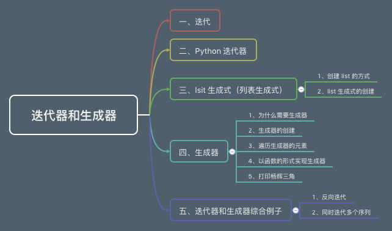

## 迭代

什么叫做迭代？

比如在 Java 中，我们通过 List 集合的下标来遍历 List 集合中的元素，在 Python 中，给定一个 list 或 tuple，我们可以通过 for 循环来遍历这个 list 或 tuple ，这种遍历就是迭代。

可是，Python 的 `for` 循环抽象程度要高于 Java 的 `for` 循环的，为什么这么说呢？因为 Python 的 `for` 循环不仅可以用在 list 或tuple 上，还可以作用在其他可迭代对象上。

也就是说，只要是可迭代的对象，无论有没有下标，都是可以迭代的。

比如：

```python
# -*- coding: UTF-8 -*-

# 1、for 循环迭代字符串
for char in 'liangdianshui' :
    print ( char , end = ' ' )

print('\n')

# 2、for 循环迭代 list
list1 = [1,2,3,4,5]
for num1 in list1 :
    print ( num1 , end = ' ' )

print('\n')

# 3、for 循环也可以迭代 dict （字典）
dict1 = {'name':'两点水','age':'23','sex':'男'}

for key in dict1 :    # 迭代 dict 中的 key
    print ( key , end = ' ' )

print('\n')

for value in dict1.values() :   # 迭代 dict 中的 value
	print ( value , end = ' ' )

print ('\n')

# 如果 list 里面一个元素有两个变量，也是很容易迭代的
for x , y in [ (1,'a') , (2,'b') , (3,'c') ] :
	print ( x , y )

```

输出的结果如下：

```txt
l i a n g d i a n s h u i 

1 2 3 4 5 

name age sex 

两点水 23 男 

1 a
2 b
3 c
```


## Python 迭代器

上面简单的介绍了一下迭代，迭代是 Python 最强大的功能之一，是访问集合元素的一种方式。现在正式进入主题：迭代器，迭代器是一个可以记住遍历的位置的对象。

迭代器对象从集合的第一个元素开始访问，直到所有的元素被访问完结束。

迭代器只能往前不会后退。

迭代器有两个基本的方法：iter() 和 next(),且字符串，列表或元组对象都可用于创建迭代器，迭代器对象可以使用常规 for 语句进行遍历，也可以使用 next() 函数来遍历。

具体的实例：

```python
# 1、字符创创建迭代器对象
str1 = 'liangdianshui'
iter1 = iter ( str1 )

# 2、list对象创建迭代器
list1 = [1,2,3,4]
iter2 = iter ( list1 )

# 3、tuple(元祖) 对象创建迭代器
tuple1 = ( 1,2,3,4 )
iter3 = iter ( tuple1 )

# for 循环遍历迭代器对象
for x in iter1 :
    print ( x , end = ' ' )

print('\n------------------------')
 
# next() 函数遍历迭代器
while True :
    try :
        print ( next ( iter3 ) )
    except StopIteration :
        break

```

最后输出的结果：

```tet
l i a n g d i a n s h u i 
------------------------
1
2
3
4
```


## list 生成式（列表生成式）

## 1、创建 list 的方式 ##

之前经过我们的学习，都知道如何创建一个 list ，可是有些情况，用赋值的形式创建一个 list 太麻烦了，特别是有规律的 list ，一个一个的写，一个一个赋值，太麻烦了。比如要生成一个有 30 个元素的 list ，里面的元素为 1 - 30 。我们可以这样写：

```python
# -*- coding: UTF-8 -*-

list1=list ( range (1,31) )
print(list1)
```

输出的结果：

```txt
[1, 2, 3, 4, 5, 6, 7, 8, 9, 10, 11, 12, 13, 14, 15, 16, 17, 18, 19, 20, 21, 22, 23, 24, 25, 26, 27, 28, 29, 30]
```

这个其实在之前也有提到过，打印九九乘法表，用这个方法其实就几句代码就可以了，具体可以看之前的这个章节：[条件语句和循环语句综合实例](../python5/Example.md)

但是，如果用到 list 生成式，可以一句代码就生成九九乘法表了。

你没听错，就是一句代码。

具体实现：

```python
print('\n'.join([' '.join ('%dx%d=%2d' % (x,y,x*y)  for x in range(1,y+1)) for y in range(1,10)]))
```

最后输出的结果：

```txt
1x1= 1
1x2= 2 2x2= 4
1x3= 3 2x3= 6 3x3= 9
1x4= 4 2x4= 8 3x4=12 4x4=16
1x5= 5 2x5=10 3x5=15 4x5=20 5x5=25
1x6= 6 2x6=12 3x6=18 4x6=24 5x6=30 6x6=36
1x7= 7 2x7=14 3x7=21 4x7=28 5x7=35 6x7=42 7x7=49
1x8= 8 2x8=16 3x8=24 4x8=32 5x8=40 6x8=48 7x8=56 8x8=64
1x9= 9 2x9=18 3x9=27 4x9=36 5x9=45 6x9=54 7x9=63 8x9=72 9x9=81
```

不过，这里我们先要了解如何创建 list 生成式

## 2、list 生成式的创建 ##

首先，list 生成式的语法为：

```python
[expr for iter_var in iterable] 
[expr for iter_var in iterable if cond_expr]
```

第一种语法：首先迭代 iterable 里所有内容，每一次迭代，都把 iterable 里相应内容放到iter_var 中，再在表达式中应用该 iter_var 的内容，最后用表达式的计算值生成一个列表。

第二种语法：加入了判断语句，只有满足条件的内容才把 iterable 里相应内容放到 iter_var 中，再在表达式中应用该 iter_var 的内容，最后用表达式的计算值生成一个列表。

其实不难理解的，因为是 list 生成式，因此肯定是用 [] 括起来的，然后里面的语句是把要生成的元素放在前面，后面加 for 循环语句或者 for 循环语句和判断语句。

例子：

```python
# -*- coding: UTF-8 -*-
list1=[x * x for x in range(1, 11)]
print(list1)
```

输出的结果：

```txt
[1, 4, 9, 16, 25, 36, 49, 64, 81, 100]
```

可以看到，就是把要生成的元素 x * x 放到前面，后面跟 for 循环，就可以把 list 创建出来。那么 for 循环后面有 if 的形式呢？又该如何理解：

```python
# -*- coding: UTF-8 -*-
list1= [x * x for x in range(1, 11) if x % 2 == 0]
print(list1)
```

输出的结果：

```txt
[4, 16, 36, 64, 100]
```

这个例子是为了求 1 到 10 中偶数的平方根，上面也说到， `x * x` 是要生成的元素，后面那部分其实就是在 for 循环中嵌套了一个 if 判断语句。

那么有了这个知识点，我们也可以猜想出，for 循环里面也嵌套 for 循环。具体示例：

```python
# -*- coding: UTF-8 -*-
list1= [(x+1,y+1) for x in range(3) for y in range(5)] 
print(list1)
```

输出的结果：

```txt
[(1, 1), (1, 2), (1, 3), (1, 4), (1, 5), (2, 1), (2, 2), (2, 3), (2, 4), (2, 5), (3, 1), (3, 2), (3, 3), (3, 4), (3, 5)]
```

其实知道了 list 生成式是怎样组合的，就不难理解这个东西了。因为 list 生成式只是把之前学习的知识点进行了组合，换成了一种更简洁的写法而已。

## 生成器

### 1、为什么需要生成器 ###

通过上面的学习，可以知道列表生成式，我们可以直接创建一个列表。

但是，受到内存限制，列表容量肯定是有限的。而且，创建一个包含 1000 万个元素的列表，不仅占用很大的存储空间，如果我们仅仅需要访问前面几个元素，那后面绝大多数元素占用的空间都白白浪费了。

**所以，如果列表元素可以按照某种算法推算出来，那我们是否可以在循环的过程中不断推算出后续的元素呢？**

这样就不必创建完整的 list，从而节省大量的空间。

**在 Python 中，这种一边循环一边计算的机制，称为生成器：generator。**

在 Python 中，使用了 yield 的函数被称为生成器（generator）。

跟普通函数不同的是，生成器是一个返回迭代器的函数，只能用于迭代操作，更简单点理解生成器就是一个迭代器。

在调用生成器运行的过程中，每次遇到 yield 时函数会暂停并保存当前所有的运行信息，返回 yield 的值。并在下一次执行 next()方法时从当前位置继续运行。

那么如何创建一个生成器呢？


### 2、生成器的创建 ###

最简单最简单的方法就是把一个列表生成式的 `[]` 改成 `()`

```python
# -*- coding: UTF-8 -*-
gen= (x * x for x in range(10))
print(gen)
```

输出的结果：

```txt
<generator object <genexpr> at 0x0000000002734A40>
```

创建 List 和 generator 的区别仅在于最外层的 `[]` 和 `()` 。

但是生成器并不真正创建数字列表， 而是返回一个生成器，这个生成器在每次计算出一个条目后，把这个条目“产生” ( yield ) 出来。

生成器表达式使用了“惰性计算” ( lazy evaluation，也有翻译为“延迟求值”，我以为这种按需调用 call by need 的方式翻译为惰性更好一些)，只有在检索时才被赋值（ evaluated ），所以在列表比较长的情况下使用内存上更有效。


那么竟然知道了如何创建一个生成器，那么怎么查看里面的元素呢？

### 3、遍历生成器的元素 ###

按我们的思维，遍历用 for 循环，对了，我们可以试试：

```python
# -*- coding: UTF-8 -*-
gen= (x * x for x in range(10))

for num  in  gen :
	print(num)
```

没错，直接这样就可以遍历出来了。当然，上面也提到了迭代器，那么用 next() 可以遍历吗？当然也是可以的。


### 4、以函数的形式实现生成器 ###

上面也提到，创建生成器最简单最简单的方法就是把一个列表生成式的 `[]` 改成 `()`。为啥突然来个以函数的形式来创建呢？

其实生成器也是一种迭代器，但是你只能对其迭代一次。

这是因为它们并没有把所有的值存在内存中，而是在运行时生成值。你通过遍历来使用它们，要么用一个“for”循环，要么将它们传递给任意可以进行迭代的函数和结构。

而且实际运用中，大多数的生成器都是通过函数来实现的。那么我们该如何通过函数来创建呢？

先不急，来看下这个例子：

```python
# -*- coding: UTF-8 -*-
def my_function():
    for i in range(10):
        print ( i )

my_function()
```

输出的结果：

```txt
0
1
2
3
4
5
6
7
8
9
```

如果我们需要把它变成生成器，我们只需要把 `print ( i )` 改为 `yield i` 就可以了，具体看下修改后的例子：

```python
# -*- coding: UTF-8 -*-
def my_function():
    for i in range(10):
        yield i

print(my_function())
```

输出的结果：

```txt
<generator object my_function at 0x0000000002534A40>
```

但是，这个例子非常不适合使用生成器，发挥不出生成器的特点，生成器的最好的应用应该是：你不想同一时间将所有计算出来的大量结果集分配到内存当中，特别是结果集里还包含循环。因为这样会耗很大的资源。

比如下面是一个计算斐波那契数列的生成器：

```python
# -*- coding: UTF-8 -*-
def fibon(n):
    a = b = 1
    for i in range(n):
        yield a
        a, b = b, a + b

# 引用函数
for x in fibon(1000000):
    print(x , end = ' ')
```

运行的效果：


你看，运行一个这么大的参数，也不会说有卡死的状态，因为这种方式不会使用太大的资源。这里，最难理解的就是 generator 和函数的执行流程不一样。函数是顺序执行，遇到 return 语句或者最后一行函数语句就返回。而变成 generator 的函数，在每次调用 next() 的时候执行，遇到 yield语句返回，再次执行时从上次返回的 yield 语句处继续执行。

比如这个例子：

```python
# -*- coding: UTF-8 -*-
def odd():
    print ( 'step 1' )
    yield ( 1 )
    print ( 'step 2' )
    yield ( 3 )
    print ( 'step 3' )
    yield ( 5 )

o = odd()
print( next( o ) )
print( next( o ) )
print( next( o ) )
```

输出的结果：

```txt
step 1
1
step 2
3
step 3
5
```

可以看到，odd 不是普通函数，而是 generator，在执行过程中，遇到 yield 就中断，下次又继续执行。执行 3 次 yield 后，已经没有 yield 可以执行了，如果你继续打印 `print( next( o ) ) ` ,就会报错的。所以通常在 generator 函数中都要对错误进行捕获。

### 5、打印杨辉三角 ###

通过学习了生成器，我们可以直接利用生成器的知识点来打印杨辉三角：

```python
# -*- coding: UTF-8 -*-
def triangles( n ):         # 杨辉三角形
    L = [1]
    while True:
        yield L
        L.append(0)
        L = [ L [ i -1 ] + L [ i ] for i in range (len(L))]

n= 0
for t in triangles( 10 ):   # 直接修改函数名即可运行
    print(t)
    n = n + 1
    if n == 10:
        break
```

输出的结果为：

```txt
[1]
[1, 1]
[1, 2, 1]
[1, 3, 3, 1]
[1, 4, 6, 4, 1]
[1, 5, 10, 10, 5, 1]
[1, 6, 15, 20, 15, 6, 1]
[1, 7, 21, 35, 35, 21, 7, 1]
[1, 8, 28, 56, 70, 56, 28, 8, 1]
[1, 9, 36, 84, 126, 126, 84, 36, 9, 1]
```


## 迭代器和生成器综合例子

因为迭代器和生成器基本是互通的，因此有些知识点需要综合在一起

### 1、反向迭代 ###

反向迭代，应该也是常有的需求了，比如从一开始迭代的例子里，有个输出 list 的元素，从 1 到 5 的

```python
list1 = [1,2,3,4,5]
for num1 in list1 :
    print ( num1 , end = ' ' )
```

那么我们从 5 到 1 呢？这也很简单， Python 中有内置的函数 `reversed()`

```python
list1 = [1,2,3,4,5]
for num1 in reversed(list1) :
    print ( num1 , end = ' ' )
```

方向迭代很简单，可是要注意一点就是：**反向迭代仅仅当对象的大小可预先确定或者对象实现了 `__reversed__()` 的特殊方法时才能生效。 如果两者都不符合，那你必须先将对象转换为一个列表才行**

其实很多时候我们可以通过在自定义类上实现 `__reversed__()` 方法来实现反向迭代。不过有些知识点在之前的篇节中还没有提到，不过可以相应的看下，有编程基础的，学完上面的知识点应该也能理解的。

```python
# -*- coding: UTF-8 -*-

class Countdown:
    def __init__(self, start):
        self.start = start

    def __iter__(self):
    	# Forward iterator
        n = self.start
        while n > 0:
            yield n
            n -= 1

    def __reversed__(self):
    	# Reverse iterator
        n = 1
        while n <= self.start:
            yield n
            n += 1

for rr in reversed(Countdown(30)):
    print(rr)
for rr in Countdown(30):
    print(rr)
```

输出的结果是 1 到 30 然后 30 到 1 ，分别是顺序打印和倒序打印

### 2、同时迭代多个序列 ###

你想同时迭代多个序列，每次分别从一个序列中取一个元素。你遇到过这样的需求吗？

为了同时迭代多个序列，使用 zip() 函数，具体示例：

```python
# -*- coding: UTF-8 -*-

names = ['laingdianshui', 'twowater', '两点水']
ages = [18, 19, 20]
for name, age in zip(names, ages):
     print(name,age)
```

输出的结果：

```txt
laingdianshui 18
twowater 19
两点水 20
```

其实 zip(a, b) 会生成一个可返回元组 (x, y) 的迭代器，其中 x 来自 a，y 来自 b。 一旦其中某个序列到底结尾，迭代宣告结束。 因此迭代长度跟参数中最短序列长度一致。注意理解这句话喔，也就是说如果 a ， b 的长度不一致的话，以最短的为标准，遍历完后就结束。

利用 `zip()` 函数，我们还可把一个 key 列表和一个 value 列表生成一个 dict （字典）,如下：

```python
# -*- coding: UTF-8 -*-

names = ['laingdianshui', 'twowater', '两点水']
ages = [18, 19, 20]

dict1= dict(zip(names,ages))

print(dict1)

```


输出如下结果：

```python
{'laingdianshui': 18, 'twowater': 19, '两点水': 20}
```

这里提一下， `zip()` 是可以接受多于两个的序列的参数，不仅仅是两个。

# 七、面向对象

## 面向对象的概念

### 1、面向对象的两个基本概念 ###

编程语言中，一般有两种编程思维，面向过程和面向对象。

面向过程，看重的是解决问题的过程。

这好比我们解决日常生活问题差不多，分析解决问题的步骤，然后一步一步的解决。

而面向对象是一种抽象，抽象是指用分类的眼光去看世界的一种方法。

Python 就是一门面向对象的语言, 

如果你学过 Java ，就知道 Java 的编程思想就是：万事万物皆对象。Python 也不例外，在解决实际问题的过程中，可以把构成问题事务分解成各个对象。

面向对象都有两个基本的概念，分别是类和对象。

* **类**

用来描述具有相同的属性和方法的对象的集合。它定义了该集合中每个对象所共有的属性和方法。对象是类的实例。

* **对象**

通过类定义的数据结构实例


### 2、面向对象的三大特性 ###

面向对象的编程语言，也有三大特性，继承，多态和封装性。

* **继承**

即一个派生类（derived class）继承基类（base class）的字段和方法。继承也允许把一个派生类的对象作为一个基类对象对待。

例如：一个 Dog 类型的对象派生自 Animal 类，这是模拟"是一个（is-a）"关系（例图，Dog 是一个 Animal ）。

* **多态**

它是指对不同类型的变量进行相同的操作，它会根据对象（或类）类型的不同而表现出不同的行为。

* **封装性**

“封装”就是将抽象得到的数据和行为（或功能）相结合，形成一个有机的整体（即类）；封装的目的是增强安全性和简化编程，使用者不必了解具体的实现细节，而只是要通过外部接口，一特定的访问权限来使用类的成员。


**如果你是初次接触面向对象的编程语言，看到这里还一脸懵逼，不要紧，这是正常的。下面我们会通过大量的例子逐步了解 Python 的面向对象的知识。**


## 类的定义和调用

### 1、怎么理解类？ ###

类是什么？

个人认为理解类，最简单的方式就是：类是一个变量和函数的集合。

可以看下下面的这张图。

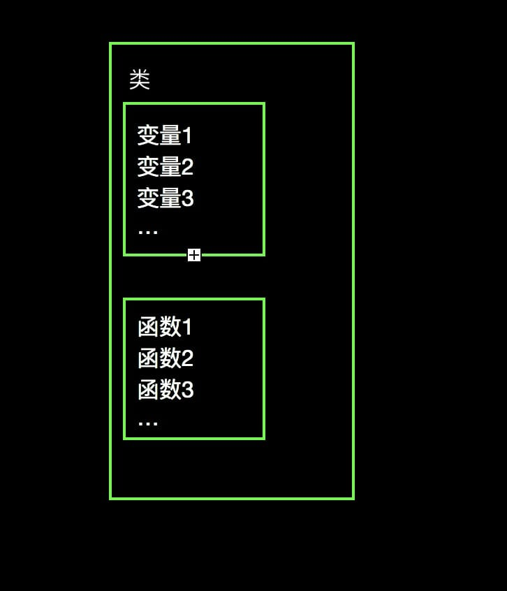

这张图很好的诠释了类，就是把变量和函数包装在一起。

当然我们包装也不是毫无目的的包装，我们会把同性质的包装在一个类里，这样就方便我们重复使用。

所以学到现在，你会发现很多编程的设计，都是为了我们能偷懒，重复使用。


### 2、怎么定义类 ###

知道了类是什么样子的，我们接下来就要学习怎么去定义类了。

类定义语法格式如下：

```python
class ClassName():
    <statement-1>
    .
    .
    .
    <statement-N>
```

可以看到，我们是用 `class` 语句来自定义一个类的，其实这就好比我们是用 `def` 语句来定义一个函数一样。

竟然说类是变量和方法的集合包，那么我们来创建一个类。

```python
class ClassA():
    var1 = 100
    var2 = 0.01
    var3 = '两点水'

    def fun1():
        print('我是 fun1')

    def fun2():
        print('我是 fun1')

    def fun3():
        print('我是 fun1')
```

你看，上面我们就定义了一个类，类名叫做 `ClassA` , 类里面的变量我们称之为属性，那么就是这个类里面有 3 个属性，分别是 `var1` , `var2` 和 `var3` 。除此之外，类里面还有 3 个类方法 `fun1()` , `fun2()` 和 `fun3()` 。


### 3、怎么调用类属性和类方法 ###


我们定义了类之后，那么我们怎么调用类里面的属性和方法呢？

直接看下图：

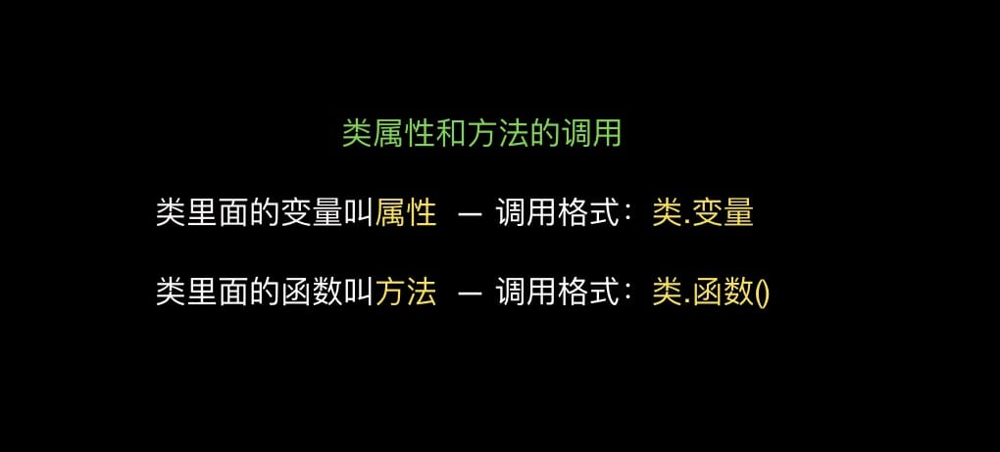

这里就不文字解释了（注：做图也不容易啊，只有写过技术文章才知道，这系列文章，多耗时）

好了，知道怎么调用之后，我们尝试一下：


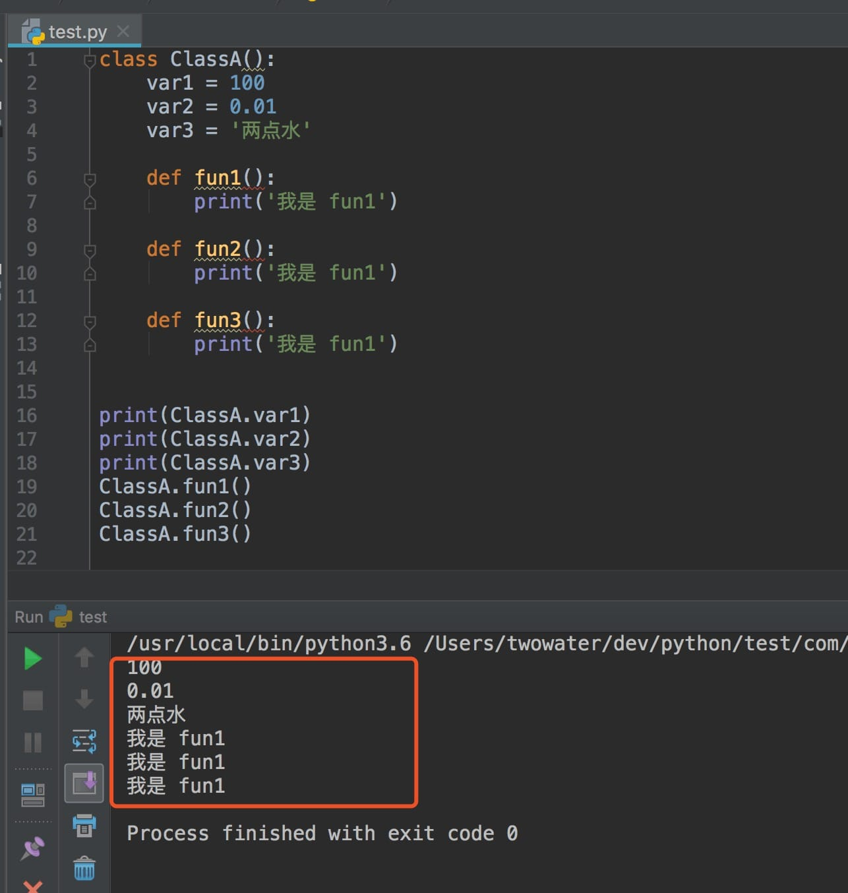

## 类方法

### 1、类方法如何调用类属性 ###

通过上面我们已经会定义类了，那么这里讲一下在同一个类里，类方法如何调用类属性的。

直接看个例子吧：


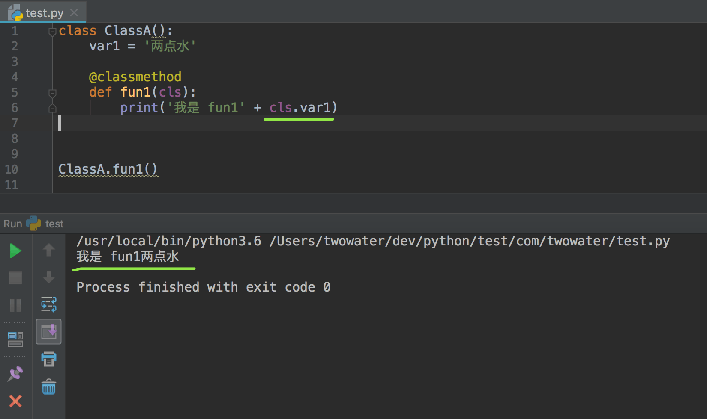

注意看，在类方法上面多了个 `@classmethod` ，这是干嘛用的呢？

这是用于声明下面的函数是类函数。其实从名字就很好理解了。

class 就是类，method 就是方法。

那是不是一定需要注明这个呢？

答案是是的。

如果你没使用，是会报错的。


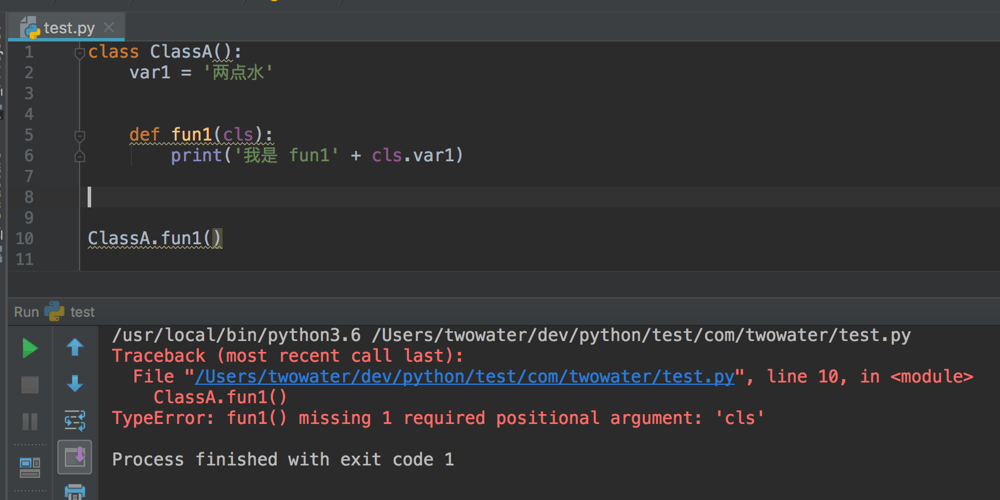

如果没有声明是类方法，方法参数中就没有 `cls` , 就没法通过 `cls` 获取到类属性。

因此类方法，想要调用类属性，需要以下步骤： 

* 在方法上面，用 `@classmethod` 声明该方法是类方法。只有声明了是类方法，才能使用类属性
* 类方法想要使用类属性，在第一个参数中，需要写上 `cls` ,  cls 是 class 的缩写，其实意思就是把这个类作为参数，传给自己，这样就可以使用类属性了。
* 类属性的使用方式就是 `cls.变量名`


记住喔，无论是 `@classmethod` 还是 `cls` ,都是不能省去的。

省了都会报错。


### 2、类方法传参 ###

上面我们学习了类方法如何调用类属性，那么类方法如何传参呢？

其实很简单，跟普通的函数一样，直接增加参数就好了。

这个就直接上例子了：

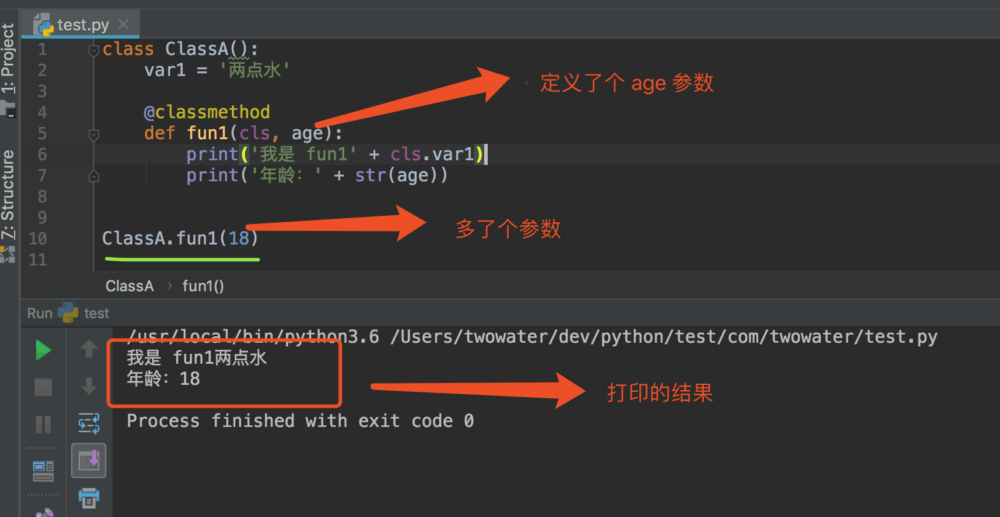

## 修改和增加类属性

### 1、从内部增加和修改类属性 ###

来，我们先来温习一下类的结构。

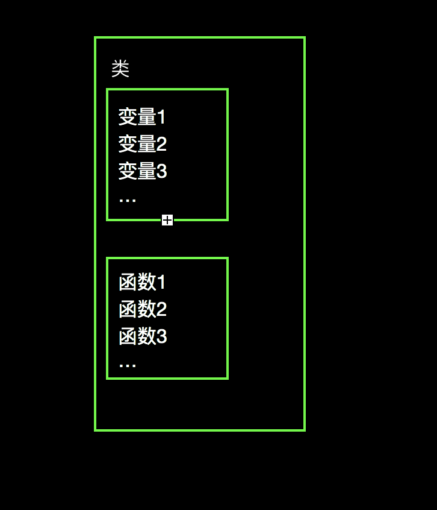

看着这个结构，提一个问题，如何修改类属性，也就是类里面的变量？

从类结构来看，我们可以猜测，从类方法来修改，也就是从类内部来修改和增加类属性。

看下具体的实例：

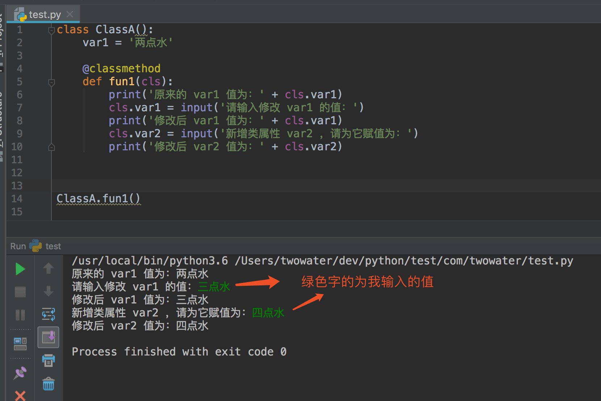

这里还是强调一下，例子还是要自己多写，不要只看，自己运行， 看效果。多想。


### 2、从外部增加和修改类属性 ###

我们刚刚看了通过类方法来修改类的属性，这时我们看下从外部如何修改和增加类属性。

例子如下：

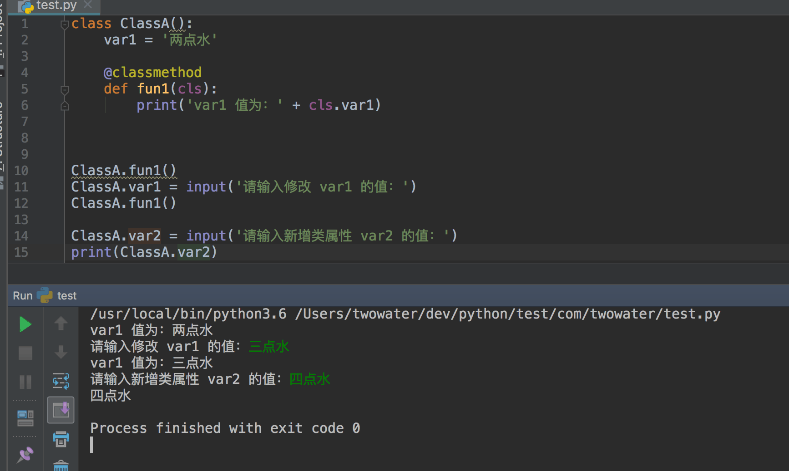

## 类和对象

### 1、类和对象之间的关系 ###

这部分内容主要讲类和对象，我们先来说说类和对象之间的关系。

**类是对象的模板**

我们得先有了类，才能制作出对象。

类就相对于工厂里面的模具，对象就是根据模具制造出来的产品。

**从模具变成产品的过程，我们就称为类的实例化。**

**类实例化之后，就变成对象了。也就是相当于例子中的产品。**


### 2、类的实例化 ###

这里强调一下，类的实例化和直接使用类的格式是不一样的。

之前我们就学过，直接使用类格式是这样的：

```python
class ClassA():
    var1 = '两点水'

    @classmethod
    def fun1(cls):
        print('var1 值为：' + cls.var1)


ClassA.fun1()
```

而类的实例化是怎样的呢？

是这样的，可以仔细对比一下，类的实例化和直接使用类的格式有什么不同？

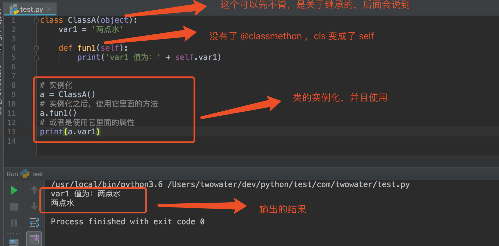


主要的不同点有：

* 类方法里面没有了 `@classmethod` 声明了，不用声明他是类方法
* 类方法里面的参数 `cls` 改为  `self`
* 类的使用，变成了先通过 `实例名 = 类()` 的方式实例化对象，为类创建一个实例，然后再使用 `实例名.函数()` 的方式调用对应的方法 ，使用 `实例名.变量名` 的方法调用类的属性


这里说明一下，类方法的参数为什么 `cls` 改为  `self` ？

其实这并不是说一定要写这个，你改为什么字母，什么名字都可以。 

不妨试一下：

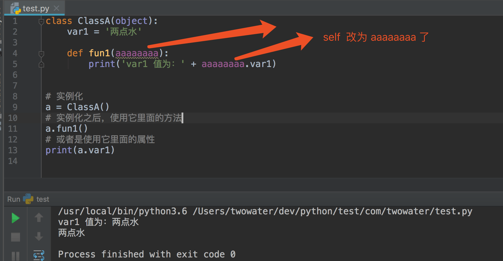

你看，把 `self` 改为 `aaaaaaaa` 还是可以一样运行的。

只不过使用  `cls` 和 `self` 是我们的编程习惯，这也是我们的编程规范。

因为 cls 是 class 的缩写，代表这类 ， 而 self 代表这对象的意思。

所以啊，这里我们实例化对象的时候，就使用 self 。

**而且 self 是所有类方法位于首位、默认的特殊参数。**

除此之外，在这里，还要强调一个概念，当你把类实例化之后，里面的属性和方法，就不叫类属性和类方法了，改为叫实例属性和实例方法，也可以叫对象属性和对象方法。

为什么要这样强调呢？

**因为一个类是可以创造出多个实例对象出来的。**

你看下面的例子：


我不仅能用这个类创建 a 对象，还能创建 b 对象


### 3、实例属性和类属性 ###

一个类可以实例化多个对象出来。

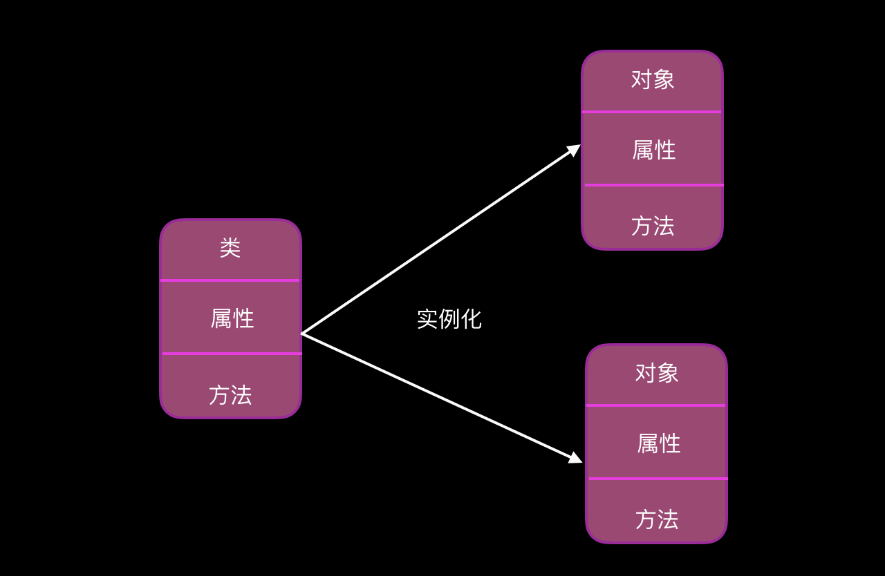

根据这个图，我们探究一下实例对象的属性和类属性之间有什么关系呢？

**先提出第一个问题，如果类属性改变了，实例属性会不会跟着改变呢？**

还是跟以前一样，提出了问题，我们直接用程序来验证就好。

看程序：


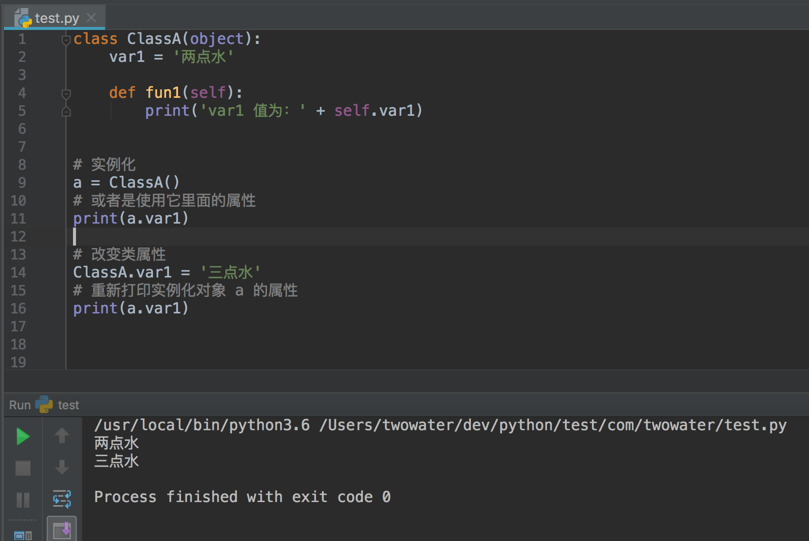


从程序运行的结果来看，**类属性改变了，实例属性会跟着改变。**

这很好理解，因为我们的实例对象就是根据类来复制出来的，类属性改变了，实例对象的属性也会跟着改变。

**那么相反，如果实例属性改变了，类属性会改变吗？**

答案当然是不能啦。因为每个实例都是单独的个体，不能影响到类的。

具体我们做下实验：


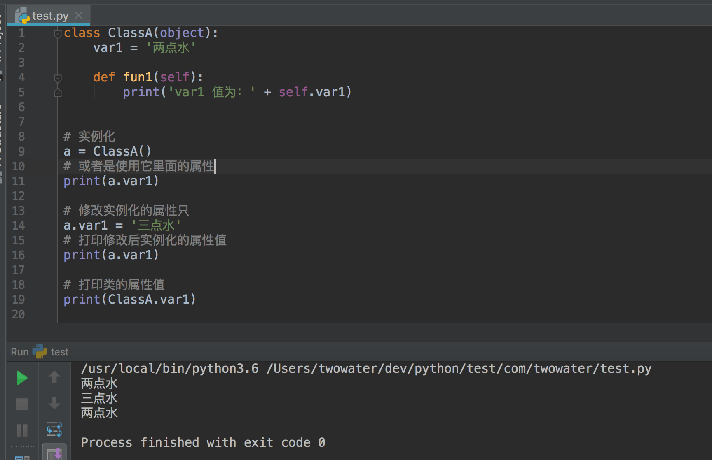

可以看到，**不管实例对象怎么修改属性值，对类的属性还是没有影响的。**


### 4、实例方法和类方法 ###

那这里跟上面一样，还是提出同样的问题。

**如果类方法改变了，实例方法会不会跟着改变呢？**

看下下面的例子：

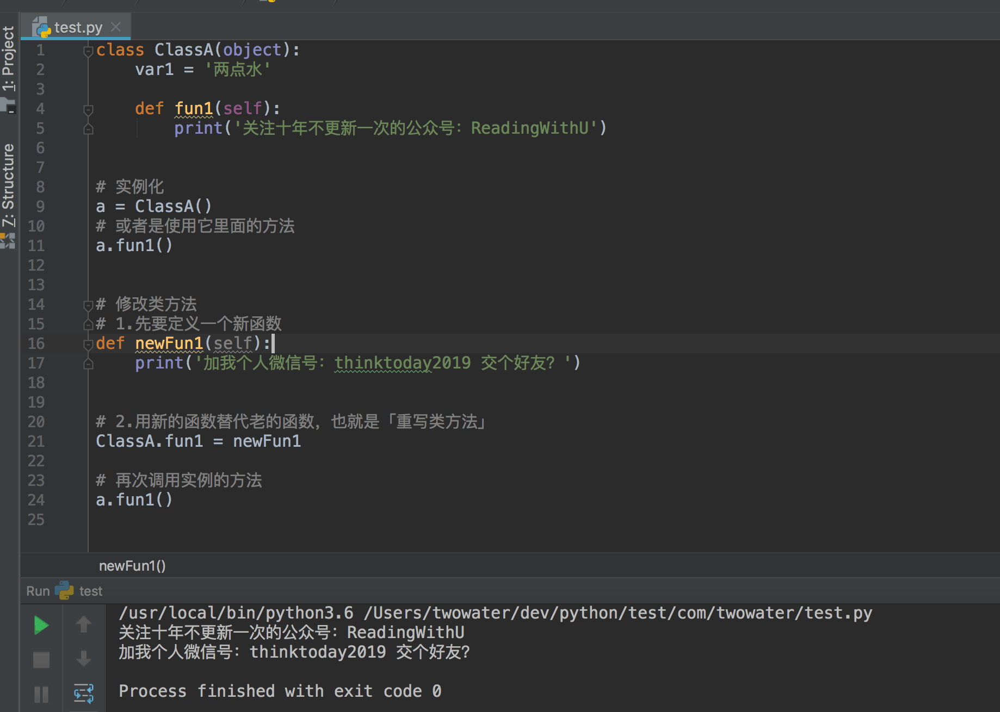

这里建议我的例子，各位都要仔细看一下，自己重新敲一遍。相信为什么要这么做，这么证明。

还是那句话多想，多敲。

回归正题，从运行的结果来看，类方法改变了，实例方法也是会跟着改变的。

在这个例子中，我们需要改变类方法，就用到了**类的重写**。

我们使用了  `类.原始函数 = 新函数`  就完了类的重写了。

要注意的是，这里的赋值是在替换方法，并不是调用函数。所以是不能加上括号的，也就是 `类.原始函数() = 新函数()` 这个写法是不对的。


**那么如果实例方法改变了，类方法会改变吗？**

如果这个问题我们需要验证的话，是不是要重写实例的方法，然后观察结果，看看类方法有没有改变，这样就能得出结果了。


可是我们是不能重写实例方法。

你看，会直接报错。

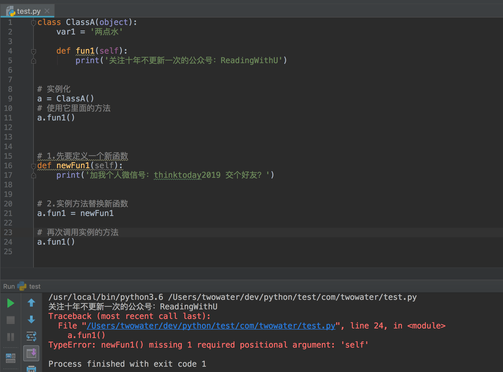


## 初始化函数

### 1、什么是初始化函数 ###

初始化函数的意思是，当你创建一个实例的时候，这个函数就会被调用。

比如：

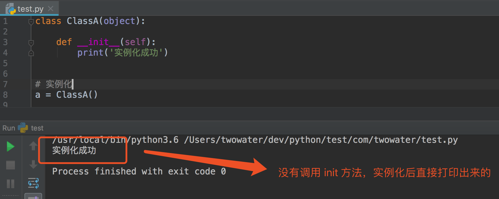

当代码在执行 `a = ClassA()` 的语句时，就自动调用了 `__init__(self)` 函数。

**而这个 `__init__(self)`  函数就是初始化函数，也叫构造函数。**

初始化函数的写法是固定的格式：中间是 `init`，意思是初始化，然后前后都要有【两个下划线】，然后 `__init__()` 的括号中，第一个参数一定要写上 `self`，不然会报错。

构造函数（初始化函数）格式如下：

```python
def __init__(self,[...):
```


初始化函数一样可以传递参数的，例如：

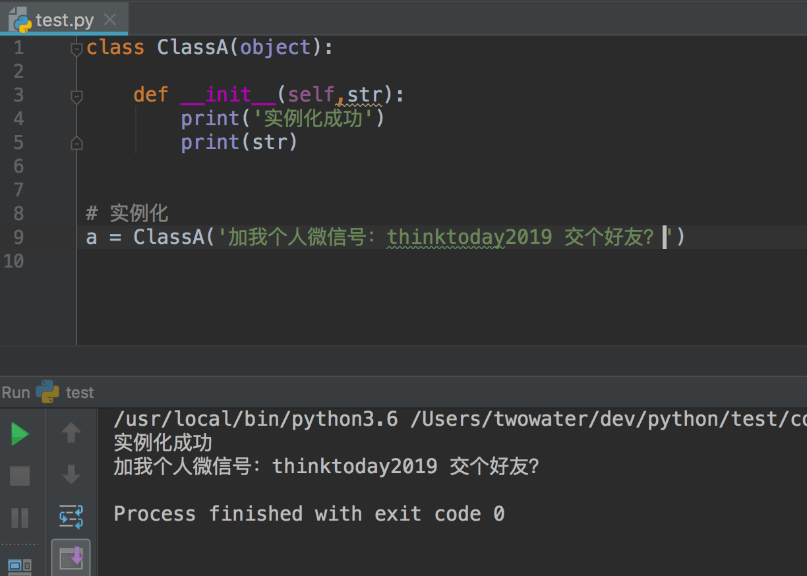


### 2、析构函数 ###

竟然一个在创建的时候，会调用构造函数，那么理所当然，这个当一个类销毁的时候，就会调用析构函数。

析构函数语法如下：

```python
def __del__(self,[...):
```

看下具体的示例：


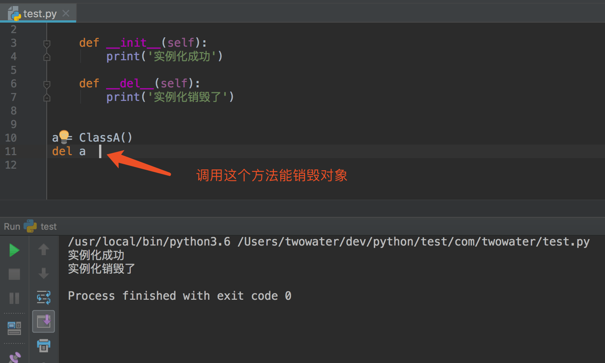


### 3、Python 定义类的历史遗留问题 ###

Python  在版本的迭代中，有一个关于类的历史遗留问题，就是新式类和旧式类的问题，具体先看以下的代码：

```python
#!/usr/bin/env python
# -*- coding: UTF-8 -*-

# 旧式类
class OldClass:
    pass

# 新式类
class NewClass(object):
    pass

```

可以看到，这里使用了两者中不同的方式定义类，可以看到最大的不同就是，新式类继承了`object` 类，在 Python2 中，我们定义类的时候最好定义新式类，当然在 Python3 中不存在这个问题了，因为 Python3 中所有类都是新式类。

那么新式类和旧式类有什么区别呢？

运行下下面的那段代码：

```python
#!/usr/bin/env python
# -*- coding: UTF-8 -*-

# 旧式类
class OldClass:
    def __init__(self, account, name):
        self.account = account
        self.name = name


# 新式类
class NewClass(object):
    def __init__(self, account, name):
        self.account = account
        self.name = name


if __name__ == '__main__':
    old_class = OldClass(111111, 'OldClass')
    print(old_class)
    print(type(old_class))
    print(dir(old_class))
    print('\n')
    new_class = NewClass(222222, 'NewClass')
    print(new_class)
    print(type(new_class))
    print(dir(new_class))

```

这是 python 2.7 运行的结果：

```
/Users/twowater/dev/python/test/venv/bin/python /Users/twowater/dev/python/test/com/twowater/test.py
<__main__.OldClass instance at 0x109a50560>
<type 'instance'>
['__doc__', '__init__', '__module__', 'account', 'name']


<__main__.NewClass object at 0x109a4b150>
<class '__main__.NewClass'>
['__class__', '__delattr__', '__dict__', '__doc__', '__format__', '__getattribute__', '__hash__', '__init__', '__module__', '__new__', '__reduce__', '__reduce_ex__', '__repr__', '__setattr__', '__sizeof__', '__str__', '__subclasshook__', '__weakref__', 'account', 'name']

Process finished with exit code 0

```

这是 Python 3.6 运行的结果：

```
/usr/local/bin/python3.6 /Users/twowater/dev/python/test/com/twowater/test.py
<__main__.OldClass object at 0x1038ba630>
<class '__main__.OldClass'>
['__class__', '__delattr__', '__dict__', '__dir__', '__doc__', '__eq__', '__format__', '__ge__', '__getattribute__', '__gt__', '__hash__', '__init__', '__init_subclass__', '__le__', '__lt__', '__module__', '__ne__', '__new__', '__reduce__', '__reduce_ex__', '__repr__', '__setattr__', '__sizeof__', '__str__', '__subclasshook__', '__weakref__', 'account', 'name']


<__main__.NewClass object at 0x103e3c9e8>
<class '__main__.NewClass'>
['__class__', '__delattr__', '__dict__', '__dir__', '__doc__', '__eq__', '__format__', '__ge__', '__getattribute__', '__gt__', '__hash__', '__init__', '__init_subclass__', '__le__', '__lt__', '__module__', '__ne__', '__new__', '__reduce__', '__reduce_ex__', '__repr__', '__setattr__', '__sizeof__', '__str__', '__subclasshook__', '__weakref__', 'account', 'name']

Process finished with exit code 0

```


仔细观察输出的结果，对比一下，就能观察出来，注意喔，Pyhton3 中输出的结果是一模一样的，因为Python3 中没有新式类旧式类的问题。

## 类的继承

### 1、定义类的继承 ###

说到继承，你一定会联想到继承你老爸的家产之类的。

类的继承也是一样。

比如有一个旧类，是可以算平均数的。然后这时候有一个新类，也要用到算平均数，那么这时候我们就可以使用继承的方式。新类继承旧类，这样子新类也就有这个功能了。

通常情况下，我们叫旧类为父类，新类为子类。


首先我们来看下类的继承的基本语法：

```python
class ClassName(BaseClassName):
    <statement-1>
    .
    .
    .
    <statement-N>
```

在定义类的时候，可以在括号里写继承的类，如果不用继承类的时候，也要写继承 object 类，因为在 Python 中 object 类是一切类的父类。

当然上面的是单继承，Python 也是支持多继承的，具体的语法如下：

```python
class ClassName(Base1,Base2,Base3):
    <statement-1>
    .
    .
    .
    <statement-N>
```

多继承有一点需要注意的：若是父类中有相同的方法名，而在子类使用时未指定，python 在圆括号中父类的顺序，从左至右搜索 ， 即方法在子类中未找到时，从左到右查找父类中是否包含方法。

那么继承的子类可以干什么呢？

继承的子类的好处：

* 会继承父类的属性和方法
* 可以自己定义，覆盖父类的属性和方法

### 2、调用父类的方法 ###

一个类继承了父类后，可以直接调用父类的方法的，比如下面的例子，`UserInfo2` 继承自父类 `UserInfo` ，可以直接调用父类的  `get_account` 方法。

```python
#!/usr/bin/env python
# -*- coding: UTF-8 -*-

class UserInfo(object):
    lv = 5

    def __init__(self, name, age, account):
        self.name = name
        self._age = age
        self.__account = account

    def get_account(self):
        return self.__account


class UserInfo2(UserInfo):
    pass


if __name__ == '__main__':
    userInfo2 = UserInfo2('两点水', 23, 347073565);
    print(userInfo2.get_account())

```

### 3、父类方法的重写 ###

当然，也可以重写父类的方法。

示例：

```python
#!/usr/bin/env python3
# -*- coding: UTF-8 -*-

class UserInfo(object):
    lv = 5

    def __init__(self, name, age, account):
        self.name = name
        self._age = age
        self.__account = account

    def get_account(self):
        return self.__account

    @classmethod
    def get_name(cls):
        return cls.lv

    @property
    def get_age(self):
        return self._age


class UserInfo2(UserInfo):
    def __init__(self, name, age, account, sex):
        super(UserInfo2, self).__init__(name, age, account)
        self.sex = sex;


if __name__ == '__main__':
    userInfo2 = UserInfo2('两点水', 23, 347073565, '男');
    # 打印所有属性
    print(dir(userInfo2))
    # 打印构造函数中的属性
    print(userInfo2.__dict__)
    print(UserInfo2.get_name())

```

最后打印的结果：


这里就是重写了父类的构造函数。


### 4、子类的类型判断 ###

对于 class 的继承关系来说，有些时候我们需要判断 class 的类型，该怎么办呢？

可以使用 `isinstance()` 函数,

一个例子就能看懂 `isinstance()` 函数的用法了。

```python
#!/usr/bin/env python3
# -*- coding: UTF-8 -*-

class User1(object):
    pass


class User2(User1):
    pass


class User3(User2):
    pass


if __name__ == '__main__':
    user1 = User1()
    user2 = User2()
    user3 = User3()
    # isinstance()就可以告诉我们，一个对象是否是某种类型
    print(isinstance(user3, User2))
    print(isinstance(user3, User1))
    print(isinstance(user3, User3))
    # 基本类型也可以用isinstance()判断
    print(isinstance('两点水', str))
    print(isinstance(347073565, int))
    print(isinstance(347073565, str))

```

输出的结果如下：

```txt
True
True
True
True
True
False
```

可以看到 `isinstance()` 不仅可以告诉我们，一个对象是否是某种类型，也可以用于基本类型的判断。

## 类的多态

多态的概念其实不难理解，它是指对不同类型的变量进行相同的操作，它会根据对象（或类）类型的不同而表现出不同的行为。

事实上，我们经常用到多态的性质，比如：

```
>>> 1 + 2
3
>>> 'a' + 'b'
'ab'
```

可以看到，我们对两个整数进行 + 操作，会返回它们的和，对两个字符进行相同的 + 操作，会返回拼接后的字符串。

也就是说，不同类型的对象对同一消息会作出不同的响应。


看下面的实例，来了解多态：


```python
#!/usr/bin/env python3
# -*- coding: UTF-8 -*-

class User(object):
    def __init__(self, name):
        self.name = name

    def printUser(self):
        print('Hello !' + self.name)


class UserVip(User):
    def printUser(self):
        print('Hello ! 尊敬的Vip用户：' + self.name)


class UserGeneral(User):
    def printUser(self):
        print('Hello ! 尊敬的用户：' + self.name)


def printUserInfo(user):
    user.printUser()


if __name__ == '__main__':
    userVip = UserVip('两点水')
    printUserInfo(userVip)
    userGeneral = UserGeneral('水水水')
    printUserInfo(userGeneral)

```

输出的结果:

```txt
Hello ! 尊敬的Vip用户：两点水
Hello ! 尊敬的用户：水水水
```

可以看到，userVip 和 userGeneral 是两个不同的对象，对它们调用 printUserInfo 方法，它们会自动调用实际类型的 printUser 方法，作出不同的响应。这就是多态的魅力。

要注意喔，有了继承，才有了多态，也会有不同类的对象对同一消息会作出不同的相应。


最后，本章的所有代码都可以在 [https://github.com/TwoWater/Python](https://github.com/TwoWater/Python) 上面找到，文章的内容和源文件都放在上面。同步更新到 Gitbooks。

## 类的访问控制

### 1、类属性的访问控制 ###

在 Java 中，有 public （公共）属性 和 private （私有）属性，这可以对属性进行访问控制。

那么在 Python 中有没有属性的访问控制呢？

一般情况下，我们会使用 `__private_attrs` 两个下划线开头，声明该属性为私有，不能在类地外部被使用或直接访问。在类内部的方法中使用时 `self.__private_attrs`。

为什么只能说一般情况下呢？

因为实际上， Python 中是没有提供私有属性等功能的。

但是 Python 对属性的访问控制是靠程序员自觉的。为什么这么说呢？

看看下面的示例：


仔细看图片，为什么说双下划线不是真正的私有属性呢？我们看下下面的例子，用下面的例子来验证：

```python
#!/usr/bin/env python
# -*- coding: UTF-8 -*-

class UserInfo(object):
    def __init__(self, name, age, account):
        self.name = name
        self._age = age
        self.__account = account

    def get_account(self):
        return self.__account


if __name__ == '__main__':
    userInfo = UserInfo('两点水', 23, 347073565);
    # 打印所有属性
    print(dir(userInfo))
    # 打印构造函数中的属性
    print(userInfo.__dict__)
    print(userInfo.get_account())
    # 用于验证双下划线是否是真正的私有属性
    print(userInfo._UserInfo__account)


```

输出的结果如下图：


### 2、类专有的方法 ###

一个类创建的时候，就会包含一些方法，主要有以下方法：

类的专有方法：

| 方法           | 说明                       |
| -------------- | -------------------------- |
| `__init__`     | 构造函数，在生成对象时调用 |
| `__del__ `     | 析构函数，释放对象时使用   |
| `__repr__ `    | 打印，转换                 |
| `__setitem__ ` | 按照索引赋值               |
| `__getitem__`  | 按照索引获取值             |
| `__len__`      | 获得长度                   |
| `__cmp__`      | 比较运算                   |
| `__call__`     | 函数调用                   |
| `__add__`      | 加运算                     |
| `__sub__`      | 减运算                     |
| `__mul__`      | 乘运算                     |
| `__div__`      | 除运算                     |
| `__mod__`      | 求余运算                   |
| `__pow__`      | 乘方                       |

当然有些时候我们需要获取类的相关信息，我们可以使用如下的方法：

* `type(obj)`：来获取对象的相应类型；
* `isinstance(obj, type)`：判断对象是否为指定的 type 类型的实例；
* `hasattr(obj, attr)`：判断对象是否具有指定属性/方法；
* `getattr(obj, attr[, default])` 获取属性/方法的值, 要是没有对应的属性则返回 default 值（前提是设置了 default），否则会抛出 AttributeError 异常；
* `setattr(obj, attr, value)`：设定该属性/方法的值，类似于 obj.attr=value；
* `dir(obj)`：可以获取相应对象的所有属性和方法名的列表：


### 3、方法的访问控制 ###

其实我们也可以把方法看成是类的属性的，那么方法的访问控制也是跟属性是一样的，也是没有实质上的私有方法。一切都是靠程序员自觉遵守 Python 的编程规范。

示例如下，具体规则也是跟属性一样的，

```python
#!/usr/bin/env python
# -*- coding: UTF-8 -*-

class User(object):
    def upgrade(self):
        pass

    def _buy_equipment(self):
        pass

    def __pk(self):
        pass

```


# 八、模块与包

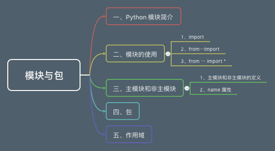

## Python 模块简介

在开发过程中，随着程序代码越写越多，在一个文件里代码就会越来越长，越来越不容易维护。

后面我们学习了函数，知道函数是实现一项或多项功能的一段程序，这样就更方便我们重复使用代码。

紧接着，我们有学了类，类可以封装方法和变量（属性）。这样就更方便我们维护代码了。

我们之前学过，类的结构是这样的:


而我们要学的模块是这样的：


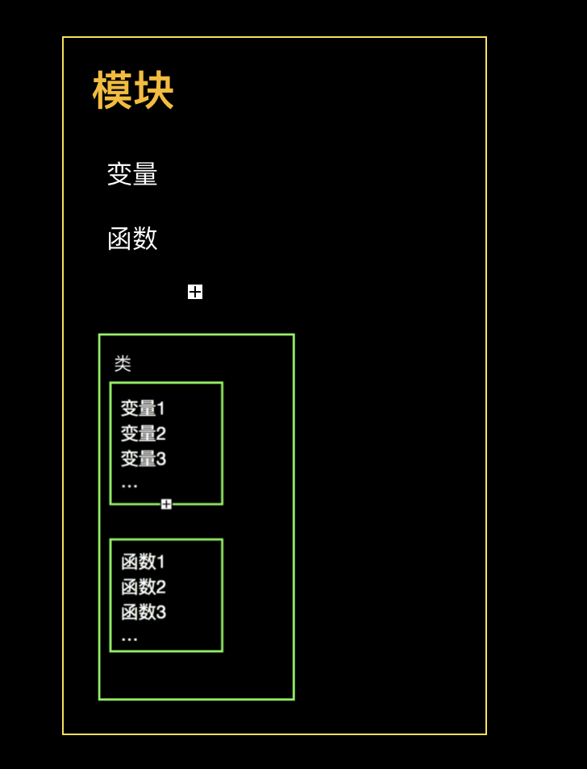

在模块中，我们不但可以直接存放变量，还能存放函数，还能存放类。

不知道你们还有没有印象，我们封装函数用的是 `def` , 封装类用的是 `class` 。

而我们封装模块，是不需要任何语句的。

**在 Python 中，一个 .py 文件就称之为一个模块（Module）。**

可以看下我之前写的例子，在 pychrome 上 ，这样一个 test.py 文件就是一个模块。

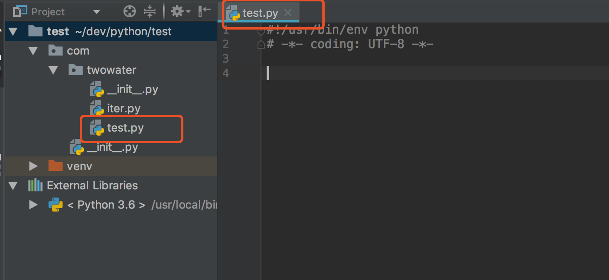

其实模块就是函数功能的扩展。为什么这么说呢？

那是因为模块其实就是实现一项或多项功能的程序块。

通过上面的定义，不难发现，函数和模块都是用来实现功能的，只是模块的范围比函数广，在模块中，可以有多个函数。

然有了函数，那为啥那需要模块？

最大的好处是大大提高了代码的可维护性。

其次，编写代码不必从零开始。当一个模块编写完毕，就可以被其他地方引用。我们在编写程序的时候，也经常引用其他模块，包括 Python 内置的模块和来自第三方的模块。

使用模块还可以避免函数名和变量名冲突。相同名字的函数和变量完全可以分别存在不同的模块中，因此，我们自己在编写模块时，不必考虑名字会与其他模块冲突。但是也要注意，尽量不要与内置函数名字冲突。

Python 本身就内置了很多非常有用的模块，只要安装完毕，这些模块就可以立刻使用。我们可以尝试找下这些模块，比如我的 Python 安装目录是默认的安装目录，在 C:\Users\Administrator\AppData\Local\Programs\Python\Python36 ，然后找到 Lib 目录，就可以发现里面全部都是模块，没错，这些 `.py` 文件就是模块了。


其实模块可以分为标准库模块和自定义模块，而刚刚我们看到的 Lib 目录下的都是标准库模块。


## 模块的使用

### 1、import ###

Python 模块的使用跟其他编程语言也是类似的。你要使用某个模块，在使用之前，必须要导入这个模块。导入模块我们使用关键字 `import`。

`import` 的语法基本如下：

```python
import module1[, module2[,... moduleN]
```

比如我们使用标准库模块中的 math 模块。当解释器遇到 `import` 语句，如果模块在当前的搜索路径就会被导入。

```python
#!/usr/bin/env python3
# -*- coding: UTF-8 -*-

import math

_author_ = '两点水'

print(math.pi)
```

输出的结果：

```txt
3.141592653589793
```

一个模块只会被导入一次，不管你执行了多少次 import。这样可以防止导入模块被一遍又一遍地执行。

当我们使用 import 语句的时候，Python 解释器是怎样找到对应的文件的呢？

这就涉及到 Python 的搜索路径，搜索路径是由一系列目录名组成的，Python 解释器就依次从这些目录中去寻找所引入的模块。这看起来很像环境变量，事实上，也可以通过定义环境变量的方式来确定搜索路径。搜索路径是在 Python 编译或安装的时候确定的，安装新的库应该也会修改。搜索路径被存储在sys 模块中的 path 变量 。

因此，我们可以查一下路径：

```python
#!/usr/bin/env python
# -*- coding: UTF-8 -*-

import sys

print(sys.path)
```

输出结果：


```txt
['C:\\Users\\Administrator\\Desktop\\Python\\Python8Code', 'G:\\PyCharm 2017.1.4\\helpers\\pycharm', 'C:\\Users\\Administrator\\AppData\\Local\\Programs\\Python\\Python36\\python36.zip', 'C:\\Users\\Administrator\\AppData\\Local\\Programs\\Python\\Python36\\DLLs', 'C:\\Users\\Administrator\\AppData\\Local\\Programs\\Python\\Python36\\lib', 'C:\\Users\\Administrator\\AppData\\Local\\Programs\\Python\\Python36', 'C:\\Users\\Administrator\\AppData\\Local\\Programs\\Python\\Python36\\lib\\site-packages', 'C:\\Users\\Administrator\\Desktop\\Python\\Python8Code\\com\\Learn\\module\\sys']

```

### 2、from···import  ###


有没有想过，怎么直接导入某个模块中的属性和方法呢？

Python 中，导入一个模块的方法我们使用的是 `import` 关键字，这样做是导入了这个模块，这里需要注意了，这样做只是导入了模块，并没有导入模块中具体的某个属性或方法的。而我们想直接导入某个模块中的某一个功能，也就是属性和方法的话，我们可以使用 `from···import` 语句。

语法如下：

```python
from modname import name1[, name2[, ... nameN]]
```

看完简介后可能会想， `from···import`  和 `import` 方法有啥区别呢？

想知道区别是什么，观察下面两个例子：

 `import` 导入 sys 模块，然后使用 version 属性


`from···import` 直接导入 version 属性


### 3、from ··· import *  ###

通过上面的学习，我们知道了 `from sys import version` 可以直接导入 version 属性。

但是如果我们想使用其他的属性呢？

比如使用 sys 模块中的 `executable` ，难道又要写多一句 `from sys import executable` ,两个还好，如果三个，四个呢？

难道要一直这样写下去？

这时候就需要 `from ··· import *` 语句了，这个语句可以把某个模块中的所有方法属性都导入。比如：

```python
#!/usr/bin/env python3
# -*- coding: UTF-8 -*-

from sys import *

print(version)
print(executable)

```

输出的结果为：

```txt
3.6.1 (v3.6.1:69c0db5, Mar 21 2017, 18:41:36) [MSC v.1900 64 bit (AMD64)]
C:\Users\Administrator\AppData\Local\Programs\Python\Python36\python.exe
```

注意：这提供了一个简单的方法来导入一个模块中的所有方法属性。然而这种声明不该被过多地使用。


## 主模块和非主模块

## 1、主模块和非主模块的定义 ##

在 Python 函数中，如果一个函数调用了其他函数完成一项功能，我们称这个函数为主函数，如果一个函数没有调用其他函数，我们称这种函数为非主函数。主模块和非主模块的定义也类似，如果一个模块被直接使用，而没有被别人调用，我们称这个模块为主模块，如果一个模块被别人调用，我们称这个模块为非主模块。

## 2、__name__ 属性 ##

在 Python  中，有主模块和非主模块之分，当然，我们也得区分他们啊。那么怎么区分主模块和非主模块呢？

这就需要用到 `__name__`  属性了，这个 `——name——` 属性值是一个变量，且这个变量是系统给出的。利用这个变量可以判断一个模块是否是主模块。如果一个属性的值是 `__main__` ,那么就说明这个模块是主模块，反之亦然。但是要注意了：** 这个 `__main__` 属性只是帮助我们判断是否是主模块，并不是说这个属性决定他们是否是主模块，决定是否是主模块的条件只是这个模块有没有被人调用**

具体看示例：

首先创建了模块 lname ，然后判断一下是否是主模块，如果是主模块就输出 `main` 不是，就输出 `not main` ，首先直接运行该模块，由于该模块是直接使用，而没有被人调用，所以是主模块，因此输出了 `main` ，具体看下图：


然后又创建一个 user_lname 模块，里面只是简单的导入了 lname 模块，然后执行，输出的结果是 `not main` ，因为 lname 模块被该模块调用了，所以不是主模块，输出结果如图：


## 包

包，其实在上面的一些例子中，都创建了不同的包名了，具体可以仔细观察。

在一开始模块的简介中提到，使用模块可以避免函数名和变量名冲突。

相同名字的函数和变量完全可以分别存在不同的模块中，因此，我们自己在编写模块时，不必考虑名字会与其他模块冲突。但是也要注意，尽量不要与内置函数名字冲突。

但是这里也有个问题，如果不同的人编写的模块名相同怎么办？

为了避免模块名冲突，Python 又引入了按目录来组织模块的方法，称为包（Package）。

比如最开始的例子，就引入了包，这样子做就算有相同的模块名，也不会造成重复，因为包名不同，其实也就是路径不同。如下图，引入了包名后， lname.py 其实变成了 com.Learn.module.nameattributes.lname


仔细观察的人，基本会发现，每一个包目录下面都会有一个 `__init__.py` 的文件，为什么呢？

因为这个文件是必须的，否则，Python 就把这个目录当成普通目录，而不是一个包 。 `__init__.py` 可以是空文件，也可以有Python代码，因为 `__init__.py` 本身就是一个模块，而它对应的模块名就是它的包名。


## 作用域

学习过 Java 的同学都知道，Java 的类里面可以给方法和属性定义公共的（ public ）或者是私有的 （ private ）,这样做主要是为了我们希望有些函数和属性能给别人使用或者只能内部使用。

 通过学习 Python 中的模块，其实和 Java 中的类相似，那么我们怎么实现在一个模块中，有的函数和变量给别人使用，有的函数和变量仅仅在模块内部使用呢？

在 Python 中，是通过 `_` 前缀来实现的。正常的函数和变量名是公开的（public），可以被直接引用，比如：abc，ni12，PI等；类似`__xxx__`这样的变量是特殊变量，可以被直接引用，但是有特殊用途，比如上面的 `__name__` 就是特殊变量，还有 `__author__` 也是特殊变量，用来标明作者。

注意，我们自己的变量一般不要用这种变量名；类似 `_xxx` 和 `__xxx` 这样的函数或变量就是非公开的（private），不应该被直接引用，比如 `_abc` ，`__abc` 等；

**这里是说不应该，而不是不能。因为 Python 种并没有一种方法可以完全限制访问 private 函数或变量，但是，从编程习惯上不应该引用 private 函数或变量。**

比如：

```python
#!/usr/bin/env python3
# -*- coding: UTF-8 -*-

def _diamond_vip(lv):
    print('尊敬的钻石会员用户，您好')
    vip_name = 'DiamondVIP' + str(lv)
    return vip_name


def _gold_vip(lv):
    print('尊敬的黄金会员用户，您好')
    vip_name = 'GoldVIP' + str(lv)
    return vip_name


def vip_lv_name(lv):
    if lv == 1:
        print(_gold_vip(lv))
    elif lv == 2:
        print(_diamond_vip(lv))


vip_lv_name(2)

```

输出的结果：

```txt
尊敬的钻石会员用户，您好
DiamondVIP2
```

在这个模块中，我们公开 `vip_lv_name`  方法函数，而其他内部的逻辑分别在 `_diamond_vip` 和 `_gold_vip` private 函数中实现，因为是内部实现逻辑，调用者根本不需要关心这个函数方法，它只需关心调用 `vip_lv_name`  的方法函数，所以用 private 是非常有用的代码封装和抽象的方法

一般情况下，外部不需要引用的函数全部定义成 private，只有外部需要引用的函数才定义为 public。

------------------------

最后扯淡，欢迎加我微信：`thinktoday2019`, 进入微信 Python 讨论群。

# 九、Python 的 Magic Method

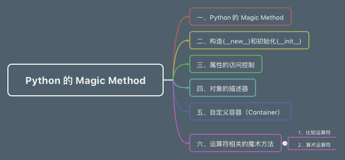

## Python 的 Magic Method

在 Python 中，所有以 "__" 双下划线包起来的方法，都统称为"魔术方法"。比如我们接触最多的 `__init__` 。

魔术方法有什么作用呢？

使用这些魔术方法，我们可以构造出优美的代码，将复杂的逻辑封装成简单的方法。

那么一个类中有哪些魔术方法呢？

我们可以使用 Python 内置的方法 `dir()` 来列出类中所有的魔术方法.示例如下：

```python
#!/usr/bin/env python3
# -*- coding: UTF-8 -*-

class User(object):
    pass


if __name__ == '__main__':
    print(dir(User()))
```

输出的结果：

```
['__class__', '__delattr__', '__dict__', '__dir__', '__doc__', '__eq__', '__format__', '__ge__', '__getattribute__', '__gt__', '__hash__', '__init__', '__init_subclass__', '__le__', '__lt__', '__module__', '__ne__', '__new__', '__reduce__', '__reduce_ex__', '__repr__', '__setattr__', '__sizeof__', '__str__', '__subclasshook__', '__weakref__']
```

可以看到，一个类的魔术方法还是挺多的，不过我们只需要了解一些常见和常用的魔术方法就好了。

## 构造(__new__)和初始化(__init__)

通过之前的学习，我们已经知道定义一个类时，我们经常会通过 `__init__(self)` 的方法在实例化对象的时候，对属性进行设置。

比如下面的例子：

```python
#!/usr/bin/env python3
# -*- coding: UTF-8 -*-

class User(object):
    def __init__(self, name, age):
        self.name = name;
        self.age = age;

user=User('两点水',23)
```

实际上，创建一个类的过程是分为两步的，一步是创建类的对象，还有一步就是对类进行初始化。

`__new__` 是用来创建类并返回这个类的实例, 而`__init__` 只是将传入的参数来初始化该实例.`__new__` 在创建一个实例的过程中必定会被调用,但 `__init__` 就不一定，比如通过 pickle.load 的方式反序列化一个实例时就不会调用 `__init__` 方法。


`def __new__(cls)` 是在 `def __init__(self)` 方法之前调用的，作用是返回一个实例对象。还有一点需要注意的是：`__new__` 方法总是需要返回该类的一个实例，而 `__init__`  不能返回除了 `None` 的任何值

具体的示例：

```python
#!/usr/bin/env python3
# -*- coding: UTF-8 -*-

class User(object):
    def __new__(cls, *args, **kwargs):
        # 打印 __new__方法中的相关信息
        print('调用了 def __new__ 方法')
        print(args)
        # 最后返回父类的方法
        return super(User, cls).__new__(cls)

    def __init__(self, name, age):
        print('调用了 def __init__ 方法')
        self.name = name
        self.age = age


if __name__ == '__main__':
    usr = User('两点水', 23)
```

看看输出的结果：

```txt
调用了 def __new__ 方法
('两点水', 23)
调用了 def __init__ 方法
```

通过打印的结果来看，我们就可以知道一个类创建的过程是怎样的了，先是调用了 `__new__` 方法来创建一个对象，把参数传给 `__init__` 方法进行实例化。

其实在实际开发中，很少会用到 `__new__` 方法，除非你希望能够控制类的创建。通常讲到 `__new__` ，都是牵扯到 `metaclass`(元类)的。

当然当一个对象的生命周期结束的时候，析构函数 `__del__` 方法会被调用。但是这个方法是 Python 自己对对象进行垃圾回收的。


## 属性的访问控制

之前也有讲到过，Python 没有真正意义上的私有属性。然后这就导致了对 Python 类的封装性比较差。我们有时候会希望 Python 能够定义私有属性，然后提供公共可访问的 get 方法和 set 方法。Python 其实可以通过魔术方法来实现封装。

| 方法                             | 说明                                                         |
| -------------------------------- | ------------------------------------------------------------ |
| `__getattr__(self, name)`        | 该方法定义了你试图访问一个不存在的属性时的行为。因此，重载该方法可以实现捕获错误拼写然后进行重定向, 或者对一些废弃的属性进行警告。 |
| `__setattr__(self, name, value)` | 定义了对属性进行赋值和修改操作时的行为。不管对象的某个属性是否存在,都允许为该属性进行赋值.有一点需要注意，实现 `__setattr__` 时要避免"无限递归"的错误， |
| `__delattr__(self, name)`        | `__delattr__` 与 `__setattr__` 很像，只是它定义的是你删除属性时的行为。实现 `__delattr__` 是同时要避免"无限递归"的错误 |
| `__getattribute__(self, name)`   | `__getattribute__` 定义了你的属性被访问时的行为，相比较，`__getattr__` 只有该属性不存在时才会起作用。因此，在支持 `__getattribute__ `的 Python 版本,调用`__getattr__` 前必定会调用 `__getattribute__``__getattribute__` 同样要避免"无限递归"的错误。 |

通过上面的方法表可以知道，在进行属性访问控制定义的时候你可能会很容易的引起一个错误，可以看看下面的示例：

```python
def __setattr__(self, name, value):
    self.name = value
    # 每当属性被赋值的时候， ``__setattr__()`` 会被调用，这样就造成了递归调用。
    # 这意味这会调用 ``self.__setattr__('name', value)`` ，每次方法会调用自己。这样会造成程序崩溃。

def __setattr__(self, name, value):
    # 给类中的属性名分配值
    self.__dict__[name] = value  
    # 定制特有属性
```

上面方法的调用具体示例如下：

```python
#!/usr/bin/env python3
# -*- coding: UTF-8 -*-

class User(object):
    def __getattr__(self, name):
        print('调用了 __getattr__ 方法')
        return super(User, self).__getattr__(name)

    def __setattr__(self, name, value):
        print('调用了 __setattr__ 方法')
        return super(User, self).__setattr__(name, value)

    def __delattr__(self, name):
        print('调用了 __delattr__ 方法')
        return super(User, self).__delattr__(name)

    def __getattribute__(self, name):
        print('调用了 __getattribute__ 方法')
        return super(User, self).__getattribute__(name)


if __name__ == '__main__':
    user = User()
    # 设置属性值，会调用 __setattr__
    user.attr1 = True
    # 属性存在,只有__getattribute__调用
    user.attr1
    try:
        # 属性不存在, 先调用__getattribute__, 后调用__getattr__
        user.attr2
    except AttributeError:
        pass
    # __delattr__调用
    del user.attr1

```

输出的结果：

```txt
调用了 __setattr__ 方法
调用了 __getattribute__ 方法
调用了 __getattribute__ 方法
调用了 __getattr__ 方法
调用了 __delattr__ 方法
```


## 对象的描述器

一般来说，一个描述器是一个有“绑定行为”的对象属性 (object attribute)，它的访问控制被描述器协议方法重写。

这些方法是 `__get__()`, `__set__()` , 和 `__delete__()`  。

有这些方法的对象叫做描述器。

默认对属性的访问控制是从对象的字典里面 (`__dict__`) 中获取 (get) , 设置 (set) 和删除 (delete) 。

举例来说， `a.x` 的查找顺序是, `a.__dict__['x']` , 然后 `type(a).__dict__['x']` , 然后找 `type(a)` 的父类 ( 不包括元类 (metaclass) ).如果查找到的值是一个描述器, Python 就会调用描述器的方法来重写默认的控制行为。

这个重写发生在这个查找环节的哪里取决于定义了哪个描述器方法。

注意, 只有在新式类中时描述器才会起作用。在之前的篇节中已经提到新式类和旧式类的，有兴趣可以查看之前的篇节来看看，至于新式类最大的特点就是所有类都继承自 type 或者 object 的类。

在面向对象编程时，如果一个类的属性有相互依赖的关系时，使用描述器来编写代码可以很巧妙的组织逻辑。在 Django 的 ORM 中,models.Model 中的 InterField 等字段, 就是通过描述器来实现功能的。

我们先看下下面的例子：

```python
#!/usr/bin/env python3
# -*- coding: UTF-8 -*-

class User(object):
    def __init__(self, name='两点水', sex='男'):
        self.sex = sex
        self.name = name

    def __get__(self, obj, objtype):
        print('获取 name 值')
        return self.name

    def __set__(self, obj, val):
        print('设置 name 值')
        self.name = val


class MyClass(object):
    x = User('两点水', '男')
    y = 5


if __name__ == '__main__':
    m = MyClass()
    print(m.x)

    print('\n')

    m.x = '三点水'
    print(m.x)

    print('\n')

    print(m.x)

    print('\n')

    print(m.y)

```

输出的结果如下：

```txt
获取 name 值
两点水


设置 name 值
获取 name 值
三点水


获取 name 值
三点水


5

```

通过这个例子，可以很好的观察到这 `__get__()` 和  `__set__()` 这些方法的调用。

再看一个经典的例子

我们知道，距离既可以用单位"米"表示,也可以用单位"英尺"表示。
现在我们定义一个类来表示距离,它有两个属性: 米和英尺。

```python
#!/usr/bin/env python3
# -*- coding: UTF-8 -*-


class Meter(object):
    def __init__(self, value=0.0):
        self.value = float(value)

    def __get__(self, instance, owner):
        return self.value

    def __set__(self, instance, value):
        self.value = float(value)


class Foot(object):
    def __get__(self, instance, owner):
        return instance.meter * 3.2808

    def __set__(self, instance, value):
        instance.meter = float(value) / 3.2808


class Distance(object):
    meter = Meter()
    foot = Foot()


if __name__ == '__main__':
    d = Distance()
    print(d.meter, d.foot)
    d.meter = 1
    print(d.meter, d.foot)
    d.meter = 2
    print(d.meter, d.foot)

```

输出的结果：

```txt
0.0 0.0
1.0 3.2808
2.0 6.5616
```

在上面例子中,在还没有对 Distance 的实例赋值前, 我们认为 meter 和 foot 应该是各自类的实例对象, 但是输出却是数值。这是因为 `__get__` 发挥了作用.

我们只是修改了 meter ,并且将其赋值成为 int ，但 foot 也修改了。这是 `__set__` 发挥了作用.

描述器对象 (Meter、Foot) 不能独立存在, 它需要被另一个所有者类 (Distance) 所持有。描述器对象可以访问到其拥有者实例的属性，比如例子中 Foot 的 `instance.meter` 。

## 自定义容器（Container）

经过之前编章的介绍，我们知道在 Python 中，常见的容器类型有: dict, tuple, list, string。其中也提到过可容器和不可变容器的概念。其中 tuple, string 是不可变容器，dict, list 是可变容器。

可变容器和不可变容器的区别在于，不可变容器一旦赋值后，不可对其中的某个元素进行修改。当然具体的介绍，可以看回之前的文章，有图文介绍。

那么这里先提出一个问题，这些数据结构就够我们开发使用吗？

不够的时候，或者说有些特殊的需求不能单单只使用这些基本的容器解决的时候，该怎么办呢？

这个时候就需要自定义容器了，那么具体我们该怎么做呢？

| 功能                                                         | 说明                                                         |
| ------------------------------------------------------------ | ------------------------------------------------------------ |
| 自定义不可变容器类型                                         | 需要定义 `__len__` 和 `__getitem__` 方法                     |
| 自定义可变类型容器                                           | 在不可变容器类型的基础上增加定义 `__setitem__` 和 `__delitem__` |
| 自定义的数据类型需要迭代                                     | 需定义 `__iter__`                                            |
| 返回自定义容器的长度                                         | 需实现 `__len__(self)`                                       |
| 自定义容器可以调用 `self[key]` ，如果 key 类型错误，抛出TypeError ，如果没法返回key对应的数值时,该方法应该抛出ValueError | 需要实现 `__getitem__(self, key)`                            |
| 当执行 	`self[key] = value` 时                            | 调用是 `__setitem__(self, key, value)`这个方法               |
| 当执行 `del self[key]` 方法                                  | 其实调用的方法是 `__delitem__(self, key)`                    |
| 当你想你的容器可以执行 `for x in container:` 或者使用 `iter(container)` 时 | 需要实现 `__iter__(self)` ，该方法返回的是一个迭代器         |

来看一下使用上面魔术方法实现 Haskell 语言中的一个数据结构：

```python
#!/usr/bin/env python3
# -*- coding: UTF-8 -*-

class FunctionalList:
    ''' 实现了内置类型list的功能,并丰富了一些其他方法: head, tail, init, last, drop, take'''

    def __init__(self, values=None):
        if values is None:
            self.values = []
        else:
            self.values = values

    def __len__(self):
        return len(self.values)

    def __getitem__(self, key):
        return self.values[key]

    def __setitem__(self, key, value):
        self.values[key] = value

    def __delitem__(self, key):
        del self.values[key]

    def __iter__(self):
        return iter(self.values)

    def __reversed__(self):
        return FunctionalList(reversed(self.values))

    def append(self, value):
        self.values.append(value)

    def head(self):
        # 获取第一个元素
        return self.values[0]

    def tail(self):
        # 获取第一个元素之后的所有元素
        return self.values[1:]

    def init(self):
        # 获取最后一个元素之前的所有元素
        return self.values[:-1]

    def last(self):
        # 获取最后一个元素
        return self.values[-1]

    def drop(self, n):
        # 获取所有元素，除了前N个
        return self.values[n:]

    def take(self, n):
        # 获取前N个元素
        return self.values[:n]

```


## 运算符相关的魔术方法

运算符相关的魔术方法实在太多了,j就大概列举下面两类：


### 1、比较运算符 ###

| 魔术方法               | 说明                                                         |
| ---------------------- | ------------------------------------------------------------ |
| `__cmp__(self, other)` | 如果该方法返回负数，说明 `self < other`;  返回正数，说明 `self > other`; 返回 0 说明 `self == other `。强烈不推荐来定义 `__cmp__` , 取而代之, 最好分别定义 `__lt__`, `__eq__` 等方法从而实现比较功能。 `__cmp__` 在 Python3 中被废弃了。 |
| `__eq__(self, other)`  | 定义了比较操作符 == 的行为                                   |
| `__ne__(self, other)`  | 定义了比较操作符 != 的行为                                   |
| `__lt__(self, other)`  | 定义了比较操作符 < 的行为                                    |
| `__gt__(self, other)`  | 定义了比较操作符 > 的行为                                    |
| `__le__(self, other)`  | 定义了比较操作符 <= 的行为                                   |
| `__ge__(self, other)`  | 定义了比较操作符 >= 的行为                                   |


来看个简单的例子就能理解了：

```python
#!/usr/bin/env python3
# -*- coding: UTF-8 -*-

class Number(object):
    def __init__(self, value):
        self.value = value

    def __eq__(self, other):
        print('__eq__')
        return self.value == other.value

    def __ne__(self, other):
        print('__ne__')
        return self.value != other.value

    def __lt__(self, other):
        print('__lt__')
        return self.value < other.value

    def __gt__(self, other):
        print('__gt__')
        return self.value > other.value

    def __le__(self, other):
        print('__le__')
        return self.value <= other.value

    def __ge__(self, other):
        print('__ge__')
        return self.value >= other.value


if __name__ == '__main__':
    num1 = Number(2)
    num2 = Number(3)
    print('num1 == num2 ? --------> {} \n'.format(num1 == num2))
    print('num1 != num2 ? --------> {} \n'.format(num1 == num2))
    print('num1 < num2 ? --------> {} \n'.format(num1 < num2))
    print('num1 > num2 ? --------> {} \n'.format(num1 > num2))
    print('num1 <= num2 ? --------> {} \n'.format(num1 <= num2))
    print('num1 >= num2 ? --------> {} \n'.format(num1 >= num2))

```

输出的结果为：

```txt
__eq__
num1 == num2 ? --------> False

__eq__
num1 != num2 ? --------> False

__lt__
num1 < num2 ? --------> True

__gt__
num1 > num2 ? --------> False

__le__
num1 <= num2 ? --------> True

__ge__
num1 >= num2 ? --------> False

```

### 2、算术运算符 ###

| 魔术方法                    | 说明                                                         |
| --------------------------- | ------------------------------------------------------------ |
| `__add__(self, other)`      | 实现了加号运算                                               |
| `__sub__(self, other)`      | 实现了减号运算                                               |
| `__mul__(self, other)`      | 实现了乘法运算                                               |
| `__floordiv__(self, other)` | 实现了 // 运算符                                             |
| `___div__(self, other)`     | 实现了/运算符. 该方法在 Python3 中废弃. 原因是 Python3 中，division 默认就是 true division |
| `__truediv__(self, other)`  | 实现了 true division. 只有你声明了 `from __future__ import division` 该方法才会生效 |
| `__mod__(self, other)`      | 实现了 % 运算符, 取余运算                                    |
| `__divmod__(self, other)`   | 实现了 divmod() 內建函数                                     |
| `__pow__(self, other)`      | 实现了 `**` 操作. N 次方操作                                 |
| `__lshift__(self, other)`   | 实现了位操作 `<<`                                            |
| `__rshift__(self, other)`   | 实现了位操作 `>>`                                            |
| `__and__(self, other)`      | 实现了位操作 `&`                                             |
| `__or__(self, other)`       | 实现了位操作 `|`                                             |
| `__xor__(self, other)`      | 实现了位操作 `^`                                             |


可以关注下公众号：

这个公号可能很少更新，但是一更新，就是把整理的一系列文章更新上去。

# 十、枚举类

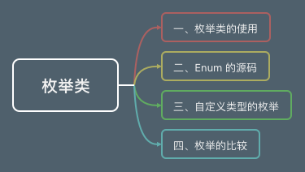

## 枚举类的使用

实际开发中，我们离不开定义常量，当我们需要定义常量时，其中一个办法是用大写变量通过整数来定义，例如月份：

```python
JAN = 1
FEB = 2
MAR = 3
...
NOV = 11
DEC = 12
```

当然这样做简单快捷，缺点是类型是 `int` ，并且仍然是变量。

那有没有什么好的方法呢？

这时候我们定义一个 class 类型，每个常量都是 class 里面唯一的实例。

正好 Python 提供了 Enum 类来实现这个功能如下：

```python
#!/usr/bin/env python3
# -*- coding: UTF-8 -*-

from enum import Enum

Month = Enum('Month', ('Jan', 'Feb', 'Mar', 'Apr', 'May', 'Jun', 'Jul', 'Aug', 'Sep', 'Oct', 'Nov', 'Dec'))

# 遍历枚举类型
for name, member in Month.__members__.items():
    print(name, '---------', member, '----------', member.value)

# 直接引用一个常量
print('\n', Month.Jan)

```

输出的结果如下：


我们使用 `Enum` 来定义了一个枚举类。

上面的代码，我们创建了一个有关月份的枚举类型 Month ，这里要注意的是构造参数，第一个参数 Month 表示的是该枚举类的类名，第二个 tuple 参数，表示的是枚举类的值；当然，枚举类通过 `__members__` 遍历它的所有成员的方法。

注意的一点是 ， `member.value` 是自动赋给成员的 `int` 类型的常量，默认是从 1 开始的。

**而且 Enum 的成员均为单例（Singleton），并且不可实例化，不可更改**

## Enum 的源码

通过上面的实例可以知道通过 `__members__`  可以遍历枚举类的所有成员。

那有没有想过为什么呢？

当你看到那段代码的时候，有没有想过为什么通过  `__members__`  就能遍历枚举类型的所有成员出来？


我们可以先来大致看看 Enum 的源码是如何实现的；

Enum 在模块 enum.py 中，先来看看 Enum 类的片段

```python
class Enum(metaclass=EnumMeta):
    """Generic enumeration.
    Derive from this class to define new enumerations.
    """
```

可以看到，Enum 是继承元类 EnumMeta 的；再看看 EnumMeta 的相关片段

```python
class EnumMeta(type):
    """Metaclass for Enum"""
    @property
    def __members__(cls):
        """Returns a mapping of member name->value.
        This mapping lists all enum members, including aliases. Note that this
        is a read-only view of the internal mapping.
        """
        return MappingProxyType(cls._member_map_)
```

首先 `__members__` 方法返回的是一个包含一个 Dict 既 Map 的 MappingProxyType，并且通过 @property 将方法 `__members__(cls)` 的访问方式改变为了变量的的形式，那么就可以直接通过 `__members__` 来进行访问了

## 自定义类型的枚举

但有些时候我们需要控制枚举的类型，那么我们可以 Enum 派生出自定义类来满足这种需要。通过修改上面的例子：

```python
#!/usr/bin/env python3
# -*- coding: UTF-8 -*-
from enum import Enum, unique

Enum('Month', ('Jan', 'Feb', 'Mar', 'Apr', 'May', 'Jun', 'Jul', 'Aug', 'Sep', 'Oct', 'Nov', 'Dec'))


# @unique 装饰器可以帮助我们检查保证没有重复值
@unique
class Month(Enum):
    Jan = 'January'
    Feb = 'February'
    Mar = 'March'
    Apr = 'April'
    May = 'May'
    Jun = 'June'
    Jul = 'July'
    Aug = 'August'
    Sep = 'September '
    Oct = 'October'
    Nov = 'November'
    Dec = 'December'


if __name__ == '__main__':
    print(Month.Jan, '----------',
          Month.Jan.name, '----------', Month.Jan.value)
    for name, member in Month.__members__.items():
        print(name, '----------', member, '----------', member.value)

```


输出的结果如下：


通过上面的例子，可以知道枚举模块定义了具有迭代 (interator) 和比较(comparison) 功能的枚举类型。 它可以用来为值创建明确定义的符号，而不是使用具体的整数或字符串。

## 枚举的比较

因为枚举成员不是有序的，所以它们只支持通过标识(identity) 和相等性 (equality) 进行比较。下面来看看 `==` 和 `is` 的使用：

```python
#!/usr/bin/env python3
# -*- coding: UTF-8 -*-
from enum import Enum


class User(Enum):
    Twowater = 98
    Liangdianshui = 30
    Tom = 12


Twowater = User.Twowater
Liangdianshui = User.Liangdianshui

print(Twowater == Liangdianshui, Twowater == User.Twowater)
print(Twowater is Liangdianshui, Twowater is User.Twowater)

try:
    print('\n'.join('  ' + s.name for s in sorted(User)))
except TypeError as err:
    print(' Error : {}'.format(err))

```

输出的结果：

```txt
False True
False True
 Error : '<' not supported between instances of 'User' and 'User'

```

可以看看最后的输出结果，报了个异常，那是因为大于和小于比较运算符引发 TypeError 异常。也就是 `Enum` 类的枚举是不支持大小运算符的比较的。

那么能不能让枚举类进行大小的比较呢？

当然是可以的，使用 IntEnum 类进行枚举，就支持比较功能。

```python
#!/usr/bin/env python3
# -*- coding: UTF-8 -*-
import enum


class User(enum.IntEnum):
    Twowater = 98
    Liangdianshui = 30
    Tom = 12


try:
    print('\n'.join(s.name for s in sorted(User)))
except TypeError as err:
    print(' Error : {}'.format(err))


```

看看输出的结果：

```txt
Tom
Liangdianshui
Twowater
```

通过输出的结果可以看到，枚举类的成员通过其值得大小进行了排序。也就是说可以进行大小的比较。

# 十一、元类

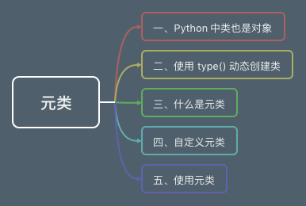

## Python 中类也是对象

在了解元类之前，我们先进一步理解 Python 中的类，在大多数编程语言中，类就是一组用来描述如何生成一个对象的代码段。在 Python 中这一点也是一样的。

这点在学习类的章节也强调过了，下面可以通过例子回忆一下：

```python
class ObjectCreator(object):
    pass


mObject = ObjectCreator()
print(mObject)
```

输出结果：

```
<__main__.ObjectCreator object at 0x00000000023EE048>
```

但是，Python 中的类有一点跟大多数的编程语言不同，在 Python 中，可以把类理解成也是一种对象。对的，这里没有写错，就是对象。

为什么呢？

因为只要使用关键字 `class` ，Python 解释器在执行的时候就会创建一个对象。

如：

```python
class ObjectCreator(object):
    pass
```

当程序运行这段代码的时候，就会在内存中创建一个对象，名字就是ObjectCreator。这个对象（类）自身拥有创建对象（类实例）的能力，而这就是为什么它是一个类的原因。

但是，它的本质仍然是一个对象，于是我们可以对它做如下的操作：

```python
class ObjectCreator(object):
    pass


def echo(ob):
    print(ob)


mObject = ObjectCreator()
print(mObject)

# 可以直接打印一个类，因为它其实也是一个对象
print(ObjectCreator)
# 可以直接把一个类作为参数传给函数（注意这里是类，是没有实例化的）
echo(ObjectCreator)
# 也可以直接把类赋值给一个变量
objectCreator = ObjectCreator
print(objectCreator)
```

输出的结果如下：

```
<__main__.ObjectCreator object at 0x000000000240E358>
<class '__main__.ObjectCreator'>
<class '__main__.ObjectCreator'>
<class '__main__.ObjectCreator'>
```


## 使用 type() 动态创建类

因为类也是对象，所以我们可以在程序运行的时候创建类。

Python 是动态语言。

**动态语言和静态语言最大的不同，就是函数和类的定义，不是编译时定义的，而是运行时动态创建的。**

在之前，我们先了了解下 `type()` 函数。


首先我们新建一个 `hello.py` 的模块，然后定义一个 Hello 的 class ，

```python
class Hello(object):
    def hello(self, name='Py'):
        print('Hello,', name)
```

然后在另一个模块中引用 hello 模块，并输出相应的信息。

其中 `type()` 函数的作用是可以查看一个类型和变量的类型。

```python
#!/usr/bin/env python3
# -*- coding: UTF-8 -*-

from com.twowater.hello import Hello

h = Hello()
h.hello()

print(type(Hello))
print(type(h))

```

输出的结果是怎样的呢？

```
Hello, Py
<class 'type'>
<class 'com.twowater.hello.Hello'>
```

上面也提到过，`type()` 函数可以查看一个类型或变量的类型，`Hello` 是一个 `class` ，它的类型就是 `type` ，而 `h` 是一个实例，它的类型就是 `com.twowater.hello.Hello`。

前面的 `com.twowater` 是我的包名，`hello` 模块在该包名下。

在这里还要细想一下，上面的例子中，我们使用 `type()` 函数查看一个类型或者变量的类型。

其中查看了一个 `Hello` class 的类型，打印的结果是： `<class 'type'>` 。

**其实 	`type()` 函数不仅可以返回一个对象的类型，也可以创建出新的类型。**

class 的定义是运行时动态创建的，而创建 class 的方法就是使用 `type()` 函数。

比如我们可以通过 `type()` 函数创建出上面例子中的 `Hello` 类，具体看下面的代码：

```python
# -*- coding: UTF-8 -*-

def printHello(self, name='Py'):
    # 定义一个打印 Hello 的函数
    print('Hello,', name)


# 创建一个 Hello 类
Hello = type('Hello', (object,), dict(hello=printHello))

# 实例化 Hello 类
h = Hello()
# 调用 Hello 类的方法
h.hello()
# 查看 Hello class 的类型
print(type(Hello))
# 查看实例 h 的类型
print(type(h))

```

输出的结果如下：

```
Hello, Py
<class 'type'>
<class '__main__.Hello'>
```

在这里，需先了解下通过 `type()` 函数创建 class 对象的参数说明：

1、class 的名称，比如例子中的起名为 `Hello`

2、继承的父类集合，注意 Python 支持多重继承，如果只有一个父类，tuple 要使用单元素写法；例子中继承 object 类，因为是单元素的 tuple ，所以写成 `(object,)`

3、class 的方法名称与函数绑定；例子中将函数 `printHello` 绑定在方法名 `hello` 中

具体的模式如下：

```python
type(类名, 父类的元组（针对继承的情况，可以为空），包含属性的字典（名称和值）)
```

好了，了解完具体的参数使用之外，我们看看输出的结果，可以看到，通过 `type()` 函数创建的类和直接写 class 是完全一样的。

这是因为Python 解释器遇到 class 定义时，仅仅是扫描一下 class 定义的语法，然后调用 `type()` 函数创建出 class 的。

不过一般的情况下，我们都是使用 `class ***...` 的方法来定义类的，不过 `type()` 函数也可以让我们创建出类来。

也就是说，动态语言本身支持运行期动态创建类，这和静态语言有非常大的不同，要在静态语言运行期创建类，必须构造源代码字符串再调用编译器，或者借助一些工具生成字节码实现，本质上都是动态编译，会非常复杂。

**可以看到，在 Python 中，类也是对象，你可以动态的创建类。**

其实这也就是当你使用关键字 class 时 Python 在幕后做的事情，而这就是通过元类来实现的。 


## 什么是元类

通过上面的介绍，终于模模糊糊的带到元类这里来了。可是我们到现在还不知道元类是什么鬼东西。

我们创建类的时候，大多数是为了创建类的实例对象。

那么元类呢？

**元类就是用来创建类的。也可以换个理解方式就是：元类就是类的类。**

通过上面 `type()` 函数的介绍，我们知道可以通过 `type()` 函数创建类：

```python	
MyClass = type('MyClass', (), {})
```

**实际上 `type()` 函数是一个元类。**

`type()` 就是 Python 在背后用来创建所有类的元类。

那么现在我们也可以猜到一下为什么 `type()` 函数是 type 而不是 Type呢？

这可能是为了和 str 保持一致性，str 是用来创建字符串对象的类，而 int 是用来创建整数对象的类。

type 就是创建类对象的类。

你可以通过检查 `__class__` 属性来看到这一点。

Python 中所有的东西，注意喔，这里是说所有的东西，他们都是对象。

这包括整数、字符串、函数以及类。它们全部都是对象，而且它们都是从一个类创建而来。

```python
# 整形
age = 23
print(age.__class__)
# 字符串
name = '两点水'
print(name.__class__)


# 函数
def fu():
    pass


print(fu.__class__)


# 实例
class eat(object):
    pass


mEat = eat()

print(mEat.__class__)
```

输出的结果如下：

```
<class 'int'>
<class 'str'>
<class 'function'>
<class '__main__.eat'>
```

可以看到，上面的所有东西，也就是所有对象都是通过类来创建的，那么我们可能会好奇，`__class__` 的 `__class__` 会是什么呢？

**换个说法就是，创建这些类的类是什么呢？**

我们可以继续在上面的代码基础上新增下面的代码：

```python
print(age.__class__.__class__)
print(name.__class__.__class__)
print(fu.__class__.__class__)
print(mEat.__class__.__class__)
```

输出的结果如下：

```
<class 'type'>
<class 'type'>
<class 'type'>
<class 'type'>
```

认真观察，再理清一下，上面输出的结果是我们把整形 `age` ,字符创 `name` ,函数 `fu` 和对象实例 `mEat` 里  `__class__` 的 `__class__` 打印出来的结果。

也可以说是他们类的类打印结果。发现打印出来的 class 都是 type 。

一开始也提到了，元类就是类的类。

也就是元类就是负责创建类的一种东西。

你也可以理解为，元类就是负责生成类的。

**而 type 就是内建的元类。也就是 Python 自带的元类。**

## 自定义元类

到现在，我们已经知道元类是什么鬼东西了。

那么，从始至终我们还不知道元类到底有啥用。

只是了解了一下元类。

在了解它有啥用的时候，我们先来了解下怎么自定义元类。

因为只有了解了怎么自定义才能更好的理解它的作用。

首先我们来了解下 `__metaclass__` 属性

metaclass，直译为元类，简单的解释就是：

当我们定义了类以后，就可以根据这个类创建出实例，所以：先定义类，然后创建实例。

但是如果我们想创建出类呢？

那就必须根据metaclass创建出类，所以：先定义metaclass，然后创建类。

连接起来就是：先定义metaclass，就可以创建类，最后创建实例。

所以，metaclass 允许你创建类或者修改类。

换句话说，你可以把类看成是 metaclass 创建出来的“实例”。

```python
class MyObject(object):
    __metaclass__ = something…
[…]
```

如果是这样写的话，Python 就会用元类来创建类 MyObject。

当你写下 `class MyObject(object)`，但是类对象 MyObject 还没有在内存中创建。P

ython 会在类的定义中寻找 `__metaclass__` 属性，如果找到了，Python 就会用它来创建类 MyObject，如果没有找到，就会用内建的 type 函数来创建这个类。如果还不怎么理解，看下下面的流程图：


再举个实例：

```python
class Foo(Bar):
    pass
```

它的判断流程是怎样的呢？

首先判断 Foo 中是否有 `__metaclass__` 这个属性？如果有，Python 会在内存中通过 `__metaclass__` 创建一个名字为 Foo 的类对象（注意，这里是类对象）。如果 Python 没有找到`__metaclass__` ，它会继续在 Bar（父类）中寻找`__metaclass__` 属性，并尝试做和前面同样的操作。如果 Python在任何父类中都找不到 `__metaclass__` ，它就会在模块层次中去寻找 `__metaclass__` ，并尝试做同样的操作。如果还是找不到` ` `__metaclass__` ,Python 就会用内置的 type 来创建这个类对象。

其实 `__metaclass__` 就是定义了 class 的行为。类似于 class 定义了 instance 的行为，metaclass 则定义了 class 的行为。可以说，class 是 metaclass 的 instance。


现在，我们基本了解了 `__metaclass__` 属性，但是，也没讲过如何使用这个属性，或者说这个属性可以放些什么？

答案就是：可以创建一个类的东西。那么什么可以用来创建一个类呢？type，或者任何使用到 type 或者子类化 type 的东东都可以。

**元类的主要目的就是为了当创建类时能够自动地改变类。**

通常，你会为API 做这样的事情，你希望可以创建符合当前上下文的类。假想一个很傻的例子，你决定在你的模块里所有的类的属性都应该是大写形式。有好几种方法可以办到，但其中一种就是通过在模块级别设定`__metaclass__` 。采用这种方法，这个模块中的所有类都会通过这个元类来创建，我们只需要告诉元类把所有的属性都改成大写形式就万事大吉了。

幸运的是，`__metaclass__` 实际上可以被任意调用，它并不需要是一个正式的类。所以，我们这里就先以一个简单的函数作为例子开始。

```python
# 元类会自动将你通常传给‘type’的参数作为自己的参数传入
def upper_attr(future_class_name, future_class_parents, future_class_attr):
    '''返回一个类对象，将属性都转为大写形式'''
    #  选择所有不以'__'开头的属性
    attrs = ((name, value) for name, value in future_class_attr.items() if not name.startswith('__'))
```


```python
# 将它们转为大写形式
uppercase_attr = dict((name.upper(), value) for name, value in attrs)
 
# 通过'type'来做类对象的创建
return type(future_class_name, future_class_parents, uppercase_attr)
 
__metaclass__ = upper_attr  
#  这会作用到这个模块中的所有类
 
class Foo(object):
    # 我们也可以只在这里定义__metaclass__，这样就只会作用于这个类中
    bar = 'bip'
```

```python
print hasattr(Foo, 'bar')
# 输出: False
print hasattr(Foo, 'BAR')
# 输出:True
 
f = Foo()
print f.BAR
# 输出:'bip'
```

用 class 当做元类的做法：

```python
# 请记住，'type'实际上是一个类，就像'str'和'int'一样
# 所以，你可以从type继承
class UpperAttrMetaClass(type):
    # __new__ 是在__init__之前被调用的特殊方法
    # __new__是用来创建对象并返回之的方法
    # 而__init__只是用来将传入的参数初始化给对象
    # 你很少用到__new__，除非你希望能够控制对象的创建
    # 这里，创建的对象是类，我们希望能够自定义它，所以我们这里改写__new__
    # 如果你希望的话，你也可以在__init__中做些事情
    # 还有一些高级的用法会涉及到改写__call__特殊方法，但是我们这里不用
    def __new__(upperattr_metaclass, future_class_name, future_class_parents, future_class_attr):
        attrs = ((name, value) for name, value in future_class_attr.items() if not name.startswith('__'))
        uppercase_attr = dict((name.upper(), value) for name, value in attrs)
        return type(future_class_name, future_class_parents, uppercase_attr)

```

但是，这种方式其实不是 OOP。我们直接调用了 type，而且我们没有改写父类的 `__new__` 方法。现在让我们这样去处理:

```python
class UpperAttrMetaclass(type):
    def __new__(upperattr_metaclass, future_class_name, future_class_parents, future_class_attr):
        attrs = ((name, value) for name, value in future_class_attr.items() if not name.startswith('__'))
        uppercase_attr = dict((name.upper(), value) for name, value in attrs)
 
        # 复用type.__new__方法
        # 这就是基本的OOP编程，没什么魔法
        return type.__new__(upperattr_metaclass, future_class_name, future_class_parents, uppercase_attr)
```

你可能已经注意到了有个额外的参数 `upperattr_metaclass` ，这并没有什么特别的。类方法的第一个参数总是表示当前的实例，就像在普通的类方法中的 self 参数一样。当然了，为了清晰起见，这里的名字我起的比较长。但是就像 self 一样，所有的参数都有它们的传统名称。因此，在真实的产品代码中一个元类应该是像这样的：

```python
class UpperAttrMetaclass(type):
    def __new__(cls, name, bases, dct):
        attrs = ((name, value) for name, value in dct.items() if not name.startswith('__')
        uppercase_attr  = dict((name.upper(), value) for name, value in attrs)
        return type.__new__(cls, name, bases, uppercase_attr)

```

如果使用 super 方法的话，我们还可以使它变得更清晰一些，这会缓解继承（是的，你可以拥有元类，从元类继承，从 type 继承）

```python
class UpperAttrMetaclass(type):
    def __new__(cls, name, bases, dct):
        attrs = ((name, value) for name, value in dct.items() if not name.startswith('__'))
        uppercase_attr = dict((name.upper(), value) for name, value in attrs)
        return super(UpperAttrMetaclass, cls).__new__(cls, name, bases, uppercase_attr)
```

通常我们都会使用元类去做一些晦涩的事情，依赖于自省，控制继承等等。确实，用元类来搞些“黑暗魔法”是特别有用的，因而会搞出些复杂的东西来。但就元类本身而言，它们其实是很简单的：

* 拦截类的创建
* 修改类
* 返回修改之后的类


## 使用元类

终于到了使用元类了，可是一般来说，我们根本就用不上它，就像Python 界的领袖 Tim Peters 说的：

> 元类就是深度的魔法，99% 的用户应该根本不必为此操心。如果你想搞清楚究竟是否需要用到元类，那么你就不需要它。那些实际用到元类的人都非常清楚地知道他们需要做什么，而且根本不需要解释为什么要用元类。

元类的主要用途是创建 API。一个典型的例子是 Django ORM。它允许你像这样定义：

```python
class Person(models.Model):
    name = models.CharField(max_length=30)
    age = models.IntegerField()
```

但是如果你这样做的话：

```python
guy  = Person(name='bob', age='35')
print guy.age
```

这并不会返回一个 IntegerField 对象，而是会返回一个 int，甚至可以直接从数据库中取出数据。

这是有可能的，因为 models.Model 定义了 `__metaclass__` ， 并且使用了一些魔法能够将你刚刚定义的简单的Person类转变成对数据库的一个复杂 hook。

Django 框架将这些看起来很复杂的东西通过暴露出一个简单的使用元类的 API 将其化简，通过这个 API 重新创建代码，在背后完成真正的工作。

Python 中的一切都是对象，它们要么是类的实例，要么是元类的实例，除了 type。type 实际上是它自己的元类，在纯 Python 环境中这可不是你能够做到的，这是通过在实现层面耍一些小手段做到的。

参考：

[https://stackoverflow.com/questions/100003/what-is-a-metaclass-in-python](https://stackoverflow.com/questions/100003/what-is-a-metaclass-in-python)


# 十二、线程与进程

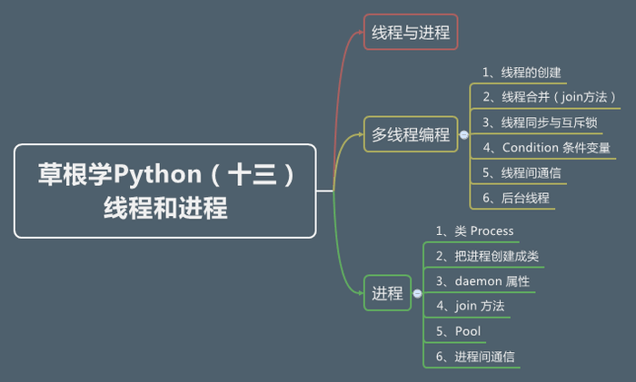

## 线程与进程

线程与进程是操作系统里面的术语，简单来讲，每一个应用程序都有一个自己的进程。

操作系统会为这些进程分配一些执行资源，例如内存空间等。

在进程中，又可以创建一些线程，他们共享这些内存空间，并由操作系统调用，以便并行计算。

我们都知道现代操作系统比如 Mac OS X，UNIX，Linux，Windows 等可以同时运行多个任务。

打个比方，你一边在用浏览器上网，一边在听敲代码，一边用 Markdown 写博客，这就是多任务，至少同时有 3 个任务正在运行。

当然还有很多任务悄悄地在后台同时运行着，只是桌面上没有显示而已。

对于操作系统来说，一个任务就是一个进程（Process），比如打开一个浏览器就是启动一个浏览器进程，打开 PyCharm 就是一个启动了一个 PtCharm 进程，打开 Markdown 就是启动了一个 Md 的进程。 

虽然现在多核 CPU 已经非常普及了。

可是由于 CPU 执行代码都是顺序执行的，这时候我们就会有疑问，单核 CPU 是怎么执行多任务的呢？

其实就是操作系统轮流让各个任务交替执行，任务 1 执行 0.01 秒，切换到任务 2 ，任务 2 执行 0.01 秒，再切换到任务 3 ，执行 0.01秒……这样反复执行下去。

表面上看，每个任务都是交替执行的，但是，由于 CPU的执行速度实在是太快了，我们肉眼和感觉上没法识别出来，就像所有任务都在同时执行一样。

真正的并行执行多任务只能在多核 CPU 上实现，但是，由于任务数量远远多于 CPU 的核心数量，所以，操作系统也会自动把很多任务轮流调度到每个核心上执行。


有些进程不仅仅只是干一件事的啊，比如浏览器，我们可以播放时视频，播放音频，看文章，编辑文章等等，其实这些都是在浏览器进程中的子任务。在一个进程内部，要同时干多件事，就需要同时运行多个“子任务”，我们把进程内的这些“子任务”称为线程（Thread）。

由于每个进程至少要干一件事，所以，一个进程至少有一个线程。

当然，一个进程也可以有多个线程，多个线程可以同时执行，多线程的执行方式和多进程是一样的，也是由操作系统在多个线程之间快速切换，让每个线程都短暂地交替运行，看起来就像同时执行一样。

那么在 Python 中我们要同时执行多个任务怎么办？

有两种解决方案：

一种是启动多个进程，每个进程虽然只有一个线程，但多个进程可以一块执行多个任务。

还有一种方法是启动一个进程，在一个进程内启动多个线程，这样，多个线程也可以一块执行多个任务。

当然还有第三种方法，就是启动多个进程，每个进程再启动多个线程，这样同时执行的任务就更多了，当然这种模型更复杂，实际很少采用。

总结一下就是，多任务的实现有3种方式：

* 多进程模式；
* 多线程模式；
* 多进程+多线程模式。

同时执行多个任务通常各个任务之间并不是没有关联的，而是需要相互通信和协调，有时，任务 1 必须暂停等待任务 2 完成后才能继续执行，有时，任务 3 和任务 4 又不能同时执行，所以，多进程和多线程的程序的复杂度要远远高于我们前面写的单进程单线程的程序。

因为复杂度高，调试困难，所以，不是迫不得已，我们也不想编写多任务。

但是，有很多时候，没有多任务还真不行。

想想在电脑上看电影，就必须由一个线程播放视频，另一个线程播放音频，否则，单线程实现的话就只能先把视频播放完再播放音频，或者先把音频播放完再播放视频，这显然是不行的。


## 多线程编程

其实创建线程之后，线程并不是始终保持一个状态的，其状态大概如下：

* New 创建
* Runnable 就绪。等待调度
* Running 运行
* Blocked 阻塞。阻塞可能在 Wait Locked Sleeping
* Dead 消亡

线程有着不同的状态，也有不同的类型。大致可分为：

* 主线程
* 子线程
* 守护线程（后台线程）
* 前台线程

简单了解完这些之后，我们开始看看具体的代码使用了。

### 1、线程的创建 ###

Python 提供两个模块进行多线程的操作，分别是 `thread` 和 `threading`

前者是比较低级的模块，用于更底层的操作，一般应用级别的开发不常用。

因此，我们使用 `threading` 来举个例子：

```python
#!/usr/bin/env python3
# -*- coding: UTF-8 -*-

import time
import threading


class MyThread(threading.Thread):
    def run(self):
        for i in range(5):
            print('thread {}, @number: {}'.format(self.name, i))
            time.sleep(1)


def main():
    print("Start main threading")

    # 创建三个线程
    threads = [MyThread() for i in range(3)]
    # 启动三个线程
    for t in threads:
        t.start()

    print("End Main threading")


if __name__ == '__main__':
    main()

```

运行结果：

```txt
Start main threading
thread Thread-1, @number: 0
thread Thread-2, @number: 0
thread Thread-3, @number: 0
End Main threading
thread Thread-2, @number: 1
thread Thread-1, @number: 1
thread Thread-3, @number: 1
thread Thread-1, @number: 2
thread Thread-3, @number: 2
thread Thread-2, @number: 2
thread Thread-2, @number: 3
thread Thread-3, @number: 3
thread Thread-1, @number: 3
thread Thread-3, @number: 4
thread Thread-2, @number: 4
thread Thread-1, @number: 4
```

注意喔，这里不同的环境输出的结果肯定是不一样的。

### 2、线程合并（join方法） ###

上面的示例打印出来的结果来看，主线程结束后，子线程还在运行。那么我们需要主线程要等待子线程运行完后，再退出，要怎么办呢？

这时候，就需要用到 `join` 方法了。

在上面的例子，新增一段代码，具体如下：

```python
#!/usr/bin/env python3
# -*- coding: UTF-8 -*-

import time
import threading


class MyThread(threading.Thread):
    def run(self):
        for i in range(5):
            print('thread {}, @number: {}'.format(self.name, i))
            time.sleep(1)


def main():
    print("Start main threading")

    # 创建三个线程
    threads = [MyThread() for i in range(3)]
    # 启动三个线程
    for t in threads:
        t.start()

    # 一次让新创建的线程执行 join
    for t in threads:
        t.join()

    print("End Main threading")


if __name__ == '__main__':
    main()

```


从打印的结果，可以清楚看到，相比上面示例打印出来的结果，主线程是在等待子线程运行结束后才结束的。

```txt
Start main threading
thread Thread-1, @number: 0
thread Thread-2, @number: 0
thread Thread-3, @number: 0
thread Thread-1, @number: 1
thread Thread-3, @number: 1
thread Thread-2, @number: 1
thread Thread-2, @number: 2
thread Thread-1, @number: 2
thread Thread-3, @number: 2
thread Thread-2, @number: 3
thread Thread-1, @number: 3
thread Thread-3, @number: 3
thread Thread-3, @number: 4
thread Thread-2, @number: 4
thread Thread-1, @number: 4
End Main threading

```

### 3、线程同步与互斥锁 ###

使用线程加载获取数据，通常都会造成数据不同步的情况。当然，这时候我们可以给资源进行加锁，也就是访问资源的线程需要获得锁才能访问。

其中 `threading` 模块给我们提供了一个 Lock 功能。

```python
lock = threading.Lock()
```

在线程中获取锁

```python
lock.acquire()
```

使用完成后，我们肯定需要释放锁

```python
lock.release()
```

当然为了支持在同一线程中多次请求同一资源，Python 提供了可重入锁（RLock）。RLock 内部维护着一个 Lock 和一个 counter 变量，counter 记录了 acquire 的次数，从而使得资源可以被多次 require。直到一个线程所有的 acquire 都被 release，其他的线程才能获得资源。

那么怎么创建重入锁呢？也是一句代码的事情：

```python
r_lock = threading.RLock()
```

### 4、Condition 条件变量 ###

实用锁可以达到线程同步，但是在更复杂的环境，需要针对锁进行一些条件判断。

Python 提供了 Condition 对象。

**使用 Condition 对象可以在某些事件触发或者达到特定的条件后才处理数据，Condition 除了具有 Lock 对象的 acquire 方法和 release 方法外，还提供了 wait 和 notify 方法。**

线程首先 acquire 一个条件变量锁。如果条件不足，则该线程 wait，如果满足就执行线程，甚至可以 notify 其他线程。其他处于 wait 状态的线程接到通知后会重新判断条件。

其中条件变量可以看成不同的线程先后 acquire 获得锁，如果不满足条件，可以理解为被扔到一个（ Lock 或 RLock ）的 waiting 池。直到其他线程 notify 之后再重新判断条件。不断的重复这一过程，从而解决复杂的同步问题。

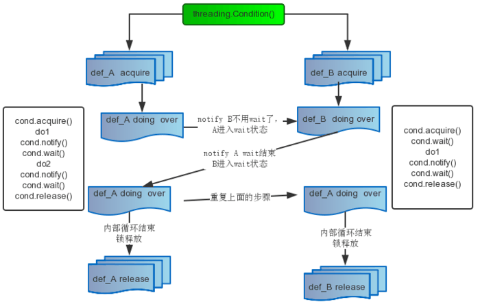

该模式常用于生产者消费者模式，具体看看下面在线购物买家和卖家的示例：

```python
#!/usr/bin/env python3
# -*- coding: UTF-8 -*-

import threading, time


class Consumer(threading.Thread):
    def __init__(self, cond, name):
        # 初始化
        super(Consumer, self).__init__()
        self.cond = cond
        self.name = name

    def run(self):
        # 确保先运行Seeker中的方法
        time.sleep(1)
        self.cond.acquire()
        print(self.name + ': 我这两件商品一起买，可以便宜点吗')
        self.cond.notify()
        self.cond.wait()
        print(self.name + ': 我已经提交订单了，你修改下价格')
        self.cond.notify()
        self.cond.wait()
        print(self.name + ': 收到，我支付成功了')
        self.cond.notify()
        self.cond.release()
        print(self.name + ': 等待收货')


class Producer(threading.Thread):
    def __init__(self, cond, name):
        super(Producer, self).__init__()
        self.cond = cond
        self.name = name

    def run(self):
        self.cond.acquire()
        # 释放对琐的占用，同时线程挂起在这里，直到被 notify 并重新占有琐。
        self.cond.wait()
        print(self.name + ': 可以的，你提交订单吧')
        self.cond.notify()
        self.cond.wait()
        print(self.name + ': 好了，已经修改了')
        self.cond.notify()
        self.cond.wait()
        print(self.name + ': 嗯，收款成功，马上给你发货')
        self.cond.release()
        print(self.name + ': 发货商品')


cond = threading.Condition()
consumer = Consumer(cond, '买家（两点水）')
producer = Producer(cond, '卖家（三点水）')
consumer.start()
producer.start()

```

输出的结果如下：

```txt
买家（两点水）: 我这两件商品一起买，可以便宜点吗
卖家（三点水）: 可以的，你提交订单吧
买家（两点水）: 我已经提交订单了，你修改下价格
卖家（三点水）: 好了，已经修改了
买家（两点水）: 收到，我支付成功了
买家（两点水）: 等待收货
卖家（三点水）: 嗯，收款成功，马上给你发货
卖家（三点水）: 发货商品
```

### 5、线程间通信 ###

如果程序中有多个线程，这些线程避免不了需要相互通信的。那么我们怎样在这些线程之间安全地交换信息或数据呢？

从一个线程向另一个线程发送数据最安全的方式可能就是使用 queue 库中的队列了。创建一个被多个线程共享的 `Queue` 对象，这些线程通过使用 `put()` 和 `get()` 操作来向队列中添加或者删除元素。

```python
# -*- coding: UTF-8 -*-
from queue import Queue
from threading import Thread

isRead = True


def write(q):
    # 写数据进程
    for value in ['两点水', '三点水', '四点水']:
        print('写进 Queue 的值为：{0}'.format(value))
        q.put(value)


def read(q):
    # 读取数据进程
    while isRead:
        value = q.get(True)
        print('从 Queue 读取的值为：{0}'.format(value))


if __name__ == '__main__':
    q = Queue()
    t1 = Thread(target=write, args=(q,))
    t2 = Thread(target=read, args=(q,))
    t1.start()
    t2.start()
```

输出的结果如下：

```txt
写进 Queue 的值为：两点水
写进 Queue 的值为：三点水
从 Queue 读取的值为：两点水
写进 Queue 的值为：四点水
从 Queue 读取的值为：三点水
从 Queue 读取的值为：四点水
```

Python 还提供了 Event 对象用于线程间通信，它是由线程设置的信号标志，如果信号标志位真，则其他线程等待直到信号接触。

Event 对象实现了简单的线程通信机制，它提供了设置信号，清楚信号，等待等用于实现线程间的通信。

* 设置信号

使用 Event 的 `set()` 方法可以设置 Event 对象内部的信号标志为真。Event 对象提供了 `isSe()` 方法来判断其内部信号标志的状态。当使用 event 对象的 `set()` 方法后，`isSet()` 方法返回真

* 清除信号

使用 Event 对象的 `clear()` 方法可以清除 Event 对象内部的信号标志，即将其设为假，当使用 Event 的 clear 方法后，isSet() 方法返回假

*  等待

Event 对象 wait 的方法只有在内部信号为真的时候才会很快的执行并完成返回。当 Event 对象的内部信号标志位假时，则 wait 方法一直等待到其为真时才返回。

示例：

```python
# -*- coding: UTF-8 -*-

import threading


class mThread(threading.Thread):
    def __init__(self, threadname):
        threading.Thread.__init__(self, name=threadname)

    def run(self):
        # 使用全局Event对象
        global event
        # 判断Event对象内部信号标志
        if event.isSet():
            event.clear()
            event.wait()
            print(self.getName())
        else:
            print(self.getName())
            # 设置Event对象内部信号标志
            event.set()

# 生成Event对象
event = threading.Event()
# 设置Event对象内部信号标志
event.set()
t1 = []
for i in range(10):
    t = mThread(str(i))
    # 生成线程列表
    t1.append(t)

for i in t1:
    # 运行线程
    i.start()

```


输出的结果如下：

```txt
1
0
3
2
5
4
7
6
9
8
```


### 6、后台线程 ###

默认情况下，主线程退出之后，即使子线程没有 join。那么主线程结束后，子线程也依然会继续执行。如果希望主线程退出后，其子线程也退出而不再执行，则需要设置子线程为后台线程。Python 提供了 `setDeamon` 方法。

## 进程

Python 中的多线程其实并不是真正的多线程，如果想要充分地使用多核 CPU 的资源，在 Python 中大部分情况需要使用多进程。

Python 提供了非常好用的多进程包 multiprocessing，只需要定义一个函数，Python 会完成其他所有事情。

借助这个包，可以轻松完成从单进程到并发执行的转换。multiprocessing 支持子进程、通信和共享数据、执行不同形式的同步，提供了 Process、Queue、Pipe、Lock 等组件。


### 1、类 Process ###

创建进程的类：`Process([group [, target [, name [, args [, kwargs]]]]])`

* target 表示调用对象
* args 表示调用对象的位置参数元组
* kwargs表示调用对象的字典
* name为别名
* group实质上不使用

下面看一个创建函数并将其作为多个进程的例子：

```python
#!/usr/bin/env python3
# -*- coding: UTF-8 -*-

import multiprocessing
import time


def worker(interval, name):
    print(name + '【start】')
    time.sleep(interval)
    print(name + '【end】')


if __name__ == "__main__":
    p1 = multiprocessing.Process(target=worker, args=(2, '两点水1'))
    p2 = multiprocessing.Process(target=worker, args=(3, '两点水2'))
    p3 = multiprocessing.Process(target=worker, args=(4, '两点水3'))

    p1.start()
    p2.start()
    p3.start()

    print("The number of CPU is:" + str(multiprocessing.cpu_count()))
    for p in multiprocessing.active_children():
        print("child   p.name:" + p.name + "\tp.id" + str(p.pid))
    print("END!!!!!!!!!!!!!!!!!")

```

输出的结果：


### 2、把进程创建成类 ###

当然我们也可以把进程创建成一个类，如下面的例子，当进程 p 调用 start() 时，自动调用 run() 方法。


```python
# -*- coding: UTF-8 -*-

import multiprocessing
import time


class ClockProcess(multiprocessing.Process):
    def __init__(self, interval):
        multiprocessing.Process.__init__(self)
        self.interval = interval

    def run(self):
        n = 5
        while n > 0:
            print("当前时间: {0}".format(time.ctime()))
            time.sleep(self.interval)
            n -= 1


if __name__ == '__main__':
    p = ClockProcess(3)
    p.start()

```

输出结果如下：


### 3、daemon 属性 ###

想知道 daemon 属性有什么用，看下下面两个例子吧，一个加了 daemon 属性，一个没有加，对比输出的结果：

没有加 deamon 属性的例子：

```python
# -*- coding: UTF-8 -*-
import multiprocessing
import time


def worker(interval):
    print('工作开始时间：{0}'.format(time.ctime()))
    time.sleep(interval)
    print('工作结果时间：{0}'.format(time.ctime()))


if __name__ == '__main__':
    p = multiprocessing.Process(target=worker, args=(3,))
    p.start()
    print('【EMD】')

```

输出结果：

```txt
【EMD】
工作开始时间：Mon Oct  9 17:47:06 2017
工作结果时间：Mon Oct  9 17:47:09 2017
```

在上面示例中，进程 p 添加 daemon 属性：

```python
# -*- coding: UTF-8 -*-

import multiprocessing
import time


def worker(interval):
    print('工作开始时间：{0}'.format(time.ctime()))
    time.sleep(interval)
    print('工作结果时间：{0}'.format(time.ctime()))


if __name__ == '__main__':
    p = multiprocessing.Process(target=worker, args=(3,))
    p.daemon = True
    p.start()
    print('【EMD】')
```

输出结果：

```txt
【EMD】
```


根据输出结果可见，如果在子进程中添加了 daemon 属性，那么当主进程结束的时候，子进程也会跟着结束。所以没有打印子进程的信息。


### 4、join 方法 ###

结合上面的例子继续，如果我们想要让子线程执行完该怎么做呢？

那么我们可以用到 join 方法，join 方法的主要作用是：阻塞当前进程，直到调用 join 方法的那个进程执行完，再继续执行当前进程。

因此看下加了 join 方法的例子：

```python
import multiprocessing
import time


def worker(interval):
    print('工作开始时间：{0}'.format(time.ctime()))
    time.sleep(interval)
    print('工作结果时间：{0}'.format(time.ctime()))


if __name__ == '__main__':
    p = multiprocessing.Process(target=worker, args=(3,))
    p.daemon = True
    p.start()
    p.join()
    print('【EMD】')
```

输出的结果：

```txt
工作开始时间：Tue Oct 10 11:30:08 2017
工作结果时间：Tue Oct 10 11:30:11 2017
【EMD】
```

### 5、Pool ###

如果需要很多的子进程，难道我们需要一个一个的去创建吗？

当然不用，我们可以使用进程池的方法批量创建子进程。

例子如下：

```python
# -*- coding: UTF-8 -*-

from multiprocessing import Pool
import os, time, random


def long_time_task(name):
    print('进程的名称：{0} ；进程的PID: {1} '.format(name, os.getpid()))
    start = time.time()
    time.sleep(random.random() * 3)
    end = time.time()
    print('进程 {0} 运行了 {1} 秒'.format(name, (end - start)))


if __name__ == '__main__':
    print('主进程的 PID：{0}'.format(os.getpid()))
    p = Pool(4)
    for i in range(6):
        p.apply_async(long_time_task, args=(i,))
    p.close()
    # 等待所有子进程结束后在关闭主进程
    p.join()
    print('【End】')
```

输出的结果如下：

```txt
主进程的 PID：7256
进程的名称：0 ；进程的PID: 1492
进程的名称：1 ；进程的PID: 12232
进程的名称：2 ；进程的PID: 4332
进程的名称：3 ；进程的PID: 11604
进程 2 运行了 0.6500370502471924 秒
进程的名称：4 ；进程的PID: 4332
进程 1 运行了 1.0830621719360352 秒
进程的名称：5 ；进程的PID: 12232
进程 5 运行了 0.029001712799072266 秒
进程 4 运行了 0.9720554351806641 秒
进程 0 运行了 2.3181326389312744 秒
进程 3 运行了 2.5331451892852783 秒
【End】
```

这里有一点需要注意： `Pool` 对象调用 `join()` 方法会等待所有子进程执行完毕，调用 `join()` 之前必须先调用 `close()` ，调用`close()` 之后就不能继续添加新的 Process 了。

请注意输出的结果，子进程 0，1，2，3是立刻执行的，而子进程 4 要等待前面某个子进程完成后才执行，这是因为 Pool 的默认大小在我的电脑上是 4，因此，最多同时执行 4 个进程。这是 Pool 有意设计的限制，并不是操作系统的限制。如果改成：

```python
p = Pool(5)
```

就可以同时跑 5 个进程。


### 6、进程间通信 ###

Process 之间肯定是需要通信的，操作系统提供了很多机制来实现进程间的通信。Python 的 multiprocessing 模块包装了底层的机制，提供了Queue、Pipes 等多种方式来交换数据。

以 Queue 为例，在父进程中创建两个子进程，一个往 Queue 里写数据，一个从 Queue 里读数据：

```python
#!/usr/bin/env python3
# -*- coding: UTF-8 -*-

from multiprocessing import Process, Queue
import os, time, random


def write(q):
    # 写数据进程
    print('写进程的PID:{0}'.format(os.getpid()))
    for value in ['两点水', '三点水', '四点水']:
        print('写进 Queue 的值为：{0}'.format(value))
        q.put(value)
        time.sleep(random.random())


def read(q):
    # 读取数据进程
    print('读进程的PID:{0}'.format(os.getpid()))
    while True:
        value = q.get(True)
        print('从 Queue 读取的值为：{0}'.format(value))


if __name__ == '__main__':
    # 父进程创建 Queue，并传给各个子进程
    q = Queue()
    pw = Process(target=write, args=(q,))
    pr = Process(target=read, args=(q,))
    # 启动子进程 pw
    pw.start()
    # 启动子进程pr
    pr.start()
    # 等待pw结束:
    pw.join()
    # pr 进程里是死循环，无法等待其结束，只能强行终止
    pr.terminate()

```

输出的结果为：

```txt
读进程的PID:13208
写进程的PID:10864
写进 Queue 的值为：两点水
从 Queue 读取的值为：两点水
写进 Queue 的值为：三点水
从 Queue 读取的值为：三点水
写进 Queue 的值为：四点水
从 Queue 读取的值为：四点水
```


# 十三、一步一步了解正则表达式

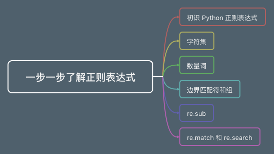

## 初识 Python 正则表达式

正则表达式是一个特殊的字符序列，用于判断一个字符串是否与我们所设定的字符序列是否匹配，也就是说检查一个字符串是否与某种模式匹配。

Python 自 1.5 版本起增加了re 模块，它提供 Perl 风格的正则表达式模式。re 模块使 Python 语言拥有全部的正则表达式功能。

下面通过实例，一步一步来初步认识正则表达式。

比如在一段字符串中寻找是否含有某个字符或某些字符，通常我们使用内置函数来实现，如下：

```python
# 设定一个常量
a = '两点水|twowater|liangdianshui|草根程序员|ReadingWithU'

# 判断是否有 “两点水” 这个字符串，使用 PY 自带函数

print('是否含有“两点水”这个字符串：{0}'.format(a.index('两点水') > -1))
print('是否含有“两点水”这个字符串：{0}'.format('两点水' in a))
```

输出的结果如下：

```txt
是否含有“两点水”这个字符串：True
是否含有“两点水”这个字符串：True
```

那么，如果使用正则表达式呢？

刚刚提到过，Python 给我们提供了 re 模块来实现正则表达式的所有功能，那么我们先使用其中的一个函数：

```python
re.findall(pattern, string[, flags])
```

该函数实现了在字符串中找到正则表达式所匹配的所有子串，并组成一个列表返回,具体操作如下：

```python
import re

# 设定一个常量
a = '两点水|twowater|liangdianshui|草根程序员|ReadingWithU'

# 正则表达式

findall = re.findall('两点水', a)
print(findall)

if len(findall) > 0:
    print('a 含有“两点水”这个字符串')
else:
    print('a 不含有“两点水”这个字符串')

```

输出的结果：

```txt
['两点水']
a 含有“两点水”这个字符串
```

从输出结果可以看到，可以实现和内置函数一样的功能，可是在这里也要强调一点，上面这个例子只是方便我们理解正则表达式，这个正则表达式的写法是毫无意义的。为什么这样说呢？

因为用 Python 自带函数就能解决的问题，我们就没必要使用正则表达式了，这样做多此一举。而且上面例子中的正则表达式设置成为了一个常量，并不是一个正则表达式的规则，正则表达式的灵魂在于规则，所以这样做意义不大。

那么正则表达式的规则怎么写呢？先不急，我们一步一步来，先来一个简单的，找出字符串中的所有小写字母。首先我们在 `findall` 函数中第一个参数写正则表达式的规则，其中	`[a-z]` 就是匹配任何小写字母，第二个参数只要填写要匹配的字符串就行了。具体如下：

```python
import re

# 设定一个常量
a = '两点水|twowater|liangdianshui|草根程序员|ReadingWithU'

# 选择 a 里面的所有小写英文字母

re_findall = re.findall('[a-z]', a)

print(re_findall)

```

输出的结果：

```txt
['t', 'w', 'o', 'w', 'a', 't', 'e', 'r', 'l', 'i', 'a', 'n', 'g', 'd', 'i', 'a', 'n', 's', 'h', 'u', 'i', 'e', 'a', 'd', 'i', 'n', 'g', 'i', 't', 'h']
```

这样我们就拿到了字符串中的所有小写字母了。

## 字符集

好了，通过上面的几个实例我们初步认识了 Python 的正则表达式，可能你就会问，正则表达式还有什么规则，什么字母代表什么意思呢？

其实，这些都不急，在本章后面会给出对应的正则表达式规则列表，而且这些东西在网上随便都能 Google 到。所以现在，我们还是进一步加深对正则表达式的理解，讲一下正则表达式的字符集。

字符集是由一对方括号 “[]” 括起来的字符集合。使用字符集，可以匹配多个字符中的一个。

举个例子，比如你使用 `C[ET]O` 匹配到的是 CEO 或 CTO ，也就是说 `[ET]` 代表的是一个 E 或者一个 T 。像上面提到的 `[a-z]` ,就是所有小写字母中的其中一个，这里使用了连字符 “-” 定义一个连续字符的字符范围。当然，像这种写法，里面可以包含多个字符范围的，比如：`[0-9a-fA-F]` ,匹配单个的十六进制数字，且不分大小写。注意了，字符和范围定义的先后顺序对匹配的结果是没有任何影响的。

其实说了那么多，只是想证明，字符集一对方括号 “[]” 里面的字符关系是"或（OR）"关系，下面看一个例子：

```Python
import re
a = 'uav,ubv,ucv,uwv,uzv,ucv,uov'

# 字符集

# 取 u 和 v 中间是 a 或 b 或 c 的字符
findall = re.findall('u[abc]v', a)
print(findall)
# 如果是连续的字母，数字可以使用 - 来代替
l = re.findall('u[a-c]v', a)
print(l)

# 取 u 和 v 中间不是 a 或 b 或 c 的字符
re_findall = re.findall('u[^abc]v', a)
print(re_findall)

```

输出的结果：

```txt
['uav', 'ubv', 'ucv', 'ucv']
['uav', 'ubv', 'ucv', 'ucv']
['uwv', 'uzv', 'uov']
```

在例子中，使用了取反字符集，也就是在左方括号 “[” 后面紧跟一个尖括号 “^”，就会对字符集取反。需要记住的一点是，取反字符集必须要匹配一个字符。比如：`q[^u]` 并不意味着：匹配一个 q，后面没有 u 跟着。它意味着：匹配一个 q，后面跟着一个不是 u 的字符。具体可以对比上面例子中输出的结果来理解。

我们都知道，正则表达式本身就定义了一些规则，比如 `\d`,匹配所有数字字符,其实它是等价于 [0-9]，下面也写了个例子，通过字符集的形式解释了这些特殊字符。

```Python
import re

a = 'uav_ubv_ucv_uwv_uzv_ucv_uov&123-456-789'

# 概括字符集

# \d 相当于 [0-9] ,匹配所有数字字符
# \D 相当于 [^0-9] ， 匹配所有非数字字符
findall1 = re.findall('\d', a)
findall2 = re.findall('[0-9]', a)
findall3 = re.findall('\D', a)
findall4 = re.findall('[^0-9]', a)
print(findall1)
print(findall2)
print(findall3)
print(findall4)

# \w 匹配包括下划线的任何单词字符，等价于 [A-Za-z0-9_]
findall5 = re.findall('\w', a)
findall6 = re.findall('[A-Za-z0-9_]', a)
print(findall5)
print(findall6)

```

输出结果：

```txt
['1', '2', '3', '4', '5', '6', '7', '8', '9']
['1', '2', '3', '4', '5', '6', '7', '8', '9']
['u', 'a', 'v', '_', 'u', 'b', 'v', '_', 'u', 'c', 'v', '_', 'u', 'w', 'v', '_', 'u', 'z', 'v', '_', 'u', 'c', 'v', '_', 'u', 'o', 'v', '&', '-', '-']
['u', 'a', 'v', '_', 'u', 'b', 'v', '_', 'u', 'c', 'v', '_', 'u', 'w', 'v', '_', 'u', 'z', 'v', '_', 'u', 'c', 'v', '_', 'u', 'o', 'v', '&', '-', '-']
['u', 'a', 'v', '_', 'u', 'b', 'v', '_', 'u', 'c', 'v', '_', 'u', 'w', 'v', '_', 'u', 'z', 'v', '_', 'u', 'c', 'v', '_', 'u', 'o', 'v', '1', '2', '3', '4', '5', '6', '7', '8', '9']
['u', 'a', 'v', '_', 'u', 'b', 'v', '_', 'u', 'c', 'v', '_', 'u', 'w', 'v', '_', 'u', 'z', 'v', '_', 'u', 'c', 'v', '_', 'u', 'o', 'v', '1', '2', '3', '4', '5', '6', '7', '8', '9']
```


## 数量词

来，继续加深对正则表达式的理解，这部分理解一下数量词，为什么要用数量词，想想都知道，如果你要匹配几十上百的字符时，难道你要一个一个的写，所以就出现了数量词。

数量词的词法是：{min,max} 。min 和 max 都是非负整数。如果逗号有而 max 被忽略了，则 max 没有限制。如果逗号和 max 都被忽略了，则重复 min 次。比如，`\b[1-9][0-9]{3}\b`,匹配的是 1000 ~ 9999 之间的数字( “\b” 表示单词边界），而 `\b[1-9][0-9]{2,4}\b`，匹配的是一个在 100 ~ 99999 之间的数字。

下面看一个实例，匹配出字符串中 4 到 7 个字母的英文

```Python
import re

a = 'java*&39android##@@python'

# 数量词

findall = re.findall('[a-z]{4,7}', a)
print(findall)
```

输出结果：

```txt
['java', 'android', 'python']
```

注意，这里有贪婪和非贪婪之分。那么我们先看下相关的概念：


贪婪模式：它的特性是一次性地读入整个字符串，如果不匹配就吐掉最右边的一个字符再匹配，直到找到匹配的字符串或字符串的长度为 0 为止。它的宗旨是读尽可能多的字符，所以当读到第一个匹配时就立刻返回。

懒惰模式：它的特性是从字符串的左边开始，试图不读入字符串中的字符进行匹配，失败，则多读一个字符，再匹配，如此循环，当找到一个匹配时会返回该匹配的字符串，然后再次进行匹配直到字符串结束。

上面例子中的就是贪婪的，如果要使用非贪婪，也就是懒惰模式，怎么呢？

如果要使用非贪婪，则加一个 `?` ，上面的例子修改如下：

```Python
import re

a = 'java*&39android##@@python'

# 贪婪与非贪婪

re_findall = re.findall('[a-z]{4,7}?', a)
print(re_findall)

```

输出结果如下：

```txt
['java', 'andr', 'pyth']
```

从输出的结果可以看出，android 只打印除了 andr ，Python  只打印除了 pyth ，因为这里使用的是懒惰模式。

当然，还有一些特殊字符也是可以表示数量的，比如：


> `?`：告诉引擎匹配前导字符 0 次或 1 次
>
> `+`：告诉引擎匹配前导字符 1 次或多次
>
> `*`：告诉引擎匹配前导字符 0 次或多次


把这部分的知识点总结一下,就是下面这个表了:

| 贪   婪 | 惰   性 | 描   述                       |
| ------- | ------- | ----------------------------- |
| ？      | ？？    | 零次或一次出现，等价于{0,1}   |
| +       | +？     | 一次或多次出现 ，等价于{1,}   |
| *       | *？     | 零次或多次出现   ，等价于{0,} |
| {n}     | {n}？   | 恰好 n 次出现                 |
| {n,m}   | {n,m}？ | 至少 n 次枝多 m 次出现        |
| {n,}    | {n,}？  | 至少 n 次出现                 |


## 边界匹配符和组

将上面几个点，就用了很大的篇幅了，现在介绍一些边界匹配符和组的概念。

一般的边界匹配符有以下几个：

| 语法 | 描述                                             |
| ---- | ------------------------------------------------ |
| ^    | 匹配字符串开头（在有多行的情况中匹配每行的开头） |
| $    | 匹配字符串的末尾(在有多行的情况中匹配每行的末尾) |
| \A   | 仅匹配字符串开头                                 |
| \Z   | 仅匹配字符串末尾                                 |
| \b   | 匹配 \w 和 \W 之间                               |
| \B   | [^\b]                                            |

分组，被括号括起来的表达式就是分组。分组表达式 `(...)` 其实就是把这部分字符作为一个整体，当然，可以有多分组的情况，每遇到一个分组，编号就会加 1 ，而且分组后面也是可以加数量词的。

此处本应有例子，考虑到篇幅问题，就不贴了

## re.sub

实战过程中，我们很多时候需要替换字符串中的字符，这时候就可以用到 `def sub(pattern, repl, string, count=0, flags=0)  ` 函数了，re.sub 共有五个参数。其中三个必选参数：pattern, repl, string ; 两个可选参数：count, flags .

具体参数意义如下：

| 参数    | 描述                                                         |
| ------- | ------------------------------------------------------------ |
| pattern | 表示正则中的模式字符串                                       |
| repl    | repl，就是replacement，被替换的字符串的意思                  |
| string  | 即表示要被处理，要被替换的那个 string 字符串                 |
| count   | 对于pattern中匹配到的结果，count可以控制对前几个group进行替换 |
| flags   | 正则表达式修饰符                                             |

具体使用可以看下下面的这个实例，注释都写的很清楚的了，主要是注意一下，第二个参数是可以传递一个函数的，这也是这个方法的强大之处，例如例子里面的函数 `convert` ,对传递进来要替换的字符进行判断，替换成不同的字符。

```python
#!/usr/bin/env python3
# -*- coding: UTF-8 -*-

import re

a = 'Python*Android*Java-888'

# 把字符串中的 * 字符替换成 & 字符
sub1 = re.sub('\*', '&', a)
print(sub1)

# 把字符串中的第一个 * 字符替换成 & 字符
sub2 = re.sub('\*', '&', a, 1)
print(sub2)


# 把字符串中的 * 字符替换成 & 字符,把字符 - 换成 |

# 1、先定义一个函数
def convert(value):
    group = value.group()
    if (group == '*'):
        return '&'
    elif (group == '-'):
        return '|'


# 第二个参数，要替换的字符可以为一个函数
sub3 = re.sub('[\*-]', convert, a)
print(sub3)
```

输出的结果：

```shell
Python&Android&Java-888
Python&Android*Java-888
Python&Android&Java|888
```


## re.match 和 re.search

**re.match 函数**

语法：

```python
re.match(pattern, string, flags=0)
```

re.match 尝试从字符串的起始位置匹配一个模式，如果不是起始位置匹配成功的话，match() 就返回 none。


**re.search 函数**

语法：

```Python
re.search(pattern, string, flags=0)
```

re.search 扫描整个字符串并返回第一个成功的匹配。

re.match 和 re.search 的参数，基本一致的，具体描述如下：

| 参数    | 描述                                                     |
| ------- | -------------------------------------------------------- |
| pattern | 匹配的正则表达式                                         |
| string  | 要匹配的字符串                                           |
| flags   | 标志位，用于控制正则表达式的匹配方式，如：是否区分大小写 |

那么它们之间有什么区别呢？

re.match 只匹配字符串的开始，如果字符串开始不符合正则表达式，则匹配失败，函数返回 None；而 re.search 匹配整个字符串，直到找到一个匹配。这就是它们之间的区别了。

re.match 和 re.search 在网上有很多详细的介绍了，可是再个人的使用中，还是喜欢使用  re.findall

看下下面的实例，可以对比下 re.search 和 re.findall 的区别，还有多分组的使用。具体看下注释，对比一下输出的结果：  

示例：

```python
#!/usr/bin/env python3
# -*- coding: UTF-8 -*-

# 提取图片的地址

import re

a = ''

# 使用 re.search
search = re.search('', a)
# group(0) 是一个完整的分组
print(search.group(0))
print(search.group(1))

# 使用 re.findall
findall = re.findall('', a)
print(findall)

# 多个分组的使用（比如我们需要提取 img 字段和图片地址字段）
re_search = re.search('<(.*) src="(.*)">', a)
# 打印 img
print(re_search.group(1))
# 打印图片地址
print(re_search.group(2))
# 打印 img 和图片地址，以元祖的形式
print(re_search.group(1, 2))
# 或者使用 groups
print(re_search.groups())

```

输出的结果：

```txt

https://s-media-cache-ak0.pinimg.com/originals/a8/c4/9e/a8c49ef606e0e1f3ee39a7b219b5c05e.jpg
['https://s-media-cache-ak0.pinimg.com/originals/a8/c4/9e/a8c49ef606e0e1f3ee39a7b219b5c05e.jpg']
img
https://s-media-cache-ak0.pinimg.com/originals/a8/c4/9e/a8c49ef606e0e1f3ee39a7b219b5c05e.jpg
('img', 'https://s-media-cache-ak0.pinimg.com/originals/a8/c4/9e/a8c49ef606e0e1f3ee39a7b219b5c05e.jpg')
('img', 'https://s-media-cache-ak0.pinimg.com/originals/a8/c4/9e/a8c49ef606e0e1f3ee39a7b219b5c05e.jpg')
```


最后，正则表达式是非常厉害的工具，通常可以用来解决字符串内置函数无法解决的问题，而且正则表达式大部分语言都是有的。python 的用途很多，但在爬虫和数据分析这连个模块中都是离不开正则表达式的。所以正则表达式对于学习 Python 来说，真的很重要。最后，附送一些常用的正则表达式和正则表达式和 Python 支持的正则表达式元字符和语法文档。

github：https://github.com/TwoWater/Python/blob/master/python14/%E5%B8%B8%E7%94%A8%E7%9A%84%E6%AD%A3%E5%88%99%E8%A1%A8%E8%BE%BE%E5%BC%8F.md

# 十四、闭包

网络上介绍 Python 闭包的文章已经很多了，本文将通过解决一个需求问题来了解闭包。


这个需求是这样的，我们需要一直记录自己的学习时间，以分钟为单位。就好比我学习了 2 分钟，就返回 2 ，然后隔了一阵子，我学习了 10 分钟，那么就返回 12 ，像这样把学习时间一直累加下去。


面对这个需求，我们一般都会创建一个全局变量来记录时间，然后用一个方法来新增每次的学习时间，通常都会写成下面这个形式：

```Python
time = 0

def insert_time(min):
    time = time + min
    return  time

print(insert_time(2))
print(insert_time(10))
```

认真想一下，会不会有什么问题呢？

其实，这个在 Python 里面是会报错的。会报如下错误：

```
UnboundLocalError: local variable 'time' referenced before assignment
```

那是因为，在 Python 中，如果一个函数使用了和全局变量相同的名字且改变了该变量的值，那么该变量就会变成局部变量，那么就会造成在函数中我们没有进行定义就引用了，所以会报该错误。

如果确实要引用全局变量，并在函数中对它进行修改，该怎么做呢？

我们可以使用 `global` 关键字,具体修改如下：

```Python
time = 0


def insert_time(min):
    global  time
    time = time + min
    return  time

print(insert_time(2))
print(insert_time(10))
```

输出结果如下：

```
2
12
```

可是啊，这里使用了全局变量，我们在开发中能尽量避免使用全局变量的就尽量避免使用。因为不同模块，不同函数都可以自由的访问全局变量，可能会造成全局变量的不可预知性。比如程序员甲修改了全局变量 `time` 的值，然后程序员乙同时也对 `time` 进行了修改，如果其中有错误，这种错误是很难发现和更正的。


全局变量降低了函数或模块之间的通用性，不同的函数或模块都要依赖于全局变量。同样，全局变量降低了代码的可读性，阅读者可能并不知道调用的某个变量是全局变量。

那有没有更好的方法呢？

这时候我们使用闭包来解决一下，先直接看代码：

```python
time = 0


def study_time(time):
    def insert_time(min):
        nonlocal  time
        time = time + min
        return time

    return insert_time


f = study_time(time)
print(f(2))
print(time)
print(f(10))
print(time)
```

输出结果如下:

```
2
0
12
0
```

这里最直接的表现就是全局变量 `time` 至此至终都没有修改过,这里还是用了 `nonlocal` 关键字,表示在函数或其他作用域中使用外层(非全局)变量。那么上面那段代码具体的运行流程是怎样的。我们可以看下下图：


这种内部函数的局部作用域中可以访问外部函数局部作用域中变量的行为，我们称为： 闭包。更加直接的表达方式就是，当某个函数被当成对象返回时，夹带了外部变量，就形成了一个闭包。k


闭包避免了使用全局变量，此外，闭包允许将函数与其所操作的某些数据（环境）关连起来。而且使用闭包，可以使代码变得更加的优雅。而且下一篇讲到的装饰器，也是基于闭包实现的。


到这里，就会有一个问题了，你说它是闭包就是闭包了？有没有什么办法来验证一下这个函数就是闭包呢？


有的，所有函数都有一个 ` __closure__` 属性，如果函数是闭包的话，那么它返回的是一个由 cell 组成的元组对象。cell 对象的 cell_contents 属性就是存储在闭包中的变量。

我们打印出来体验一下：

```Python
time = 0


def study_time(time):
    def insert_time(min):
        nonlocal  time
        time = time + min
        return time

    return insert_time


f = study_time(time)
print(f.__closure__)
print(f(2))
print(time)
print(f.__closure__[0].cell_contents)
print(f(10))
print(time)
print(f.__closure__[0].cell_contents)
```

打印的结果为：

```
(<cell at 0x0000000000410C48: int object at 0x000000001D6AB420>,)
2
0
2
12
0
12
```

从打印结果可见，传进来的值一直存储在闭包的 cell_contents 中,因此，这也就是闭包的最大特点，可以将父函数的变量与其内部定义的函数绑定。就算生成闭包的父函数已经释放了，闭包仍然存在。

闭包的过程其实好比类（父函数）生成实例（闭包），不同的是父函数只在调用时执行，执行完毕后其环境就会释放，而类则在文件执行时创建，一般程序执行完毕后作用域才释放，因此对一些需要重用的功能且不足以定义为类的行为，使用闭包会比使用类占用更少的资源，且更轻巧灵活。


# 十五、装饰器

上一篇文章将通过解决一个需求问题来了解了闭包，本文也将一样，通过慢慢演变一个需求，一步一步来了解 Python 装饰器。


首先有这么一个输出员工打卡信息的函数：

```Python
def punch():
    print('昵称：两点水  部门：做鸭事业部 上班打卡成功')


punch()
```

输出的结果如下：

```
昵称：两点水  部门：做鸭事业部 上班打卡成功
```

然后，产品反馈，不行啊，怎么上班打卡没有具体的日期，加上打卡的具体日期吧，这应该很简单，分分钟解决啦。好吧，那就直接添加打印日期的代码吧，如下：

```Python
import time


def punch():
    print(time.strftime('%Y-%m-%d', time.localtime(time.time())))
    print('昵称：两点水  部门：做鸭事业部 上班打卡成功')


punch()
```

输出结果如下：

```
2018-01-09
昵称：两点水  部门：做鸭事业部 上班打卡成功
```

这样改是可以，可是这样改是改变了函数的功能结构的，本身这个函数定义的时候就是打印某个员工的信息和提示打卡成功，现在增加打印日期的代码，可能会造成很多代码重复的问题。比如，还有一个地方只需要打印员工信息和打卡成功就行了，不需要日期，那么你又要重写一个函数吗？而且打印当前日期的这个功能方法是经常使用的，是可以作为公共函数给各个模块方法调用的。当然，这都是作为一个整体项目来考虑的。

既然是这样，我们可以使用函数式编程来修改这部分的代码。因为通过之前的学习，我们知道 Python 函数有两个特点，函数也是一个对象，而且函数里可以嵌套函数，那么修改一下代码变成下面这个样子：

```Python
import time


def punch():
    print('昵称：两点水  部门：做鸭事业部 上班打卡成功')


def add_time(func):
    print(time.strftime('%Y-%m-%d', time.localtime(time.time())))
    func()


add_time(punch)
```

输出结果：

```
2018-01-09
昵称：两点水  部门：做鸭事业部 上班打卡成功
```


这样是不是发现，这样子就没有改动 `punch` 方法，而且任何需要用到打印当前日期的函数都可以把函数传进 `add_time` 就可以了，就比如这样：

```Python
import time


def punch():
    print('昵称：两点水  部门：做鸭事业部 上班打卡成功')


def add_time(func):
    print(time.strftime('%Y-%m-%d', time.localtime(time.time())))
    func()


def holiday():
    print('天气太冷，今天放假')


add_time(punch)
add_time(holiday)

```

打印结果：

```
2018-01-09
昵称：两点水  部门：做鸭事业部 上班打卡成功
2018-01-09
天气太冷，今天放假
```

使用函数编程是不是很方便，但是，我们每次调用的时候，我们都不得不把原来的函数作为参数传递进去，还能不能有更好的实现方式呢？有的，就是本文要介绍的装饰器，因为装饰器的写法其实跟闭包是差不多的，不过没有了自由变量，那么这里直接给出上面那段代码的装饰器写法，来对比一下，装饰器的写法和函数式编程有啥不同。

```Python
import time


def decorator(func):
    def punch():
        print(time.strftime('%Y-%m-%d', time.localtime(time.time())))
        func()

    return punch


def punch():
    print('昵称：两点水  部门：做鸭事业部 上班打卡成功')


f = decorator(punch)
f()
```

输出的结果：

```
2018-01-09
昵称：两点水  部门：做鸭事业部 上班打卡成功
```

通过代码，能知道装饰器函数一般做这三件事：

1. 接收一个函数作为参数
2. 嵌套一个包装函数, 包装函数会接收原函数的相同参数，并执行原函数，且还会执行附加功能
3. 返回嵌套函数


可是，认真一看这代码，这装饰器的写法怎么比函数式编程还麻烦啊。而且看起来比较复杂，甚至有点多此一举的感觉。

那是因为我们还没有用到装饰器的 “语法糖” ，我们看上面的代码可以知道， Python 在引入装饰器 （Decorator） 的时候，没有引入任何新的语法特性，都是基于函数的语法特性。这也就说明了装饰器不是 Python 特有的，而是每个语言通用的一种编程思想。只不过 Python 设计出了 `@` 语法糖，让 定义装饰器，把装饰器调用原函数再把结果赋值为原函数的对象名的过程变得更加简单，方便，易操作，所以 Python 装饰器的核心可以说就是它的语法糖。

那么怎么使用它的语法糖呢？很简单，根据上面的写法写完装饰器函数后，直接在原来的函数上加 `@` 和装饰器的函数名。如下：

```Python
import time


def decorator(func):
    def punch():
        print(time.strftime('%Y-%m-%d', time.localtime(time.time())))
        func()

    return punch

@decorator
def punch():
    print('昵称：两点水  部门：做鸭事业部 上班打卡成功')

punch()
```

输出结果：

```
2018-01-09
昵称：两点水  部门：做鸭事业部 上班打卡成功
```

那么这就很方便了，方便在我们的调用上，比如例子中的，使用了装饰器后，直接在原本的函数上加上装饰器的语法糖就可以了，本函数也无虚任何改变，调用的地方也不需修改。

不过这里一直有个问题，就是输出打卡信息的是固定的，那么我们需要通过参数来传递，装饰器该怎么写呢？装饰器中的函数可以使用 `*args` 可变参数，可是仅仅使用 `*args` 是不能完全包括所有参数的情况，比如关键字参数就不能了，为了能兼容关键字参数，我们还需要加上 `**kwargs` 。

因此，装饰器的最终形式可以写成这样：

```Python
import time


def decorator(func):
    def punch(*args, **kwargs):
        print(time.strftime('%Y-%m-%d', time.localtime(time.time())))
        func(*args, **kwargs)

    return punch


@decorator
def punch(name, department):
    print('昵称：{0}  部门：{1} 上班打卡成功'.format(name, department))


@decorator
def print_args(reason, **kwargs):
    print(reason)
    print(kwargs)


punch('两点水', '做鸭事业部')
print_args('两点水', sex='男', age=99)
```

输出结果如下：

```
2018-01-09
昵称：两点水  部门：做鸭事业部 上班打卡成功
2018-01-09
两点水
{'sex': '男', 'age': 99}
```


# 十六、知识点补漏

## python关键字yield

### 问题

Python 关键字 yield 的作用是什么？用来干什么的？

比如，我正在试图理解下面的代码:

```
def node._get_child_candidates(self, distance, min_dist, max_dist):
    if self._leftchild and distance - max_dist < self._median:
        yield self._leftchild
    if self._rightchild and distance + max_dist >= self._median:
        yield self._rightchild
```


下面的是调用:

```
result, candidates = list(), [self]
while candidates:
    node = candidates.pop()
    distance = node._get_dist(obj)
    if distance <= max_dist and distance >= min_dist:
        result.extend(node._values)
    candidates.extend(node._get_child_candidates(distance, min_dist, max_dist))
return result
```


当调用 `_get_child_candidates` 的时候发生了什么？返回了一个列表？返回了一个元素？被重复调用了么？ 什么时候这个调用结束呢？

### 回答

为了理解什么是 yield ,你必须理解什么是生成器。在理解生成器之前，让我们先走近迭代。

**可迭代对象**

当你建立了一个列表，你可以逐项地读取这个列表，这叫做一个可迭代对象:

```
>>> mylist = [1, 2, 3]
>>> for i in mylist :
...    print(i)
1
2
3
```


mylist 是一个可迭代的对象。当你使用一个列表生成式来建立一个列表的时候，就建立了一个可迭代的对象:

```
>>> mylist = [x*x for x in range(3)]
>>> for i in mylist :
...    print(i)
0
1
4
```


所有你可以使用 `for .. in ..` 语法的叫做一个迭代器：列表，字符串，文件……你经常使用它们是因为你可以如你所愿的读取其中的元素，但是你把所有的值都存储到了内存中，如果你有大量数据的话这个方式并不是你想要的。

**生成器**

生成器是可以迭代的，但是你 只可以读取它一次 ，因为它并不把所有的值放在内存中，它是实时地生成数据:

```
>>> mygenerator = (x*x for x in range(3))
>>> for i in mygenerator :
...    print(i)
0
1
4
```


看起来除了把 [] 换成 () 外没什么不同。但是，你不可以再次使用 `for i in mygenerator` , 因为生成器只能被迭代一次：先计算出0，然后继续计算1，然后计算4，一个跟一个的…

**yield 关键字**

yield 是一个类似 return 的关键字，只是这个函数返回的是个生成器。

```
>>> def createGenerator() :
...    mylist = range(3)
...    for i in mylist :
...        yield i*i
...
>>> mygenerator = createGenerator() # create a generator
>>> print(mygenerator) # mygenerator is an object!
<generator object createGenerator at 0xb7555c34>
>>> for i in mygenerator:
...     print(i)
0
1
4
```


这个例子没什么用途，但是它让你知道，这个函数会返回一大批你只需要读一次的值.

为了精通 yield ,你必须要理解：当你调用这个函数的时候，函数内部的代码并不立马执行 ，这个函数只是返回一个生成器对象，这有点蹊跷不是吗。

那么，函数内的代码什么时候执行呢？当你使用for进行迭代的时候.

现在到了关键点了！

第一次迭代中你的函数会执行，从开始到达 yield 关键字，然后返回 yield 后的值作为第一次迭代的返回值. 然后，每次执行这个函数都会继续执行你在函数内部定义的那个循环的下一次，再返回那个值，直到没有可以返回的。

如果生成器内部没有定义 yield 关键字，那么这个生成器被认为成空的。这种情况可能因为是循环进行没了，或者是没有满足 if/else 条件。

**回到你的代码**

生成器:

```
# Here you create the method of the node object that will return the generator
def node._get_child_candidates(self, distance, min_dist, max_dist):

  # Here is the code that will be called each time you use the generator object :

  # If there is still a child of the node object on its left
  # AND if distance is ok, return the next child
  if self._leftchild and distance - max_dist < self._median:
            yield self._leftchild

  # If there is still a child of the node object on its right
  # AND if distance is ok, return the next child
  if self._rightchild and distance + max_dist >= self._median:
                yield self._rightchild

  # If the function arrives here, the generator will be considered empty
  # there is no more than two values : the left and the right children
```


调用者:

```
# Create an empty list and a list with the current object reference
result, candidates = list(), [self]

# Loop on candidates (they contain only one element at the beginning)
while candidates:

    # Get the last candidate and remove it from the list
    node = candidates.pop()

    # Get the distance between obj and the candidate
    distance = node._get_dist(obj)

    # If distance is ok, then you can fill the result
    if distance <= max_dist and distance >= min_dist:
        result.extend(node._values)

    # Add the children of the candidate in the candidates list
    # so the loop will keep running until it will have looked
    # at all the children of the children of the children, etc. of the candidate
    candidates.extend(node._get_child_candidates(distance, min_dist, max_dist))

return result
```


这个代码包含了几个小部分：

- 我们对一个列表进行迭代，但是迭代中列表还在不断的扩展。它是一个迭代这些嵌套的数据的简洁方式，即使这样有点危险，因为可能导致无限迭代。 `candidates.extend(node._get_child_candidates(distance, min_dist, max_dist))` 穷尽了生成器的所有值，但 while 不断地在产生新的生成器，它们会产生和上一次不一样的值，既然没有作用到同一个节点上.
- `extend()` 是一个迭代器方法，作用于迭代器，并把参数追加到迭代器的后面。

通常我们传给它一个列表参数:

```
>>> a = [1, 2]
>>> b = [3, 4]
>>> a.extend(b)
>>> print(a)
[1, 2, 3, 4]
```


但是在你的代码中的是一个生成器，这是不错的，因为：

- 你不必读两次所有的值
- 你可以有很多子对象，但不必叫他们都存储在内存里面。

并且这很奏效，因为 Python 不关心一个方法的参数是不是个列表。Python 只希望它是个可以迭代的，所以这个参数可以是列表，元组，字符串，生成器... 这叫做 `duck typing`,这也是为何 Python 如此棒的原因之一，但这已经是另外一个问题了...

你可以在这里停下，来看看生成器的一些高级用法:

**控制生成器的穷尽**

```
>>> class Bank(): # let's create a bank, building ATMs
...    crisis = False
...    def create_atm(self) :
...        while not self.crisis :
...            yield "$100"
>>> hsbc = Bank() # when everything's ok the ATM gives you as much as you want
>>> corner_street_atm = hsbc.create_atm()
>>> print(corner_street_atm.next())
$100
>>> print(corner_street_atm.next())
$100
>>> print([corner_street_atm.next() for cash in range(5)])
['$100', '$100', '$100', '$100', '$100']
>>> hsbc.crisis = True # crisis is coming, no more money!
>>> print(corner_street_atm.next())
<type 'exceptions.StopIteration'>
>>> wall_street_atm = hsbc.create_atm() # it's even true for new ATMs
>>> print(wall_street_atm.next())
<type 'exceptions.StopIteration'>
>>> hsbc.crisis = False # trouble is, even post-crisis the ATM remains empty
>>> print(corner_street_atm.next())
<type 'exceptions.StopIteration'>
>>> brand_new_atm = hsbc.create_atm() # build a new one to get back in business
>>> for cash in brand_new_atm :
...    print cash
$100
$100
$100
$100
$100
$100
$100
$100
$100
...
```


对于控制一些资源的访问来说这很有用。

**Itertools,你最好的朋友**

itertools 包含了很多特殊的迭代方法。是不是曾想过复制一个迭代器?串联两个迭代器？把嵌套的列表分组？不用创造一个新的列表的 zip/map?

只要 import itertools

需要个例子？让我们看看比赛中4匹马可能到达终点的先后顺序的可能情况:

```
>>> horses = [1, 2, 3, 4]
>>> races = itertools.permutations(horses)
>>> print(races)
<itertools.permutations object at 0xb754f1dc>
>>> print(list(itertools.permutations(horses)))
[(1, 2, 3, 4),
 (1, 2, 4, 3),
 (1, 3, 2, 4),
 (1, 3, 4, 2),
 (1, 4, 2, 3),
 (1, 4, 3, 2),
 (2, 1, 3, 4),
 (2, 1, 4, 3),
 (2, 3, 1, 4),
 (2, 3, 4, 1),
 (2, 4, 1, 3),
 (2, 4, 3, 1),
 (3, 1, 2, 4),
 (3, 1, 4, 2),
 (3, 2, 1, 4),
 (3, 2, 4, 1),
 (3, 4, 1, 2),
 (3, 4, 2, 1),
 (4, 1, 2, 3),
 (4, 1, 3, 2),
 (4, 2, 1, 3),
 (4, 2, 3, 1),
 (4, 3, 1, 2),
 (4, 3, 2, 1)]
```


**了解迭代器的内部机理**

迭代是一个实现可迭代对象(实现的是 `__iter__()` 方法)和迭代器(实现的是 `__next__()` 方法)的过程。可迭代对象是你可以从其获取到一个迭代器的任一对象。迭代器是那些允许你迭代可迭代对象的对象。